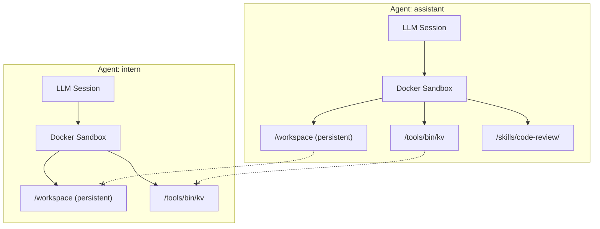
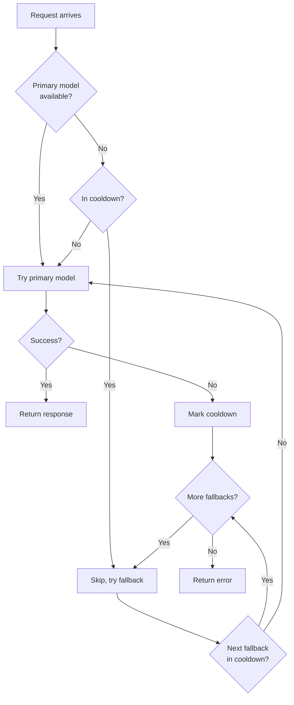

# What is an Agent?

An agent is a single AI assistant with its own:
- **LLM session** — Conversation history, model configuration
- **Docker sandbox** — Isolated execution environment
- **Tool permissions** — Which tools it can use
- **Skills** — Domain knowledge packages
- **Workspace** — Persistent `/workspace` directory

Each agent is completely isolated from other agents. They cannot access each other's files, sessions, or tools (unless explicitly allowed).



---

## Agent Configuration

Agents are defined in `config.json5` under the `agents` key:

```json5
agents: {
  assistant: {
    // Which LLM provider and model to use
    model: {
      provider: "anthropic",
      model: "claude-sonnet-4-20250514",
      thinkingLevel: "medium",
    },
    
    // Fallback models if primary fails (optional)
    fallbackModels: [
      { provider: "anthropic", model: "claude-3-5-sonnet-20241022" },
    ],
    
    // Tools this agent can use (by name from tools registry)
    tools: ["kv", "browser"],
    
    // Skills this agent has access to (optional)
    skills: ["code-review", "testing"],
    
    // Sandbox customization (optional)
    sandbox: {
      image: "beige-sandbox:latest",
      extraMounts: {
        "/host/project": "/project",
      },
      extraEnv: {
        "NODE_ENV": "development",
      },
    },
  },
}
```

### Configuration Fields

| Field | Required | Description |
|-------|----------|-------------|
| `model` | Yes | Provider, model ID, and thinking level |
| `fallbackModels` | No | Models to try if primary fails |
| `tools` | No | Array of tool names (empty = no tools) |
| `skills` | No | Array of skill names |
| `sandbox` | No | Docker image, extra mounts, extra env vars |

---

## LLM Providers

Configure providers under `llm.providers` in `config.json5`:

```json5
llm: {
  providers: {
    // Anthropic (default for Claude models)
    anthropic: {
      apiKey: "${ANTHROPIC_API_KEY}",
    },
    
    // OpenAI
    openai: {
      apiKey: "${OPENAI_API_KEY}",
    },
    
    // Custom provider (ZAI, Groq, etc.)
    zai: {
      apiKey: "${ZAI_API_KEY}",
      baseUrl: "https://api.zai.com/v1",
      api: "openai-completions",
    },
    
    // Local model via Ollama
    ollama: {
      baseUrl: "http://localhost:11434/v1",
      api: "openai-completions",
    },
    
    // Google Gemini
    google: {
      apiKey: "${GOOGLE_API_KEY}",
    },
  },
}
```

### Provider Configuration

| Field | Required | Description |
|-------|----------|-------------|
| `apiKey` | Yes* | API key (use `${VAR}` for env var) |
| `baseUrl` | No | Custom API endpoint (required for custom providers) |
| `api` | No | API type (see below) |

*For local providers like Ollama, `apiKey` is not required.

### API Types

| Value | Use For |
|-------|---------|
| `anthropic-messages` | Anthropic Claude (default for `anthropic` provider) |
| `openai-completions` | OpenAI, ZAI, Groq, Ollama, most compatible APIs |
| `openai-responses` | OpenAI Responses API |
| `google-generative-ai` | Google Gemini |

---

## Model Selection

### Primary Model

```json5
model: {
  provider: "anthropic",           // Must match a key in llm.providers
  model: "claude-sonnet-4-20250514", // Model ID
  thinkingLevel: "medium",          // off | minimal | low | medium | high
}
```

### Thinking Levels

| Level | Description |
|-------|-------------|
| `off` | No extended thinking (fastest, cheapest) |
| `minimal` | Brief thinking before responses |
| `low` | Light thinking for simple tasks |
| `medium` | Balanced thinking (recommended) |
| `high` | Deep thinking for complex tasks |

Thinking levels only apply to models that support extended thinking (e.g., Claude with thinking).

### Model Fallback

When the primary model fails (rate limits, errors), fallbacks are tried in order:

```json5
agents: {
  assistant: {
    model: { provider: "anthropic", model: "claude-sonnet-4-20250514" },
    fallbackModels: [
      { provider: "anthropic", model: "claude-3-5-sonnet-20241022" },
      { provider: "openai", model: "gpt-5" },
    ],
    tools: ["kv"],
  },
}
```



### Rate Limit Handling

When a provider returns a rate limit error (HTTP 429 or rate-limit message):

1. The provider/model is marked as "cooling down"
2. If `retry-after` header is present, that time is used
3. Otherwise, a 30-minute default cooldown is applied
4. Cooldown state persists in `~/.beige/data/provider-health.json`

```json
// ~/.beige/data/provider-health.json
{
  "providers": {
    "anthropic/claude-sonnet-4-20250514": {
      "rateLimitedAt": "2026-03-06T15:00:00.000Z",
      "retryAfter": "2026-03-06T15:30:00.000Z",
      "consecutiveFailures": 1,
      "lastError": "Rate limit exceeded"
    }
  },
  "lastUpdated": "2026-03-06T15:00:00.000Z"
}
```

---

## Tools

Assign tools to agents by listing their names:

```json5
agents: {
  assistant: {
    model: { provider: "anthropic", model: "claude-sonnet-4-20250514" },
    tools: ["kv", "browser", "slack"],  // Tool names from registry
  },
  
  // Restricted agent with limited tools
  intern: {
    model: { provider: "anthropic", model: "claude-sonnet-4-20250514" },
    tools: ["kv"],  // Only kv, no browser or slack
  },
}
```

### Tool Registry

Tools are registered separately under `tools`:

```json5
tools: {
  kv: {
    path: "~/.beige/tools/kv",
    target: "gateway",
  },
  browser: {
    path: "./tools/browser",
    target: "gateway",
  },
  slack: {
    path: "./tools/slack",
    target: "gateway",
  },
}
```

Agents can only use tools that are:
1. Registered in `tools`
2. Listed in their `tools` array

This is the **deny by default** policy.

For more on creating and using tools, see [Channels & Tools → Tools](/channels-and-tools#tools).

---

## Skills

Skills are read-only knowledge packages mounted into the sandbox. Unlike tools (which do things), skills provide context and guidelines.

```json5
skills: {
  "code-review": { path: "./skills/code-review" },
  "testing": { path: "./skills/testing" },
}

agents: {
  assistant: {
    model: { provider: "anthropic", model: "claude-sonnet-4-20250514" },
    tools: ["kv"],
    skills: ["code-review", "testing"],  // Agent can read these
  },
}
```

### How Skills Work

1. Skills are mounted at `/skills/<name>/` in the sandbox
2. The system prompt lists available skills (name + description only)
3. The agent reads the full documentation when relevant:

```bash
exec cat /skills/code-review/README.md
exec cat /skills/code-review/security-checklist.md
```

For more on creating skills, see [Channels & Tools → Skills](/channels-and-tools#skills).

---

## Sandbox Customization

### Docker Image

```json5
sandbox: {
  image: "beige-sandbox:latest",  // Default image
}
```

The default image includes:
- Deno runtime (for TypeScript execution)
- Common utilities (curl, jq, etc.)
- The tool-client binary

### Extra Mounts

Mount additional directories from the host:

```json5
sandbox: {
  extraMounts: {
    "/home/user/projects": "/projects",     // Mount a project
    "/home/user/.config/git": "/git-config", // Share git config
  },
}
```

**Warning:** Extra mounts reduce isolation. Only mount directories you trust the agent to access.

### Extra Environment Variables

Pass non-sensitive env vars to the container:

```json5
sandbox: {
  extraEnv: {
    "NODE_ENV": "development",
    "PROJECT_NAME": "my-app",
  },
}
```

**Never** pass secrets via `extraEnv`. They would be visible to the agent.

---

## Sessions

### Session Persistence

Each agent's conversation history is persisted to disk:

```
~/.beige/sessions/
├── session-map.json        # Maps keys → session files
├── session-settings.json   # Per-session setting overrides
└── assistant/
    ├── abc123.jsonl        # Session file (pi format)
    └── def456.jsonl
```

Sessions are stored in pi's native JSONL format, enabling:
- Tree-structured history (navigate to any point)
- Compaction (automatic summarization)
- Resumption (continue from any session)

### Session Keys

Different channels use different session keys:

| Channel | Session Key Format |
|---------|-------------------|
| TUI | `tui:<agent>:default` |
| Telegram | `telegram:<chatId>` or `telegram:<chatId>:<threadId>` |

This means:
- Each Telegram chat gets its own session
- TUI has one session per agent
- Sessions are isolated between channels

### Session Commands

In the TUI:

```bash
/new              # Start fresh session (old preserved)
/sessions         # List saved sessions
/resume 2         # Resume session #2
```

In Telegram:

```bash
/new              # Start fresh session
/status           # Show current session info
```

---

## Multiple Agents Example

A realistic config with multiple agents for different purposes:

```json5
{
  llm: {
    providers: {
      anthropic: { apiKey: "${ANTHROPIC_API_KEY}" },
      openai: { apiKey: "${OPENAI_API_KEY}" },
    },
  },
  
  tools: {
    kv: { path: "~/.beige/tools/kv", target: "gateway" },
    browser: { path: "./tools/browser", target: "gateway" },
    slack: { path: "./tools/slack", target: "gateway" },
  },
  
  skills: {
    "code-review": { path: "./skills/code-review" },
    "testing": { path: "./skills/testing" },
  },
  
  agents: {
    // Main assistant - full access
    assistant: {
      model: { provider: "anthropic", model: "claude-sonnet-4-20250514" },
      fallbackModels: [
        { provider: "openai", model: "gpt-5" },
      ],
      tools: ["kv", "browser", "slack"],
      skills: ["code-review", "testing"],
    },
    
    // Developer - code-focused
    dev: {
      model: { provider: "anthropic", model: "claude-sonnet-4-20250514" },
      tools: ["kv"],
      skills: ["code-review", "testing"],
      sandbox: {
        extraMounts: {
          "/home/user/projects": "/projects",
        },
      },
    },
    
    // Intern - restricted access
    intern: {
      model: { provider: "anthropic", model: "claude-sonnet-4-20250514" },
      tools: ["kv"],  // Minimal tools
      skills: [],     // No skills
    },
    
    // Researcher - browser-focused
    researcher: {
      model: { provider: "anthropic", model: "claude-sonnet-4-20250514" },
      tools: ["kv", "browser"],
      skills: [],
    },
  },
  
  channels: {
    telegram: {
      enabled: true,
      token: "${TELEGRAM_BOT_TOKEN}",
      allowedUsers: [123456789],
      agentMapping: { default: "assistant" },
    },
  },
}
```

---

## Config Validation

The gateway validates config at startup:

| Check | Error If |
|-------|----------|
| `llm.providers` exists | Missing or empty |
| `agents` exists | Missing or empty |
| Each agent has `model.provider` + `model.model` | Missing model config |
| Agent's `model.provider` exists in providers | Unknown provider |
| Agent's tools exist in tool registry | Unknown tool |
| Agent's skills exist in skill registry | Unknown skill |
| Telegram `agentMapping.default` exists | Unknown agent |
| All `${VAR}` references resolve | Environment variable not set |

---

## Next Steps

- **[The Gateway](/gateway)** — How the gateway orchestrates agents
- **[Channels & Tools](/channels-and-tools)** — TUI, Telegram, and extensibility
- **[Getting Started](/getting-started)** — Installation and first run
