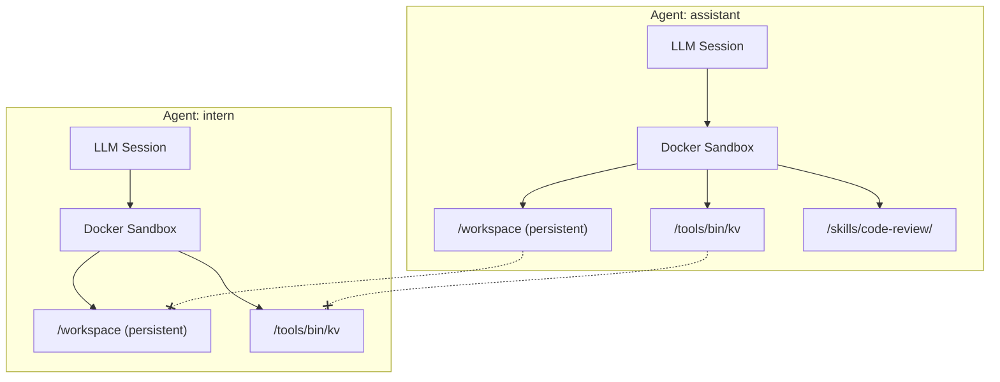

An agent is a named AI assistant with its own:
- **LLM session** — conversation history and model configuration
- **Docker sandbox** — isolated execution environment
- **Tool permissions** — the specific tools it can invoke
- **Skills** — read-only knowledge packages mounted into the sandbox
- **Workspace** — persistent `/workspace` directory that survives restarts

Each agent is completely isolated. Agents **cannot access each other's files, sessions, or tools**.



---

## Defining an Agent

Agents are defined in `config.json5` under `agents`:

```json5
{
  agents: {
    assistant: {
      // LLM model (required)
      model: {
        provider: "anthropic",
        model: "claude-sonnet-4-6",
        thinkingLevel: "medium",
      },

      // Fallback models if primary is unavailable (optional)
      fallbackModels: [
        { provider: "anthropic", model: "claude-3-5-sonnet-20241022" },
      ],

      // Tools this agent can use (names from the tools registry)
      tools: ["kv", "browser"],

      // Skills this agent has access to (optional)
      skills: ["code-review"],

      // Sandbox overrides (optional)
      sandbox: {
        image: "beige-sandbox:latest",
        extraMounts: {
          "/home/user/projects": "/projects",
        },
        extraEnv: {
          "NODE_ENV": "development",
        },
      },
    },
  },
}
```

### Configuration Fields

| Field | Required | Description |
|-------|----------|-------------|
| `model` | Yes | Provider, model ID, and thinking level |
| `fallbackModels` | No | Models to try if primary fails or is rate-limited |
| `tools` | No | Tool names from the tools registry (empty = no tools) |
| `skills` | No | Skill names from the skills registry |
| `sandbox` | No | Docker image, extra host mounts, extra env vars |

For provider and model configuration details, see [LLM Providers](/agents/providers). For the complete list of all config fields and their defaults, see the [Config Reference](/agents/configuration).

---

## Tool Permissions

Tools are registered globally in `config.json5`, then assigned to agents by name:

```json5
{
  tools: {
    kv: { path: "~/.beige/tools/kv", target: "gateway" },
    browser: { path: "./tools/browser", target: "gateway" },
  },

  agents: {
    // Full access
    assistant: {
      model: { provider: "anthropic", model: "claude-sonnet-4-6" },
      tools: ["kv", "browser"],
    },

    // Restricted — only kv, no browser
    intern: {
      model: { provider: "anthropic", model: "claude-sonnet-4-6" },
      tools: ["kv"],
    },
  },
}
```

An agent can only use tools that are **both** registered under `tools` and listed in its `tools` array. This is the deny-by-default policy.

---

## Skills

Skills are read-only knowledge packages (documentation files) mounted into the sandbox. Unlike tools, which execute code, skills provide context and guidelines the agent reads on demand.

```json5
{
  skills: {
    "code-review": { path: "./skills/code-review" },
  },

  agents: {
    assistant: {
      model: { provider: "anthropic", model: "claude-sonnet-4-6" },
      tools: ["kv"],
      skills: ["code-review"],
    },
  },
}
```

Skills are mounted at `/skills/<name>/` in the sandbox. The system prompt lists available skills; the agent reads the full documentation when relevant:

```bash
exec cat /skills/code-review/README.md
```

For more on creating skills, see [Skills](/skills).

---

## Sandbox Customization

### Docker Image

```json5
sandbox: {
  image: "beige-sandbox:latest",  // default image built by the gateway
}
```

The default image includes the Deno runtime, common utilities (curl, jq), and the tool-client binary.

### Extra Mounts

Mount additional host directories into the sandbox:

```json5
sandbox: {
  extraMounts: {
    "/home/user/projects": "/projects",      // share a project directory
    "/home/user/.gitconfig": "/etc/gitconfig", // share git config
  },
}
```

**Warning:** Extra mounts reduce isolation. Only mount directories the agent should be able to access.

### Extra Environment Variables

```json5
sandbox: {
  extraEnv: {
    "NODE_ENV": "development",
    "PROJECT_NAME": "my-app",
  },
}
```

**Never** put secrets in `extraEnv` — they would be visible to the agent. API keys and secrets stay on the gateway host only.

---

## Sessions

Each agent's conversation history is persisted to disk as JSONL files:

```
~/.beige/sessions/
├── session-map.json        # Maps session keys → file paths
├── session-settings.json   # Per-session setting overrides
└── assistant/
    ├── 20260305-120000-a1b2c3.jsonl
    └── 20260305-143000-d4e5f6.jsonl
```

### Session Keys

| Channel | Session Key |
|---------|-------------|
| TUI | `tui:<agent>:default` |
| Telegram | `telegram:<chatId>` or `telegram:<chatId>:<threadId>` |

### Session Commands

In the TUI:
```bash
/new              # Start a fresh session (old one preserved on disk)
/sessions         # List saved sessions for the current agent
/resume 2         # Resume session #2
/agent dev        # Switch to a different agent
```

In Telegram:
```bash
/new              # Start a fresh session
/status           # Show current session, agent, and settings
```

---

## Multi-Agent Example

```json5
{
  llm: {
    providers: {
      anthropic: { apiKey: "${ANTHROPIC_API_KEY}" },
    },
  },

  tools: {
    kv: { path: "~/.beige/tools/kv", target: "gateway" },
    browser: { path: "./tools/browser", target: "gateway" },
  },

  skills: {
    "code-review": { path: "./skills/code-review" },
  },

  agents: {
    // Main assistant — full access
    assistant: {
      model: { provider: "anthropic", model: "claude-sonnet-4-6" },
      tools: ["kv", "browser"],
      skills: ["code-review"],
    },

    // Developer — code-focused with project mount
    dev: {
      model: { provider: "anthropic", model: "claude-sonnet-4-6" },
      tools: ["kv"],
      skills: ["code-review"],
      sandbox: {
        extraMounts: { "/home/user/projects": "/projects" },
      },
    },

    // Restricted — minimal tools, no skills
    intern: {
      model: { provider: "anthropic", model: "claude-sonnet-4-6" },
      tools: ["kv"],
    },
  },

  channels: {
    telegram: {
      enabled: true,
      token: "${TELEGRAM_BOT_TOKEN}",
      allowedUsers: [123456789],
      agentMapping: { default: "assistant" },
    },
  },
}
```

The [Config Reference](/agents/configuration) documents every available field with types, defaults, and examples. If you use VS Code or another editor with JSON Schema support, add `"$schema": "..."` at the top of your `config.json5` for inline autocomplete — the schema path is shown in the Config Reference.

---

## Config Validation

The gateway validates agent configuration at startup:

| Check | Error if |
|-------|----------|
| `llm.providers` exists | Missing or empty |
| `agents` exists | Missing or empty |
| Each agent has `model.provider` + `model.model` | Missing model |
| Agent's `model.provider` exists in `llm.providers` | Unknown provider |
| Agent's tools exist in `tools` registry | Unknown tool |
| Agent's skills exist in `skills` registry | Unknown skill |
| Telegram `agentMapping.default` exists | Points to unknown agent |
| All `${VAR}` references resolve | Environment variable not set |

---

## Next Steps

<CardGroup cols={2}>
  <Card icon="microchip" href="/agents/providers" title="LLM Providers">
    Configure providers, models, thinking levels, and fallbacks
  </Card>
  <Card icon="sliders" href="/agents/configuration" title="Full Config Reference">
    Complete config.json5 reference with all fields
  </Card>
</CardGroup>
