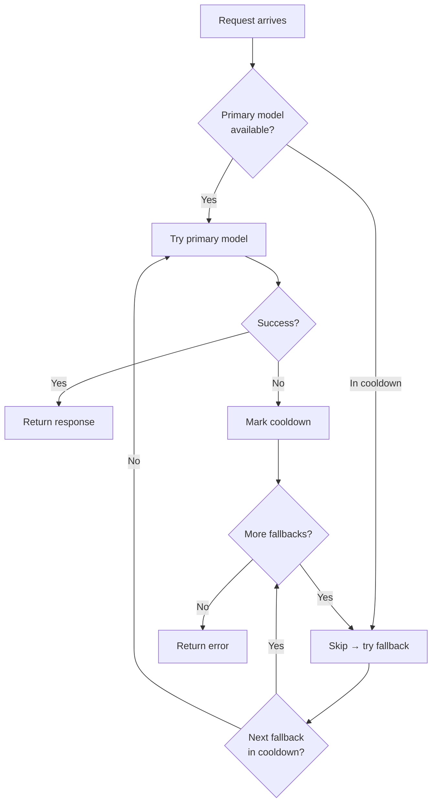

Beige uses the **pi SDK** (`@mariozechner/pi-coding-agent`) for all LLM interaction. You configure which providers and models are available, then assign them to agents.

---

## Configuring Providers

Providers are registered under `llm.providers` in `config.json5`. Each key becomes a provider name that agents reference.

```json5
{
  llm: {
    providers: {
      // Anthropic (Claude models)
      anthropic: {
        apiKey: "${ANTHROPIC_API_KEY}",
      },

      // OpenAI
      openai: {
        apiKey: "${OPENAI_API_KEY}",
      },

      // Custom / OpenAI-compatible (ZAI, Groq, Ollama, etc.)
      zai: {
        apiKey: "${ZAI_API_KEY}",
        baseUrl: "https://api.zai.com/v1",
        api: "openai-completions",
      },

      // Local model via Ollama (no API key needed)
      ollama: {
        baseUrl: "http://localhost:11434/v1",
        api: "openai-completions",
      },

      // Google Gemini
      google: {
        apiKey: "${GOOGLE_API_KEY}",
      },
    },
  },
}
```

### Provider Fields

| Field | Required | Description |
|-------|----------|-------------|
| `apiKey` | Yes* | API key — use `${VAR}` to read from environment |
| `baseUrl` | No | Custom API endpoint (required for non-built-in providers) |
| `api` | No | API type (see table below) |

*Local providers like Ollama don't need an `apiKey`.

### API Types

| Value | Use for |
|-------|---------|
| `anthropic-messages` | Anthropic Claude (default when provider key is `anthropic`) |
| `openai-completions` | OpenAI, ZAI, Groq, Ollama, and most OpenAI-compatible APIs |
| `openai-responses` | OpenAI Responses API |
| `google-generative-ai` | Google Gemini |

Built-in providers (`anthropic`, `openai`, `google`) have their API type set automatically. For all other providers, set `api` explicitly.

---

## Assigning a Model to an Agent

Each agent specifies its model under `model`:

```json5
agents: {
  assistant: {
    model: {
      provider: "anthropic",              // must match a key in llm.providers
      model: "claude-sonnet-4-6",  // model ID as the provider expects it
      thinkingLevel: "medium",            // off | minimal | low | medium | high
    },
    tools: ["kv"],
  },
}
```

### Thinking Levels

Thinking levels control how much internal reasoning a model does before responding. Only models that support extended thinking (e.g. Claude 3.7+) use this setting — other models ignore it.

| Level | Description |
|-------|-------------|
| `off` | No extended thinking (fastest, cheapest) |
| `minimal` | Brief thinking before responses |
| `low` | Light thinking for simple tasks |
| `medium` | Balanced thinking (recommended for most tasks) |
| `high` | Deep thinking for complex, multi-step tasks |

---

## Model Fallbacks

When the primary model fails (rate limit, provider error), the gateway tries fallback models in order:

```json5
agents: {
  assistant: {
    model: { provider: "anthropic", model: "claude-sonnet-4-6" },
    fallbackModels: [
      { provider: "anthropic", model: "claude-3-5-sonnet-20241022" },
      { provider: "openai", model: "gpt-4o" },
    ],
    tools: ["kv"],
  },
}
```

### Model Restriction {#model-restriction}

The `model` and `fallbackModels` fields define the **only** models an agent can use. Users cannot switch to other models via the TUI or API — even if other providers are configured. This ensures:

- **Predictable behavior** — agents always use known, tested models
- **Cost control** — no accidental usage of expensive models
- **Compliance** — enforce model policies per agent



### Rate Limit Handling

When a provider returns HTTP 429 or a rate-limit error:

1. The provider/model is marked as "cooling down"
2. If a `retry-after` header is present, that duration is used
3. Otherwise, a 30-minute default cooldown is applied
4. Cooldown state is persisted to `~/.beige/data/provider-health.json` and survives gateway restarts

```json
// ~/.beige/data/provider-health.json
{
  "providers": {
    "anthropic/claude-sonnet-4-6": {
      "rateLimitedAt": "2026-03-06T15:00:00.000Z",
      "retryAfter": "2026-03-06T15:30:00.000Z",
      "consecutiveFailures": 1,
      "lastError": "Rate limit exceeded"
    }
  }
}
```

### When to Use Fallbacks

- **High availability** — Keep agents working even if one model is rate-limited
- **Cost control** — Use a cheaper model as fallback for non-critical work
- **Model migration** — Gradually shift from one model to another
