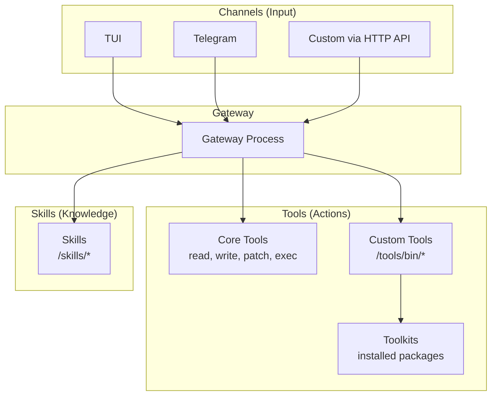
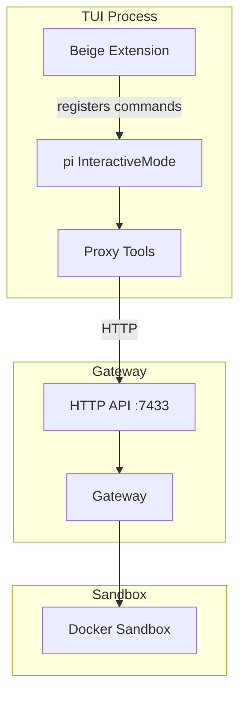
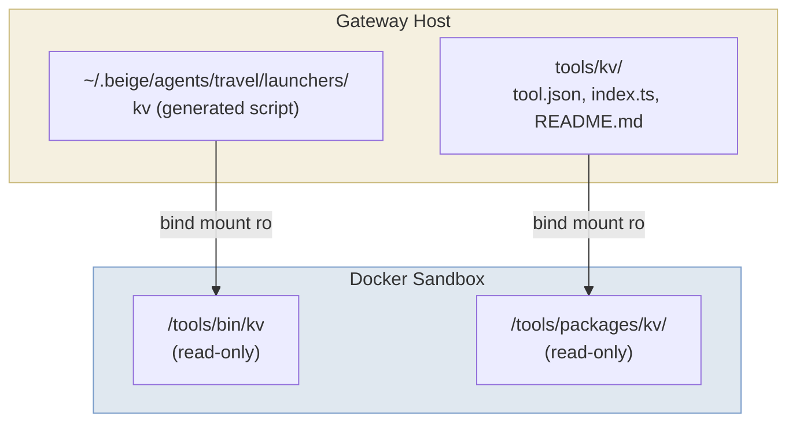
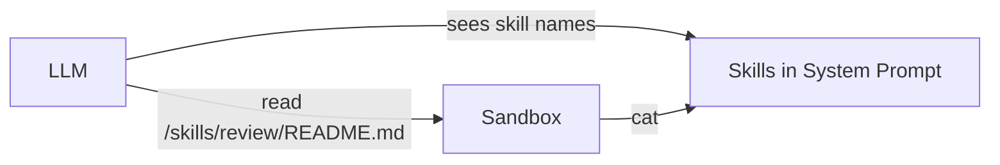
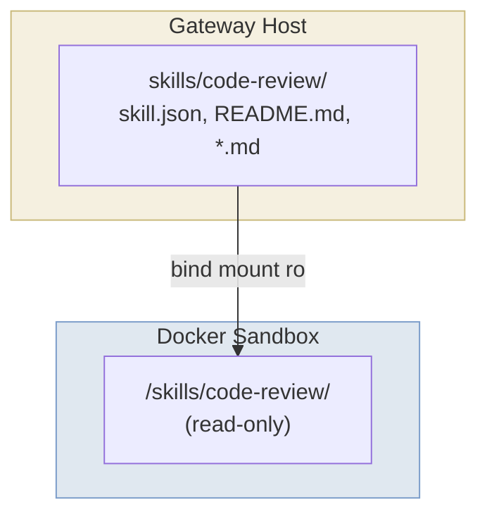

# Overview

Beige provides multiple ways to interact with your agents (channels) and a flexible system for extending their capabilities (tools, toolkits, and skills).



---

# Part A: Channels

Channels are interfaces for interacting with agents. They receive user input and send it to the gateway, then display the agent's response.

## TUI Channel

The TUI (Terminal User Interface) provides the full [pi](https://pi.dev) experience locally while proxying tool execution to the gateway.

### Usage

```bash
# Shell 1: Start the gateway
beige gateway start

# Shell 2: Start the TUI
beige tui assistant

# With custom gateway URL
beige tui assistant --gateway http://192.168.1.100:7433
```

### Features

The TUI gives you the complete pi experience:

- **Rich editor** with multi-line input, history, and autocomplete
- **Streaming responses** with live updates
- **Model switching** via Ctrl+P or `/model`
- **Session management** — resume, fork, navigate conversation tree
- **Compaction** — automatic and manual context compression
- **Extensions** — full pi extension system available

Tool execution happens in the gateway's sandbox, keeping the security model intact.

### Commands

| Command | Description |
|---------|-------------|
| `/new` | Start a fresh session (old session is preserved) |
| `/resume <number>` | Resume a previous session |
| `/sessions` | List saved sessions for the current agent |
| `/agent [name]` | Switch to a different agent |
| `/verbose on\|off` | Show tool calls as they execute |
| `/v on\|off` | Shorthand for `/verbose` |

When verbose mode is ON, tool calls are printed to stderr (appearing above the TUI frame):

```
🔧 exec: ls -la /workspace
🔧 read: /workspace/src/main.ts
```

### Architecture



---

## Telegram Channel

The Telegram channel lets users interact with agents via a Telegram bot. It runs in-process within the gateway.

### Setup

#### 1. Create a Telegram Bot

1. Open Telegram and search for `@BotFather`
2. Send `/newbot` and follow the prompts
3. Save the bot token you receive

#### 2. Get Your User ID

1. Search for `@userinfobot` on Telegram
2. Send any message — it will reply with your user ID
3. Add this ID to `allowedUsers` in your config

#### 3. Configure

```json5
{
  channels: {
    telegram: {
      enabled: true,
      token: "${TELEGRAM_BOT_TOKEN}",
      allowedUsers: [123456789],  // Your user ID
      agentMapping: {
        default: "assistant",
      },
      defaults: {
        verbose: false,  // Tool-call notifications off by default
      },
    },
  },
}
```

### Session Model

- Each **chat** gets a persistent session (survives gateway restarts)
- If a chat has **threads** (forum topics), each thread gets its own session
- Sessions are stored in `~/.beige/sessions/<agent>/<id>.jsonl`

### Commands

| Command | Description |
|---------|-------------|
| `/start` | Show welcome message and available commands |
| `/new` | Start a fresh session (old session is preserved) |
| `/status` | Show current session info, agent, and settings |
| `/verbose on\|off` | Toggle tool-call notifications |
| `/v on\|off` | Shorthand for `/verbose` |

### Verbose Mode

When verbose mode is ON, the bot sends a notification for every tool call:

```
🔧 exec: ls -la
🔧 read: /workspace/src/main.ts
🔧 write: /workspace/output.json (1234 bytes)
```

**Setting precedence** (highest wins):
1. Session override (set via `/verbose on|off`)
2. Channel default (from config: `defaults.verbose`)
3. System default (`false`)

### Example Interaction

```
User: /start
Bot: 👋 Hello! I'm your Beige agent. Send me a message and I'll help you out.

     Commands:
     /new — Start a new conversation session
     /status — Show current session info and settings
     /verbose on|off — Toggle tool-call notifications
     /v on|off — Same as /verbose (shorthand)

     Current verbose mode: 🔇 off

User: What files are in my workspace?
Bot: [streaming response...]

User: /verbose on
Bot: 🔊 Verbose mode *on* — you'll see tool calls as they happen.

User: List the files again
Bot: 🔧 exec: ls -la /workspace
     [streaming response...]
```

---

## HTTP API

The gateway exposes an HTTP API for building custom integrations. It runs on port 7433 by default.

### Base URL

```
http://127.0.0.1:7433
```

Configure in `config.json5`:

```json5
{
  gateway: {
    host: "127.0.0.1",  // default
    port: 7433,          // default
  },
}
```

### Endpoints

#### Health Check

```bash
GET /api/health
```

Response:
```json
{ "status": "ok" }
```

#### List Agents

```bash
GET /api/agents
```

Response:
```json
{
  "agents": [
    {
      "name": "assistant",
      "model": {
        "provider": "anthropic",
        "model": "claude-sonnet-4-20250514"
      },
      "tools": ["kv"]
    }
  ]
}
```

#### Execute Tool

```bash
POST /api/agents/:name/exec
```

Execute a core tool in the agent's sandbox.

Request:
```json
{
  "tool": "read|write|patch|exec",
  "params": {
    // Tool-specific parameters
  }
}
```

Response:
```json
{
  "content": [
    {
      "type": "text",
      "text": "Tool output..."
    }
  ],
  "isError": false
}
```

**Tool Parameters:**

| Tool | Parameters |
|------|------------|
| `read` | `path` (string), `offset?` (number), `limit?` (number) |
| `write` | `path` (string), `content` (string) |
| `patch` | `path` (string), `oldText` (string), `newText` (string) |
| `exec` | `command` (string), `timeout?` (number, seconds) |

**Examples:**

```bash
# Read a file
curl -X POST http://127.0.0.1:7433/api/agents/assistant/exec \
  -H "Content-Type: application/json" \
  -d '{"tool": "read", "params": {"path": "/workspace/file.txt"}}'

# Write a file
curl -X POST http://127.0.0.1:7433/api/agents/assistant/exec \
  -H "Content-Type: application/json" \
  -d '{"tool": "write", "params": {"path": "/workspace/output.txt", "content": "Hello, world!"}}'

# Execute a command
curl -X POST http://127.0.0.1:7433/api/agents/assistant/exec \
  -H "Content-Type: application/json" \
  -d '{"tool": "exec", "params": {"command": "ls -la /workspace"}}'
```

#### Send Prompt

```bash
POST /api/agents/:name/prompt
```

Send a message to an agent and get the full response.

Request:
```json
{
  "message": "Your message to the agent",
  "sessionKey": "optional-session-key"
}
```

Response:
```json
{
  "response": "Agent's response text..."
}
```

#### List Sessions

```bash
GET /api/agents/:name/sessions
```

Response:
```json
{
  "sessions": [
    {
      "id": "telegram:123456:789",
      "file": "/Users/you/.beige/sessions/assistant/abc123.jsonl",
      "createdAt": "2025-03-06T12:00:00.000Z",
      "updatedAt": "2025-03-06T14:30:00.000Z"
    }
  ]
}
```

#### Restart Gateway

```bash
POST /api/gateway/restart
```

Trigger a graceful in-place restart:
1. Drain all in-flight LLM/tool calls
2. Tear down sandboxes, sockets, API, and channels
3. Reload config from disk
4. Restart everything fresh

Response:
```json
{
  "status": "restarting",
  "message": "Graceful restart initiated. Follow progress with: beige gateway logs -f"
}
```

### Using the API from Code

#### TypeScript

```typescript
const GATEWAY_URL = "http://127.0.0.1:7433";

async function execTool(agent: string, tool: string, params: Record<string, any>) {
  const res = await fetch(`${GATEWAY_URL}/api/agents/${agent}/exec`, {
    method: "POST",
    headers: { "Content-Type": "application/json" },
    body: JSON.stringify({ tool, params }),
  });
  return res.json();
}

// Example usage
const result = await execTool("assistant", "exec", {
  command: "ls -la /workspace",
});
console.log(result);
```

#### Python

```python
import requests

GATEWAY_URL = "http://127.0.0.1:7433"

def exec_tool(agent: str, tool: str, params: dict):
    response = requests.post(
        f"{GATEWAY_URL}/api/agents/{agent}/exec",
        json={"tool": tool, "params": params},
    )
    return response.json()

# Example usage
result = exec_tool("assistant", "exec", {"command": "ls -la /workspace"})
print(result)
```

---

# Part B: Tools

## Core Tools

Every agent has access to 4 core tools, implemented as pi SDK `ToolDefinition` objects:

### `read`

Read a file from the sandbox filesystem.

| Parameter | Type | Description |
|-----------|------|-------------|
| `path` | string | File path (relative to `/workspace` or absolute) |
| `offset` | number? | Start line (1-indexed) |
| `limit` | number? | Max lines to read |

### `write`

Write content to a file. Creates parent directories.

| Parameter | Type | Description |
|-----------|------|-------------|
| `path` | string | File path |
| `content` | string | File content |

### `patch`

Find-and-replace in a file. The `oldText` must match exactly.

| Parameter | Type | Description |
|-----------|------|-------------|
| `path` | string | File path |
| `oldText` | string | Exact text to find |
| `newText` | string | Replacement text |

### `exec`

Execute any command in the sandbox.

| Parameter | Type | Description |
|-----------|------|-------------|
| `command` | string | Shell command (runs via `sh -c`) |
| `timeout` | number? | Timeout in seconds (default: 120) |

---

## Custom Tools

Tools extend agent capabilities. They're executables mounted into the sandbox at `/tools/bin/<name>`.

### Tool Package Structure

```
tools/my-tool/
├── tool.json     # Manifest: name, description, commands, target
├── index.ts      # Handler implementation (for gateway-targeted tools)
└── README.md     # Documentation (mounted for agent context)
```

### tool.json — Manifest

```json
{
  "name": "kv",
  "description": "Simple key-value store. Store and retrieve values by key.",
  "commands": [
    "set <key> <value>  — Store a value",
    "get <key>          — Retrieve a value",
    "del <key>          — Delete a key",
    "list               — List all keys"
  ],
  "target": "gateway"
}
```

| Field | Description |
|-------|-------------|
| `name` | Tool identifier (used in config, launchers, audit logs) |
| `description` | Short description (included in LLM system prompt) |
| `commands` | List of available commands with usage hints |
| `target` | Where the handler executes: `"gateway"` or `"sandbox"` |

### index.ts — Handler

For **gateway-targeted** tools, `index.ts` exports a `createHandler` factory:

```typescript
// Define ToolHandler inline — no imports from beige source tree
type ToolHandler = (
  args: string[],
  config?: Record<string, unknown>
) => Promise<{ output: string; exitCode: number }>;

export function createHandler(config: Record<string, unknown>): ToolHandler {
  return async (args: string[]) => {
    const command = args[0];
    
    switch (command) {
      case "hello":
        return { output: `Hello, ${args[1] || "world"}!`, exitCode: 0 };
      default:
        return { output: `Unknown command: ${command}`, exitCode: 1 };
    }
  };
}
```

### How Tools Are Mounted



### Writing a New Tool

1. **Create the package:**

```
tools/my-tool/
├── tool.json
├── index.ts
└── README.md
```

2. **Implement the handler:**

```typescript
// tools/my-tool/index.ts
type ToolHandler = (
  args: string[],
  config?: Record<string, unknown>
) => Promise<{ output: string; exitCode: number }>;

export function createHandler(config: Record<string, unknown>): ToolHandler {
  return async (args) => {
    const [command, ...rest] = args;

    switch (command) {
      case "run":
        return { output: `Running with: ${rest.join(" ")}`, exitCode: 0 };
      case "status":
        return { output: "OK", exitCode: 0 };
      default:
        return { output: `Unknown command: ${command}`, exitCode: 1 };
    }
  };
}
```

3. **Register in config:**

```json5
{
  tools: {
    "my-tool": {
      path: "./tools/my-tool",
      target: "gateway",
    },
  },
  agents: {
    assistant: {
      tools: ["my-tool"],
    },
  },
}
```

4. **Restart the gateway**

The agent can now use it:
```
exec /tools/bin/my-tool run arg1 arg2
→ Running with: arg1 arg2
```

---

## Toolkits

Toolkits are distributable collections of tools. They make it easy to share, install, and manage groups of related tools.

### Installing Toolkits

```bash
# From npm
beige install @myorg/communication-tools

# From GitHub
beige install github:user/beige-toolkit-slack

# From local path (for development)
beige install ./path/to/toolkit

# From URL
beige install https://example.com/toolkit.tar.gz
```

### Managing Toolkits

```bash
# List installed toolkits
beige toolkit list

# Show toolkit details
beige toolkit show @myorg/communication-tools

# Update all toolkits
beige toolkit update

# Remove a toolkit
beige toolkit remove @myorg/communication-tools
```

### Toolkit Structure

```
my-toolkit/
├── toolkit.json              # Manifest (required)
├── README.md                 # Documentation
├── tools/
│   ├── slack/
│   │   ├── tool.json
│   │   ├── index.ts
│   │   └── README.md
│   └── discord/
│       ├── tool.json
│       ├── index.ts
│       └── README.md
└── package.json              # For npm publishing
```

### toolkit.json

```json
{
  "name": "my-communication-toolkit",
  "version": "1.0.0",
  "description": "Communication tools for Slack, Discord, and more",
  "author": "Your Name",
  "license": "MIT",
  "repository": "github:user/my-communication-toolkit",
  "tools": [
    "./tools/slack",
    "./tools/discord"
  ]
}
```

### Creating a Toolkit

1. **Create the directory structure:**
```bash
mkdir -p my-toolkit/tools/{slack,discord}
```

2. **Create each tool** (see [Writing a New Tool](#writing-a-new-tool))

3. **Create toolkit.json:**
```json
{
  "name": "my-toolkit",
  "version": "1.0.0",
  "description": "My useful tools",
  "tools": ["./tools/slack", "./tools/discord"]
}
```

4. **Test locally:**
```bash
beige install ./my-toolkit
```

5. **Publish:**

**Via npm:**
```bash
cd my-toolkit
npm init -y
npm publish --access public
```

**Via GitHub:**
Just push to a public repository. Users can install with:
```bash
beige install github:yourname/my-toolkit
```

### Using Toolkit Tools

After installation, add tools to your agents:

```json5
{
  agents: {
    assistant: {
      tools: ["kv", "slack", "discord"],  // slack and discord from toolkit
    },
  },
}
```

---

# Part C: Skills

Skills provide specialized knowledge and context to agents. Unlike tools (which are executables), skills are read-only documentation.

## Overview



Skills are:
- **Mounted** into the sandbox at `/skills/<name>/`
- **Referenced** in the system prompt (name and description only)
- **Read on demand** by the agent when needed

## Skill Package Structure

```
skills/code-review/
├── skill.json            # Manifest: name, description, dependencies
├── README.md             # Main documentation
├── security-checklist.md # Supporting documentation
└── quality-guide.md      # Supporting documentation
```

### skill.json — Manifest

```json
{
  "name": "code-review",
  "description": "Code review guidelines and checklists",
  "contextFile": "README.md",
  "requires": {
    "tools": ["git"],
    "skills": ["testing"]
  }
}
```

| Field | Required | Description |
|-------|----------|-------------|
| `name` | Yes | Skill identifier |
| `description` | Yes | Short description (in system prompt) |
| `contextFile` | No | Main docs file (default: `"README.md"`) |
| `requires` | No | Dependencies on tools and other skills |

### How Skills Are Mounted



## Creating a Skill

1. **Create the package:**
```
skills/my-skill/
├── skill.json
└── README.md
```

2. **Write the manifest:**
```json
{
  "name": "my-skill",
  "description": "Description that appears in the system prompt"
}
```

3. **Write the documentation:**
```markdown
# My Skill

Brief introduction.

## When to Use

Describe scenarios where this skill is relevant.

## Guidelines

- Guideline 1
- Guideline 2

## Further Reading

See [detailed-guide.md](./detailed-guide.md) for more.
```

4. **Register in config:**
```json5
{
  skills: {
    "my-skill": { path: "./skills/my-skill" },
  },
  agents: {
    assistant: {
      skills: ["my-skill"],
    },
  },
}
```

## Skills vs Tools

| Aspect | Tools | Skills |
|--------|-------|--------|
| Purpose | Do things | Know things |
| Type | Executables | Documentation |
| Location | `/tools/bin/<name>` | `/skills/<name>/` |
| Invocation | `exec /tools/bin/<name>` | `exec cat /skills/<name>/README.md` |
| System prompt | Description + commands | Name + description only |
| Best for | Actions, integrations | Knowledge, guidelines |

---

## Next Steps

- **[Introduction](/introduction)** — Why Beige exists
- **[The Gateway](/gateway)** — Architecture and security
- **[Agents](/agents)** — Configure providers and models
- **[Getting Started](/getting-started)** — Install and run
