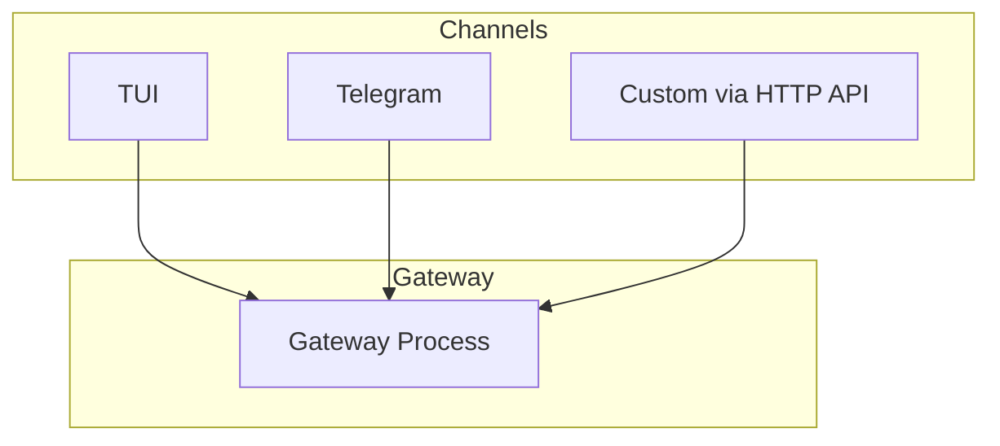

Channels are the interfaces through which you interact with agents. They receive user input, forward it to the gateway, and display the agent's response.



## Available Channels

<CardGroup cols={2}>
  <Card icon="terminal" href="/channels/tui" title="TUI">
    Full pi terminal experience. Run locally, tool execution proxied to the gateway.
  </Card>
  <Card icon="paper-plane" href="/channels/telegram" title="Telegram">
    Interact with your agents via a Telegram bot. Runs in-process with the gateway.
  </Card>
</CardGroup>

## Custom Integrations via HTTP API

Beyond the built-in channels, the gateway exposes an HTTP API on port 7433 that you can use to build your own integrations.

```bash
# Health check
curl http://127.0.0.1:7433/api/health

# Execute a tool in an agent's sandbox
curl -X POST http://127.0.0.1:7433/api/agents/assistant/exec \
  -H "Content-Type: application/json" \
  -d '{"tool": "exec", "params": {"command": "ls /workspace"}}'
```

See [Gateway HTTP API](/gateway/api) for the full reference.
