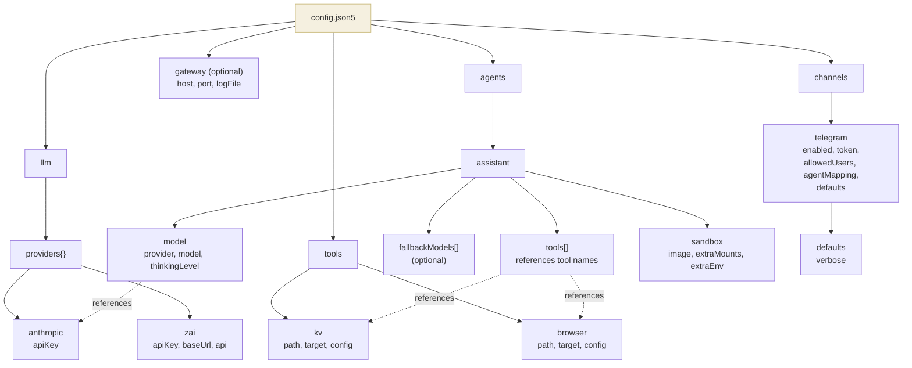

# Configuration

Beige is configured with a single `config.json5` file. JSON5 is JSON with comments, trailing commas, and unquoted keys.

## Config File Location

The gateway looks for `~/.beige/config.json5` by default. Override with:

```bash
beige --config /path/to/my-config.json5
```

## Tool Paths: npm vs Source Install

Tool `path` values in config are resolved relative to the config file's directory —
unless they are absolute paths (starting with `/`).

| Install mode | Typical tool path in config | Notes |
|---|---|---|
| **npm global** | `/Users/you/.beige/tools/kv` (absolute) | Written by `beige setup` at setup time. Never needs changing. |
| **Source** | `./tools/kv` (relative) | Relative to `~/.beige/config.json5`, so points into the repo only if the config is inside the repo. When using `~/.beige/config.json5` with a source install, use an absolute path. |

When `beige setup` generates the default config it always writes the kv tool path as
an absolute path to `~/.beige/tools/kv`, so it works regardless of working directory.

See [Installation](./installation.md) for the full picture on the two install modes.

## Environment Variable Resolution

Any string value can reference environment variables using `${VAR_NAME}` syntax. Variables are resolved at startup — if a referenced variable is not set, the gateway exits with an error.

```json5
{
  llm: {
    providers: {
      anthropic: {
        apiKey: "${ANTHROPIC_API_KEY}",  // resolved from env
      },
    },
  },
}
```

## Full Config Reference

```json5
{
  // ─── LLM Providers ───────────────────────────────────────────────
  llm: {
    providers: {
      // Provider name → config.
      // Built-in providers (anthropic, openai, google) just need an API key.
      // Custom providers also need baseUrl and api.
      anthropic: {
        apiKey: "${ANTHROPIC_API_KEY}",
      },
      zai: {
        apiKey: "${ZAI_API_KEY}",
        baseUrl: "https://api.zai.com/v1",    // required for custom providers
        api: "openai-completions",             // API type (see below)
      },
    },
  },

  // ─── Tool Registry ───────────────────────────────────────────────
  tools: {
    // Tool name → config.
    // The name is used in agent tool lists, audit logs, and /tools/bin/.
    kv: {
      path: "./tools/kv",          // path to tool package (relative to config file)
      target: "gateway",           // where the handler executes
      config: {},                  // arbitrary config passed to createHandler()
    },
  },

  // ─── Agents ───────────────────────────────────────────────────────
  agents: {
    // Agent name → config.
    // Each agent gets its own sandbox, socket, and LLM session.
    assistant: {
      model: {
        provider: "anthropic",                    // must match a key in llm.providers
        model: "claude-sonnet-4-20250514",        // model ID
        thinkingLevel: "off",                     // off | minimal | low | medium | high
      },
      fallbackModels: [                           // optional: tried if primary fails
        { provider: "anthropic", model: "claude-3-5-sonnet-20241022" },
      ],
      tools: ["kv"],                              // tool names from the tools registry
      sandbox: {                                  // optional sandbox overrides
        image: "beige-sandbox:latest",            // Docker image (default)
        extraMounts: {                            // additional bind mounts
          "/host/path": "/container/path",
        },
        extraEnv: {                               // env vars for the container (non-secret!)
          "NODE_ENV": "production",
        },
      },
    },
  },

  // ─── Gateway Server ───────────────────────────────────────────────
  // Optional. All fields have defaults and the block can be omitted.
  gateway: {
    host: "127.0.0.1",                           // bind address (default: 127.0.0.1)
    port: 7433,                                   // HTTP API port (default: 7433)
    logFile: "/custom/path/gateway.log",          // daemon log file (default: ~/.beige/logs/gateway.log)
  },

  // ─── Channels ─────────────────────────────────────────────────────
  channels: {
    telegram: {
      enabled: true,
      token: "${TELEGRAM_BOT_TOKEN}",
      allowedUsers: [123456789],                  // Telegram user IDs
      agentMapping: {
        default: "assistant",                     // which agent handles messages
      },
      // Channel-level default settings (users can override per-session)
      defaults: {
        verbose: false,                           // show tool-call notifications
      },
    },
  },
}
```

## Channel Settings

Each channel can define default settings that apply to all sessions. Users can override these per-session via commands.

### Telegram Channel Settings

| Setting | Type | Default | Description |
|---------|------|---------|-------------|
| `verbose` | boolean | `false` | When `true`, the bot sends a notification for every tool call the agent makes (e.g. "🔧 exec: ls -la") |

Users can toggle verbose mode at runtime with:
- `/verbose on` or `/verbose off`
- `/v on` or `/v off` (shorthand)

Session overrides are persisted in `~/.beige/sessions/session-settings.json`.

### TUI Channel Settings

The TUI doesn't have channel-level config defaults (it's a local process). However, verbose mode can still be toggled per-session:

- `/verbose on` or `/verbose off`
- `/v on` or `/v off`

When verbose mode is ON in the TUI, tool calls are printed to stderr (appearing above the TUI frame).

## Config Schema Diagram



## Validation

The config is validated at startup. The gateway checks:

| Check | Error if |
|-------|----------|
| `llm.providers` exists | Missing or empty |
| `tools` exists | Missing |
| `agents` exists | Missing or empty |
| Each agent has `model.provider` + `model.model` | Missing model config |
| Each agent's tools exist in tool registry | Agent references unknown tool |
| Telegram default agent exists | Agent mapping points to unknown agent |
| All `${VAR}` references resolve | Environment variable not set |

## Model Fallback

When an agent has `fallbackModels` configured, the gateway automatically falls back if the primary model fails:

```json5
agents: {
  assistant: {
    model: { provider: "anthropic", model: "claude-sonnet-4-20250514" },
    fallbackModels: [
      { provider: "anthropic", model: "claude-3-5-sonnet-20241022" },
    ],
    tools: ["kv"],
  },
}
```

### How It Works

1. The primary model is tried first
2. If it fails after the SDK's built-in retries (3 attempts), the first fallback is tried
3. This continues until a model succeeds or all models have been tried
4. Models currently in cooldown (rate-limited) are skipped

### Rate Limit Handling

When a provider returns a rate limit error (HTTP 429 or rate-limit error message):

- The provider/model is marked as "cooling down"
- If the response includes a `retry-after` header, that time is used
- Otherwise, a 30-minute default cooldown is applied
- Cooldown state persists in `~/.beige/data/provider-health.json` and survives gateway restarts

```
~/.beige/data/provider-health.json:
{
  "providers": {
    "anthropic/claude-sonnet-4-20250514": {
      "rateLimitedAt": "2026-03-06T15:00:00.000Z",
      "retryAfter": "2026-03-06T15:30:00.000Z",
      "consecutiveFailures": 1,
      "lastError": "Rate limit exceeded"
    }
  },
  "lastUpdated": "2026-03-06T15:00:00.000Z"
}
```

### When to Use Fallbacks

- **High availability**: Ensure the agent keeps working even if one model is rate-limited
- **Cost optimization**: Use a cheaper fallback for non-critical requests
- **Model migration**: Gradually shift traffic to a new model

## LLM Provider API Types

| API value | Use for |
|-----------|---------|
| `anthropic-messages` | Anthropic Claude (default for `anthropic` provider) |
| `openai-completions` | OpenAI, ZAI, and most OpenAI-compatible APIs |
| `openai-responses` | OpenAI Responses API |
| `google-generative-ai` | Google Gemini |

## Host Directory Structure

The gateway creates directories under `~/.beige/`:

```
~/.beige/
├── config.json5                # main config file
├── agents/
│   └── <agent>/
│       ├── workspace/          # mounted as /workspace (rw)
│       └── launchers/          # mounted as /tools/bin (ro)
├── sessions/
│   ├── session-map.json        # maps keys → session files
│   ├── session-settings.json   # per-session setting overrides
│   └── <agent>/
│       └── <id>.jsonl          # pi session files (persistent)
├── sockets/
│   └── <agent>.sock           # Unix socket per agent
├── data/
│   ├── kv.json                # KV tool data (example)
│   └── provider-health.json   # rate limit tracking
└── logs/
    ├── audit.jsonl            # audit log
    └── gateway.log            # daemon stdout/stderr (configurable via gateway.logFile)
```

## Minimal Working Config

The smallest config that will start:

```json5
{
  llm: {
    providers: {
      anthropic: { apiKey: "${ANTHROPIC_API_KEY}" },
    },
  },
  tools: {},
  agents: {
    bot: {
      model: { provider: "anthropic", model: "claude-sonnet-4-20250514" },
      tools: [],
    },
  },
  channels: {
    telegram: {
      enabled: true,
      token: "${TELEGRAM_BOT_TOKEN}",
      allowedUsers: [123456789],
      agentMapping: { default: "bot" },
    },
  },
}
```

This creates an agent with no tools — it can still use the 4 core tools (`read`, `write`, `patch`, `exec`) to work inside its sandbox.

## Toolkit Tools

Tools from installed toolkits are automatically discovered and added to your configuration. You don't need to manually add their paths — just enable them in your agents:

```json5
{
  // Tools from toolkits are auto-discovered
  tools: {
    // Built-in or manually configured tools go here
    kv: { path: "~/.beige/tools/kv", target: "gateway" },
  },
  agents: {
    assistant: {
      tools: ["kv", "slack", "github"],  // slack and github from installed toolkits
    },
  },
}
```

See [Toolkits](./toolkits.md) for installing and managing toolkits.
