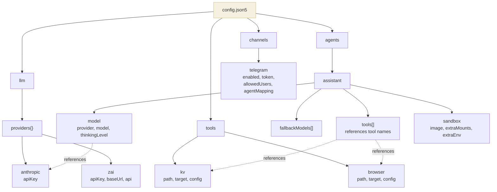

# Configuration

Beige is configured with a single `config.json5` file. JSON5 is JSON with comments, trailing commas, and unquoted keys.

## Config File Location

The gateway looks for `config.json5` in the current directory by default. Override with:

```bash
npm run dev -- /path/to/my-config.json5
```

## Environment Variable Resolution

Any string value can reference environment variables using `${VAR_NAME}` syntax. Variables are resolved at startup — if a referenced variable is not set, the gateway exits with an error.

```json5
{
  llm: {
    providers: {
      anthropic: {
        apiKey: "${ANTHROPIC_API_KEY}",  // resolved from env
      },
    },
  },
}
```

## Full Config Reference

```json5
{
  // ─── LLM Providers ───────────────────────────────────────────────
  llm: {
    providers: {
      // Provider name → config.
      // Built-in providers (anthropic, openai, google) just need an API key.
      // Custom providers also need baseUrl and api.
      anthropic: {
        apiKey: "${ANTHROPIC_API_KEY}",
      },
      zai: {
        apiKey: "${ZAI_API_KEY}",
        baseUrl: "https://api.zai.com/v1",    // required for custom providers
        api: "openai-completions",             // API type (see below)
      },
    },
  },

  // ─── Tool Registry ───────────────────────────────────────────────
  tools: {
    // Tool name → config.
    // The name is used in agent tool lists, audit logs, and /tools/bin/.
    kv: {
      path: "./tools/kv",          // path to tool package (relative to config file)
      target: "gateway",           // where the handler executes
      config: {},                  // arbitrary config passed to createHandler()
    },
  },

  // ─── Agents ───────────────────────────────────────────────────────
  agents: {
    // Agent name → config.
    // Each agent gets its own sandbox, socket, and LLM session.
    assistant: {
      model: {
        provider: "anthropic",                    // must match a key in llm.providers
        model: "claude-sonnet-4-20250514",        // model ID
        thinkingLevel: "off",                     // off | minimal | low | medium | high
      },
      fallbackModels: [                           // optional: tried if primary fails
        { provider: "zai", model: "zai-model" },
      ],
      tools: ["kv"],                              // tool names from the tools registry
      sandbox: {                                  // optional sandbox overrides
        image: "beige-sandbox:latest",            // Docker image (default)
        extraMounts: {                            // additional bind mounts
          "/host/path": "/container/path",
        },
        extraEnv: {                               // env vars for the container (non-secret!)
          "NODE_ENV": "production",
        },
      },
    },
  },

  // ─── Channels ─────────────────────────────────────────────────────
  channels: {
    telegram: {
      enabled: true,
      token: "${TELEGRAM_BOT_TOKEN}",
      allowedUsers: [123456789],                  // Telegram user IDs
      agentMapping: {
        default: "assistant",                     // which agent handles messages
      },
    },
  },
}
```

## Config Schema Diagram



## Validation

The config is validated at startup. The gateway checks:

| Check | Error if |
|-------|----------|
| `llm.providers` exists | Missing or empty |
| `tools` exists | Missing |
| `agents` exists | Missing or empty |
| Each agent has `model.provider` + `model.model` | Missing model config |
| Each agent's tools exist in tool registry | Agent references unknown tool |
| Telegram default agent exists | Agent mapping points to unknown agent |
| All `${VAR}` references resolve | Environment variable not set |

## LLM Provider API Types

| API value | Use for |
|-----------|---------|
| `anthropic-messages` | Anthropic Claude (default for `anthropic` provider) |
| `openai-completions` | OpenAI, ZAI, and most OpenAI-compatible APIs |
| `openai-responses` | OpenAI Responses API |
| `google-generative-ai` | Google Gemini |

## Host Directory Structure

The gateway creates directories under `~/.beige/`:

```
~/.beige/
├── agents/
│   └── <agent>/
│       ├── workspace/          # mounted as /workspace (rw)
│       └── launchers/          # mounted as /tools/bin (ro)
├── sessions/
│   ├── session-map.json        # maps keys → session files
│   └── <agent>/
│       └── <id>.jsonl          # pi session files (persistent)
├── sockets/
│   └── <agent>.sock           # Unix socket per agent
├── data/
│   └── kv.json                # KV tool data (example)
└── logs/
    └── audit.jsonl            # audit log
```

## Minimal Working Config

The smallest config that will start:

```json5
{
  llm: {
    providers: {
      anthropic: { apiKey: "${ANTHROPIC_API_KEY}" },
    },
  },
  tools: {},
  agents: {
    bot: {
      model: { provider: "anthropic", model: "claude-sonnet-4-20250514" },
      tools: [],
    },
  },
  channels: {
    telegram: {
      enabled: true,
      token: "${TELEGRAM_BOT_TOKEN}",
      allowedUsers: [123456789],
      agentMapping: { default: "bot" },
    },
  },
}
```

This creates an agent with no tools — it can still use the 4 core tools (`read`, `write`, `patch`, `exec`) to work inside its sandbox.
