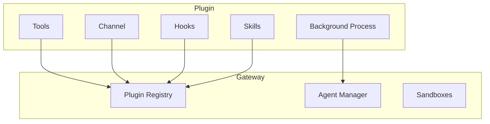

Beige is built around a **plugin architecture**. Everything that extends the gateway — tools, channels, lifecycle hooks, even skills — is provided by plugins.

## What is a Plugin?

A plugin is a package that can:

- **Register tools** available to agents (e.g. `git`, `wrangler`, `slack`)
- **Register a channel** for receiving/sending messages (e.g. Telegram, Discord)
- **Register hooks** into the session and gateway lifecycle (e.g. content filters, audit)
- **Register skills** (read-only knowledge mounted into agent sandboxes)
- **Run background processes** (e.g. Telegram polling, cron jobs, file watchers)

## Plugin Lifecycle

1. **Load** — The gateway imports the plugin and calls `createPlugin(config, ctx)`
2. **Register** — The plugin registers tools, channels, hooks, and skills via `PluginRegistrar`
3. **Start** — After all plugins register, the gateway calls `plugin.start()` for background processes
4. **Run** — The gateway routes tool calls, messages, and hooks to the registered handlers
5. **Stop** — On shutdown, the gateway calls `plugin.stop()` in reverse order

## Built-in vs Plugin

| Feature | Built-in | Plugin |
|---|---|---|
| Core tools (read, write, patch, exec) | ✅ | |
| TUI channel | ✅ | |
| HTTP API | ✅ | |
| Git, GitHub, Slack, Wrangler tools | | ✅ |
| Telegram channel | | ✅ |
| Custom channels (Discord, webhook) | | ✅ |
| Content filtering / guardrails | | ✅ |
| Schedulers / cron | | ✅ |

The gateway provides 4 core tools and the TUI channel. Everything else is a plugin.

## In This Section

<CardGroup cols={2}>
  <Card icon="cube" href="/extensibility/plugins" title="Plugins">
    How plugins work: manifest, entry point, registration, lifecycle
  </Card>
  <Card icon="wrench" href="/extensibility/tools" title="Tools">
    How plugins register tools and how agents use them
  </Card>
  <Card icon="message" href="/extensibility/channels" title="Channels">
    How plugins provide channel adapters for messaging
  </Card>
  <Card icon="book" href="/extensibility/skills" title="Skills">
    Read-only knowledge packages for agents — standalone or plugin-provided
  </Card>
  <Card icon="bolt" href="/extensibility/hooks" title="Hooks">
    Intercept messages, tool calls, and lifecycle events
  </Card>
  <Card icon="hammer" href="/extensibility/building" title="Building Plugins">
    Step-by-step guide to creating your own plugin
  </Card>
</CardGroup>
