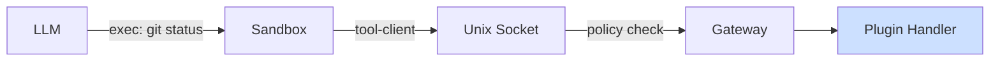

Tools are the primary way agents interact with the world. There are two kinds:

## Core Tools (Built-in)

Every agent has 4 core tools built into the gateway:

| Tool | Description |
|---|---|
| `read` | Read file contents from the sandbox |
| `write` | Write content to a file in the sandbox |
| `patch` | Find-and-replace edit a file |
| `exec` | Execute a command in the sandbox |

These are called directly by the LLM as tool calls — no `exec` needed.

## Plugin Tools

Plugins register additional tools. These are available as executables **on the agent's PATH** inside the sandbox:

```bash
# Agent calls a plugin tool via exec:
exec: git status
exec: wrangler deploy
exec: gh issue list
```

Tools are on PATH because `/tools/bin` is prepended to `$PATH` in the sandbox container. Agents use them naturally — no special paths needed.

### How It Works



1. The LLM calls `exec: git status`
2. The sandbox finds `/tools/bin/git` on PATH (a launcher script)
3. The launcher connects to the gateway via Unix socket
4. The gateway policy-checks, then routes to the plugin's tool handler
5. The result is returned to the LLM

### Tool Documentation

Each plugin's documentation is mounted at `/tools/packages/<name>/` in the sandbox:

```bash
# Agent reads tool docs before first use
exec: cat /tools/packages/git/SKILL.md
exec: cat /tools/packages/git/README.md
```

### Adding Tools to an Agent

1. Install the plugin (or add it to config)
2. Add the tool name to the agent's `tools` array

```json5
{
  plugins: {
    git: { config: { allowForcePush: false } },
  },
  agents: {
    assistant: {
      tools: ["git"],  // references the tool registered by the "git" plugin
    },
  },
}
```

### Per-Agent Tool Config

Use `pluginConfigs` to override plugin config per agent:

```json5
{
  agents: {
    safe: {
      tools: ["git"],
      // Uses base config
    },
    power: {
      tools: ["git"],
      pluginConfigs: {
        git: { allowForcePush: true },
      },
    },
  },
}
```

See the [Config Reference](/agents/configuration) for details on the deep-merge behavior.
