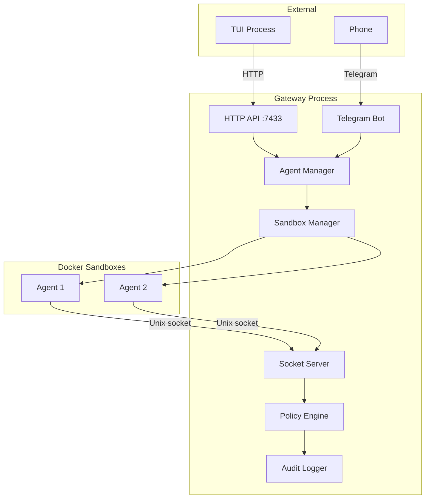

The gateway is the heart of Beige — a Node.js process that runs continuously and coordinates everything: LLM calls, Docker sandbox lifecycle, tool routing, policy enforcement, and audit logging.



**The gateway always runs.** Channels (TUI, Telegram) connect to it. Agents run inside sandboxes that the gateway creates and manages.

---

## Core Responsibilities

| Component | Responsibility |
|-----------|---------------|
| **Agent Manager** | Creates and maps agent name → LLM session + Docker container |
| **Sandbox Manager** | Creates Docker containers, generates tool launchers, manages lifecycle |
| **Socket Server** | Listens on Unix sockets (one per agent), receives tool requests |
| **Policy Engine** | Checks tool permissions before every invocation (deny by default) |
| **Audit Logger** | Logs every tool call with agent, tool, args, timing, and decision |
| **HTTP API** | REST endpoints used by TUI and custom integrations (port 7433) |

---

## Two-Process Model

Beige runs as two separate processes:

```
Shell 1: beige gateway start      ← Gateway: manages sandboxes, enforces policy, routes tools
Shell 2: beige tui [agent]        ← TUI: LLM session runs locally, tools proxied via gateway HTTP API
```

The **gateway** runs always. The **TUI** is optional — you can also interact via Telegram (in-process) or the HTTP API directly.

---

## How a Tool Call Works

When the LLM calls `exec /tools/bin/kv set mykey value`:

1. **Gateway receives** the `exec` core tool call from the pi SDK
2. **Audit log** entry written: `{type: "core_tool", tool: "exec", ...}`
3. **`docker exec`** runs `/tools/bin/kv set mykey value` inside the sandbox
4. Inside the container, the **launcher script** invokes `tool-client`
5. `tool-client` connects to `/beige/gateway.sock` (a Unix socket mounted into the container)
6. The **socket server** receives the tool request, identifies the agent from which socket it came
7. **Policy engine** checks: is this agent allowed to use `kv`?
8. If allowed: **tool handler** executes on the gateway host, result returned through socket
9. `tool-client` exits with the result, `docker exec` returns output to the LLM

Two audit log entries are created — one for the `exec` call, one for the `kv` tool invocation.

---

## Running the Gateway

```bash
# Start as background daemon
beige gateway start

# Start in foreground (for debugging)
beige gateway start --foreground

# Stop, restart, check status
beige gateway stop
beige gateway restart
beige gateway status

# View logs
beige gateway logs
beige gateway logs -f        # Follow (live tail)
```

The gateway stores a PID file at `~/.beige/gateway.pid` and logs to `~/.beige/logs/gateway.log`.

---

## In This Section

<CardGroup cols={2}>
  <Card icon="sitemap" href="/gateway/system-overview" title="System Overview">
    Component diagrams, startup sequence, and multi-agent setup
  </Card>
  <Card icon="diagram-project" href="/gateway/architecture" title="Architecture">
    Detailed technical reference: components, data flow, tech decisions
  </Card>
  <Card icon="shield-halved" href="/gateway/security-model" title="Security Model">
    Threat model, defense layers, secrets flow, and audit logging
  </Card>
  <Card icon="arrows-turn-right" href="/gateway/request-flows" title="Request Flows">
    Sequence diagrams for every type of request
  </Card>
  <Card icon="code" href="/gateway/api" title="HTTP API">
    REST API reference for external integrations
  </Card>
</CardGroup>
