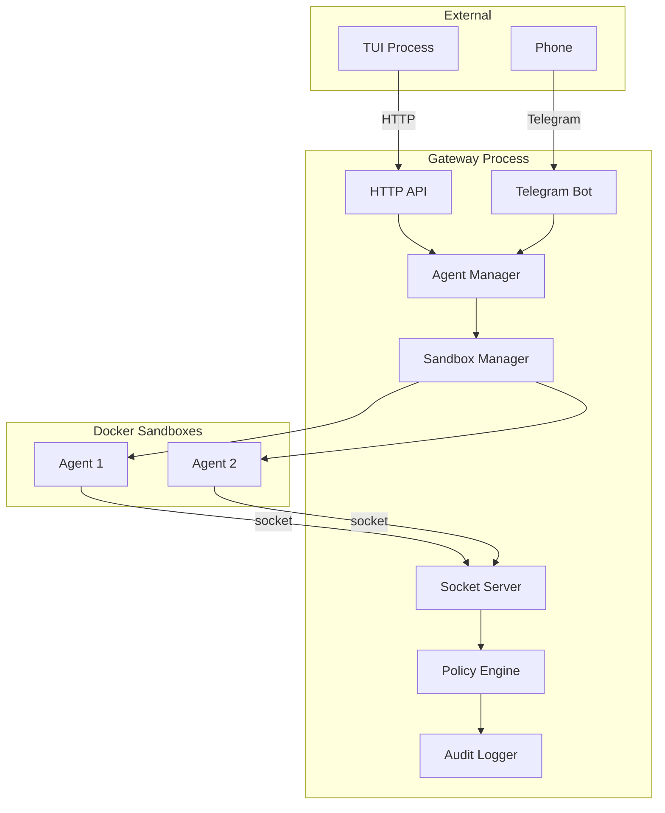
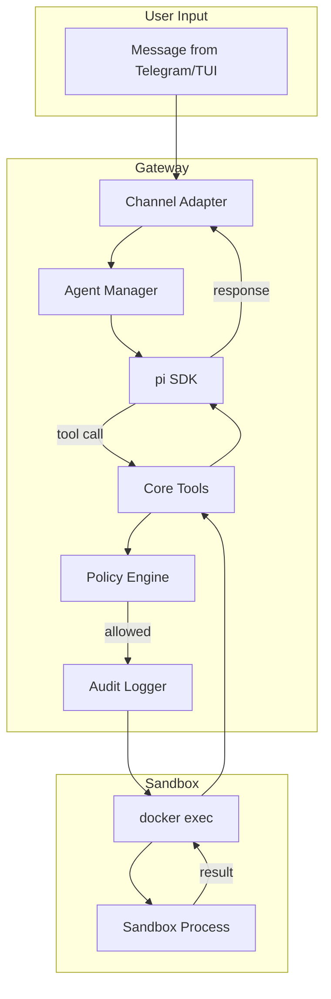
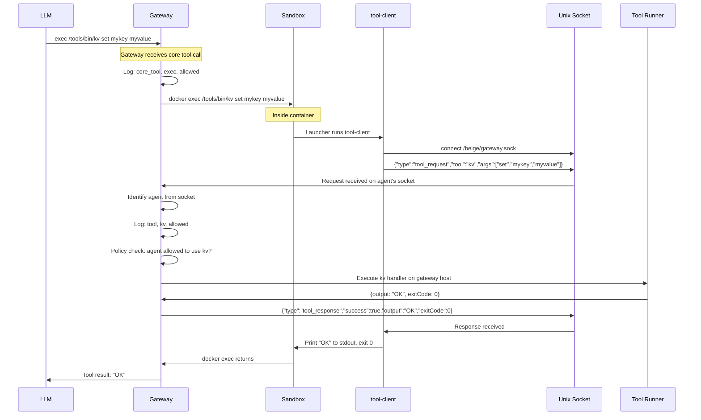
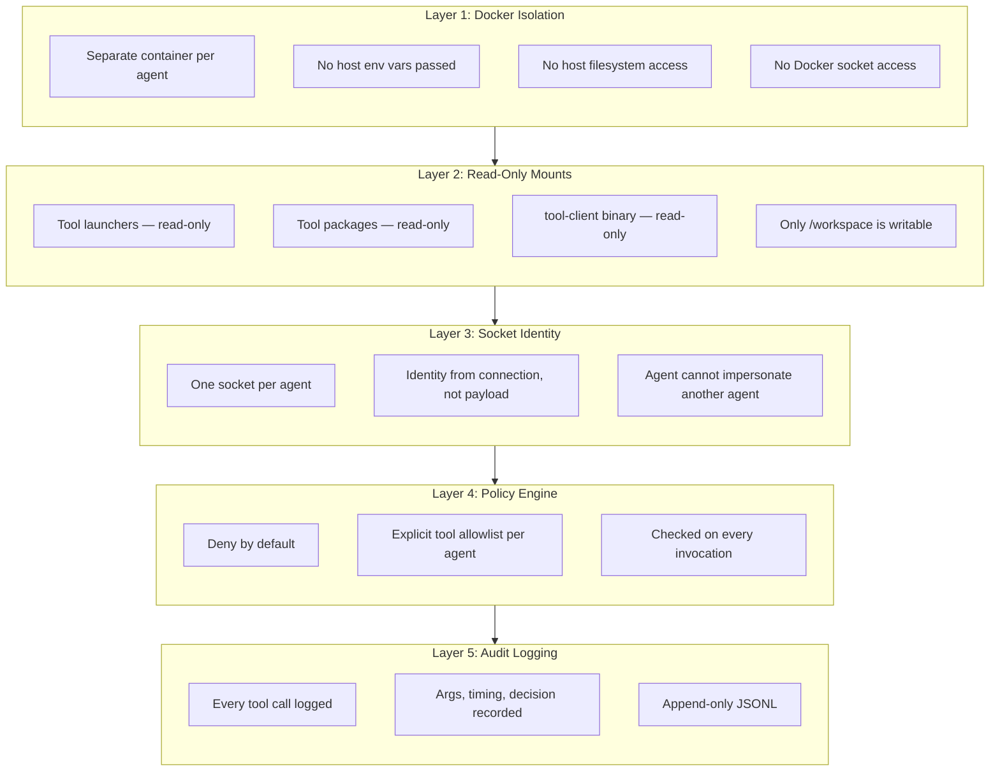
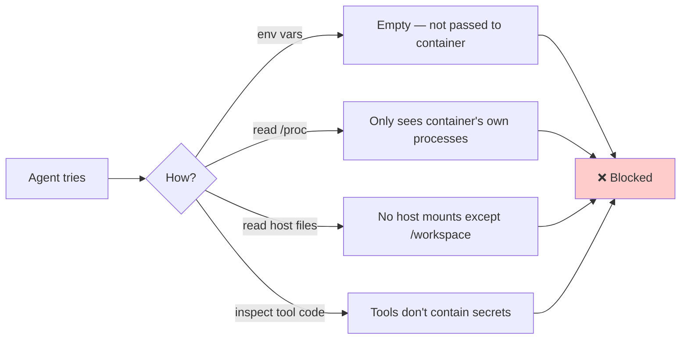
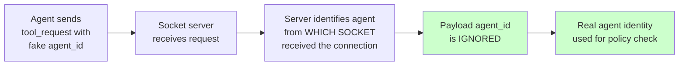
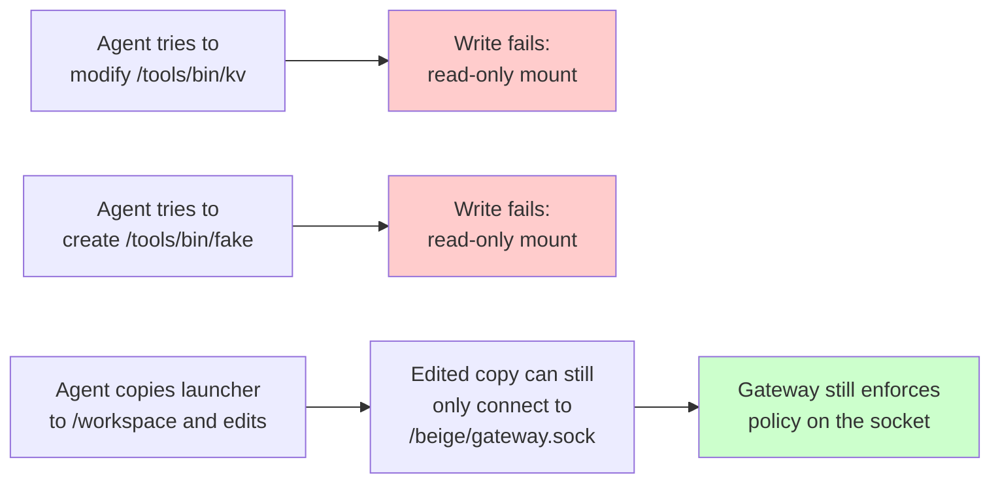
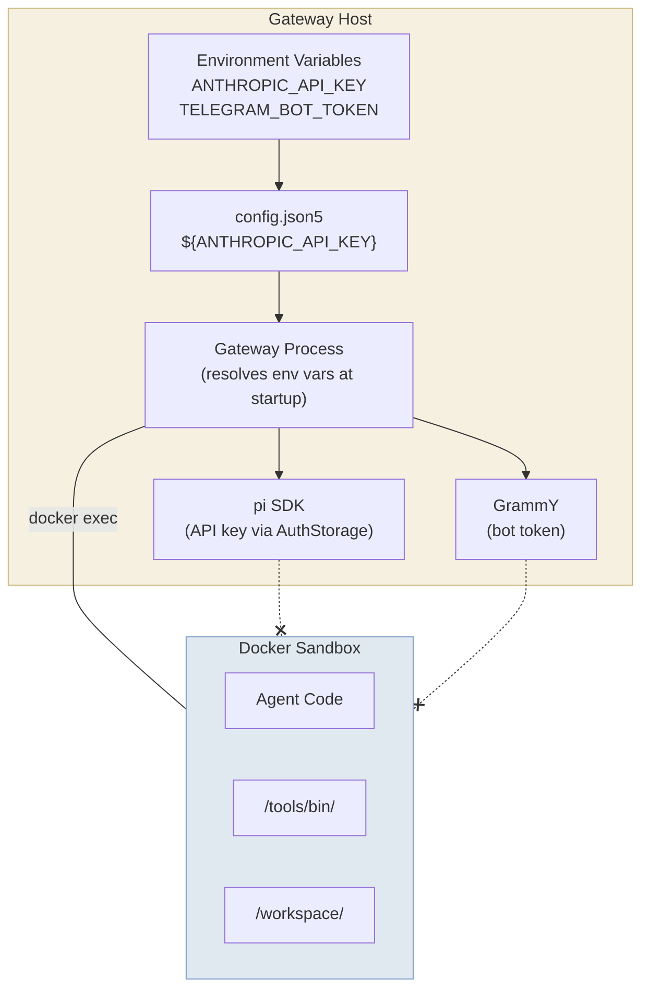

## What is the Gateway?

The gateway is the orchestrator process at the heart of Beige. It's a Node.js process that:

- **Manages sandboxes** — Creates and monitors Docker containers for each agent
- **Routes tool calls** — Receives requests via Unix sockets, executes them safely
- **Enforces policies** — Checks permissions before every tool invocation
- **Logs everything** — Audit trail of every action for accountability
- **Exposes APIs** — HTTP API for external channels like the TUI

The gateway is always running. Everything else connects to it.



---

## Architecture

### Core Components

| Component | Responsibility |
|-----------|---------------|
| **Agent Manager** | Creates agent sessions, maps agent name → LLM session + Docker container |
| **Sandbox Manager** | Creates Docker containers, generates tool launchers, manages lifecycle |
| **Socket Server** | Listens on Unix sockets (one per agent), receives tool requests from sandboxes |
| **Policy Engine** | Checks if agent is allowed to use a tool (deny by default) |
| **Audit Logger** | Logs every tool invocation with agent, tool, args, timing, decision |
| **HTTP API** | REST endpoints for external channels (TUI, custom integrations) |

### Data Flow



### Tool Call Flow

When an agent wants to use a tool (e.g., `exec /tools/bin/kv set mykey myvalue`):



---

## Socket Protocol

Tools communicate with the gateway over a simple newline-delimited JSON protocol.

### Request Format (Sandbox → Gateway)

```json
{
  "type": "tool_request",
  "tool": "kv",
  "args": ["set", "mykey", "myvalue"]
}
```

### Response Format (Gateway → Sandbox)

**Success:**
```json
{
  "type": "tool_response",
  "success": true,
  "output": "OK: mykey = myvalue",
  "exitCode": 0
}
```

**Error:**
```json
{
  "type": "tool_response",
  "success": false,
  "error": "Permission denied: tool 'kv' not allowed for agent 'intern'",
  "exitCode": 1
}
```

### Socket Identity

Each agent has its own Unix socket at `~/.beige/sockets/<agent>.sock`. The gateway mounts this into the container at `/beige/gateway.sock`.

**Key security property:** The gateway identifies the agent by which socket received the connection — not by any field in the request payload. An agent cannot impersonate another agent.

---

## Security Model

Beige is designed with the assumption that **an agent might go rogue**. Every layer contains damage.

### Defense in Depth



### What an Agent CAN Do

| Action | Allowed? | Mechanism |
|--------|----------|-----------|
| Read/write files in `/workspace` | ✅ | Writable bind mount |
| Execute code (any language) | ✅ | Deno, sh, python, etc. in sandbox |
| Call allowed tools via `/tools/bin/` | ✅ | Launcher → socket → policy → execute |
| Access the internet | ✅ | Container has network access |
| Read tool documentation | ✅ | Read-only mount at `/tools/packages/` |
| Install packages in sandbox | ✅ | Can run `apt-get`, `npm`, etc. inside container |
| Persist data across sessions | ✅ | `/workspace` is a persistent bind mount |

### What an Agent CANNOT Do

| Action | Prevented By |
|--------|-------------|
| Read gateway env vars / API keys | Docker isolation — no host env passed |
| Access host filesystem | Docker isolation — only explicit bind mounts |
| Modify tool code or launchers | Read-only mounts |
| Use tools not in its allowlist | Policy engine (deny by default) |
| Impersonate another agent | Socket identity (one socket per agent) |
| Access another agent's workspace | Separate containers, separate bind mounts |
| Access the Docker daemon | No Docker socket mount |
| Modify gateway config | Config lives on host, not in sandbox |
| Access audit logs | Logs are on host, not mounted |
| Bypass tool logging | All `/tools/bin/` calls route through gateway socket |

---

### Threat Model

#### Threat: Agent tries to read API keys



#### Threat: Agent spoofs identity to use another agent's tools



Each agent has its own Unix socket file. The gateway knows which agent sent a request by which socket server received it — not by any field in the request payload.

#### Threat: Agent modifies tool launcher to skip gateway



#### Threat: Agent escapes Docker container

This is a Docker-level concern, not Beige-specific. Mitigations:

- Use rootless Docker or Podman (future)
- Don't run containers as root (future hardening)
- Keep Docker and kernel updated
- Don't mount the Docker socket into containers (enforced)

---

### Secrets Flow



> Secrets exist **only** in the gateway process memory. They are resolved from environment variables at startup and **never** passed to any sandbox container.

---

## Audit Logging

Every tool invocation produces a JSONL audit entry at `~/.beige/logs/audit.jsonl`:

```json
{"ts":"2026-03-05T12:00:00.000Z","agent":"assistant","type":"core_tool","tool":"exec","args":["/tools/bin/kv","set","trip","Paris"],"decision":"allowed","durationMs":45,"exitCode":0,"outputBytes":23}
{"ts":"2026-03-05T12:00:00.050Z","agent":"assistant","type":"tool","tool":"kv","args":["set","trip","Paris"],"decision":"allowed","target":"gateway","durationMs":12,"exitCode":0,"outputBytes":2}
```

### Log Fields

| Field | Description |
|-------|-------------|
| `ts` | ISO 8601 timestamp |
| `agent` | Agent name (derived from socket identity) |
| `type` | `core_tool` (LLM→gateway) or `tool` (sandbox→gateway socket) |
| `tool` | Tool name |
| `args` | Arguments (future: redaction rules for sensitive values) |
| `decision` | `allowed` or `denied` |
| `target` | Where the tool executes (`gateway` or `sandbox`) |
| `durationMs` | Execution time in milliseconds |
| `exitCode` | Process exit code |
| `outputBytes` | Size of output returned |
| `error` | Error message (if any) |

---

## Gateway Configuration

Configure the gateway in `config.json5`:

```json5
{
  gateway: {
    host: "127.0.0.1",  // Bind address (default: 127.0.0.1)
    port: 7433,          // HTTP API port (default: 7433)
    logFile: "~/.beige/logs/gateway.log",  // Daemon log file
  },
}
```

All fields are optional with sensible defaults.

---

## HTTP API

The gateway exposes an HTTP API on port 7433 (configurable). This is used by the TUI and can be used for custom integrations.

### Quick Reference

| Endpoint | Method | Description |
|----------|--------|-------------|
| `/api/health` | GET | Health check |
| `/api/agents` | GET | List all agents |
| `/api/config` | GET | Get config (without API keys) |
| `/api/agents/:name/exec` | POST | Execute a core tool |
| `/api/agents/:name/prompt` | POST | Send a message to an agent |
| `/api/agents/:name/sessions` | GET | List saved sessions |
| `/api/gateway/restart` | POST | Graceful restart |

### Example: Execute a Tool

```bash
curl -X POST http://127.0.0.1:7433/api/agents/assistant/exec \
  -H "Content-Type: application/json" \
  -d '{"tool": "exec", "params": {"command": "ls -la /workspace"}}'
```

Response:
```json
{
  "content": [
    {
      "type": "text",
      "text": "total 8\ndrwxr-xr-x  2 root root 4096 Mar  5 12:00 .\ndrwxr-xr-x  1 root root 4096 Mar  5 12:00 .."
    }
  ],
  "isError": false
}
```

For the full API reference, see [Channels & Tools → HTTP API](/channels-and-tools#http-api).

---

## Directory Structure

The gateway creates and manages these directories under `~/.beige/`:

```
~/.beige/
├── config.json5                # Main config file
├── agents/
│   └── <agent>/
│       ├── workspace/          # Mounted as /workspace (rw)
│       └── launchers/          # Mounted as /tools/bin (ro)
├── sessions/
│   ├── session-map.json        # Maps keys → session files
│   ├── session-settings.json   # Per-session setting overrides
│   └── <agent>/
│       └── <id>.jsonl          # pi session files (persistent)
├── sockets/
│   └── <agent>.sock           # Unix socket per agent
├── data/
│   ├── kv.json                # KV tool data (example)
│   └── provider-health.json   # Rate limit tracking
├── toolkits/                   # Installed toolkits
│   └── @scope/toolkit-name/
├── toolkit-registry.json       # Tracks installed toolkits
└── logs/
    ├── audit.jsonl            # Audit log
    └── gateway.log            # Daemon stdout/stderr
```

---

## Next Steps

- **[Agents](/agents)** — Configure providers, models, tools, and skills
- **[Channels & Tools](/channels-and-tools)** — TUI, Telegram, HTTP API, and extensibility
- **[Getting Started](/getting-started)** — Installation and first run
