## 1. User Message → Agent Response

The end-to-end flow from a Telegram message to a response.

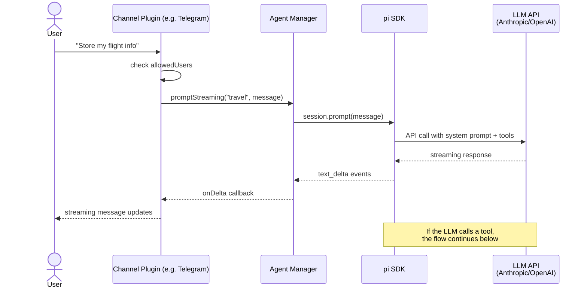

## 2. Core Tool Call — Direct Sandbox Execution

When the LLM calls `read`, `write`, `patch`, or `exec` with a regular command (not a tool launcher).

**Example:** `exec curl https://example.com`

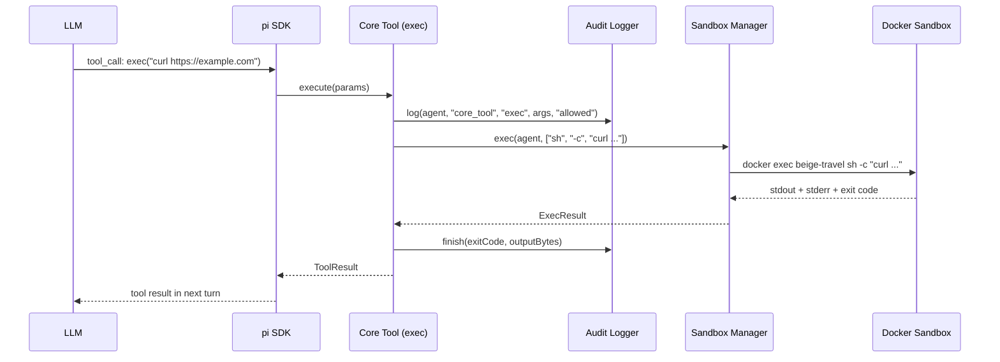

> **Key point:** The command runs entirely inside the sandbox. The gateway only logs and routes — it never executes `curl` itself.

## 3. Core Tool Call — File Operations

`read`, `write`, and `patch` all follow the same pattern: gateway runs `docker exec` to operate on files inside the sandbox.

**Example:** `write("/workspace/script.ts", "console.log('hello')")`

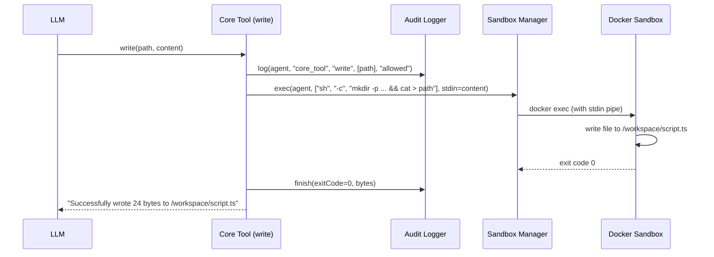

## 4. Tool Launcher Call — Double Routing

The most important flow. When `exec` runs a plugin tool (found on `$PATH` via `/tools/bin/`), the request bounces back to the gateway through the Unix socket.

**Example:** `exec git set trip:paris "March 15"`

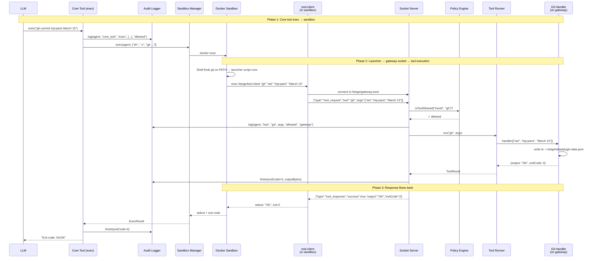

> **Two audit log entries** are created:
>
> 1. `core_tool/exec` — the exec call itself
> 2. `tool/git` — the actual tool invocation through the socket

## 5. Tool Call — Permission Denied

When an agent tries to use a tool it's not allowed to access.

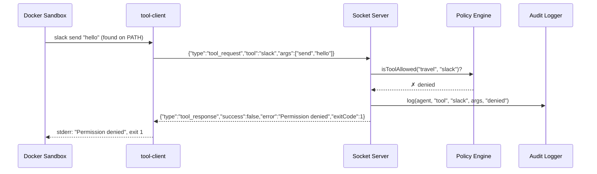

> **Note:** The tool launcher for `slack` would only exist in the sandbox if the agent's config includes `slack` in its tools list. In practice, a denied call means the agent config was changed after container creation, or there's a bug. But the policy engine is the last line of defense regardless.

## 6. Script Toolchain — Agent Writes and Executes Code

The agent can write scripts that chain multiple tool calls. This is the "let agents write code" principle in action.

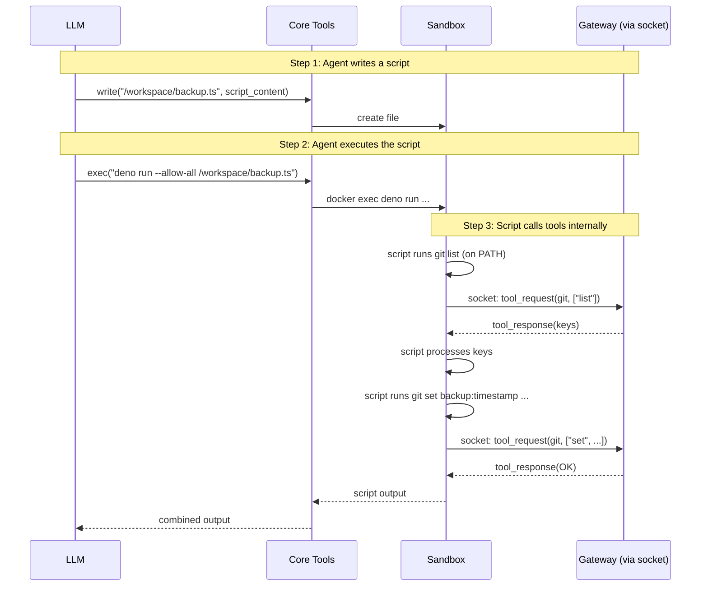

> **`Each plugin tool call inside the script`** still routes through the gateway socket, gets policy-checked, and is audit-logged. There's no way to bypass this from within the sandbox.

## 7. Telegram Streaming Flow

How responses are streamed back to the user in Telegram.

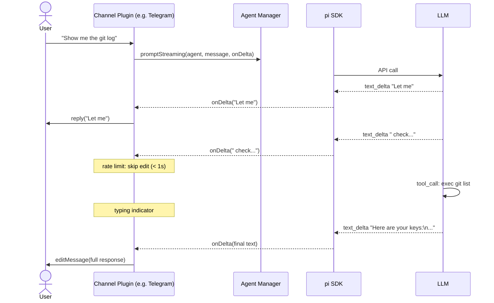

> Telegram edits are rate-limited to ~1/second to avoid API errors. The final message is always sent as a complete edit.

## 8. TUI Channel — Interactive Terminal Session

The TUI runs as a separate process (`beige tui`) and connects to the gateway's HTTP API. The LLM session runs locally in the TUI (full pi experience with editor, streaming, model switching, compaction), but **all LLM calls are proxied through the gateway** and **tool execution is proxied through the gateway**. The TUI never needs API keys.

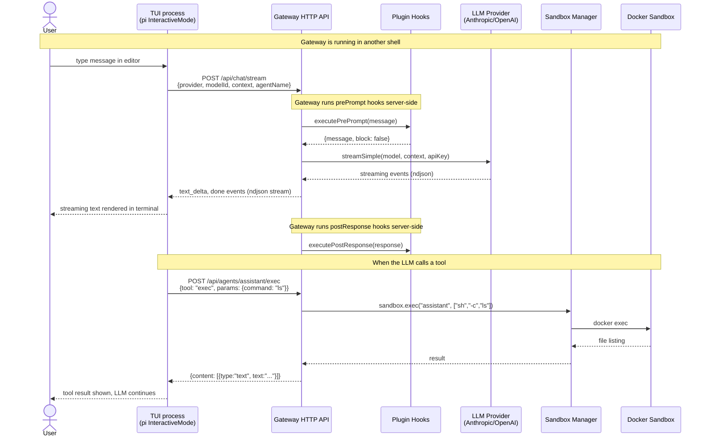

> **Key architecture points:**
> - The TUI process has **no API keys** — the gateway resolves them server-side
> - LLM calls go through `POST /api/chat/stream`, where the gateway handles auth, audit logging, prePrompt/postResponse hooks, and fallback model logic
> - Tool execution goes through `POST /api/agents/:name/exec`, where the gateway handles sandbox routing, audit logging, and policy enforcement
> - If the primary model is rate-limited, the gateway automatically tries fallback models and sends a `model_fallback` event to the TUI

## 9. LLM Proxy — Gateway-Side Fallback and Hooks

When the TUI (or any client) calls `POST /api/chat/stream`, the gateway handles auth, hooks, and fallback logic server-side.

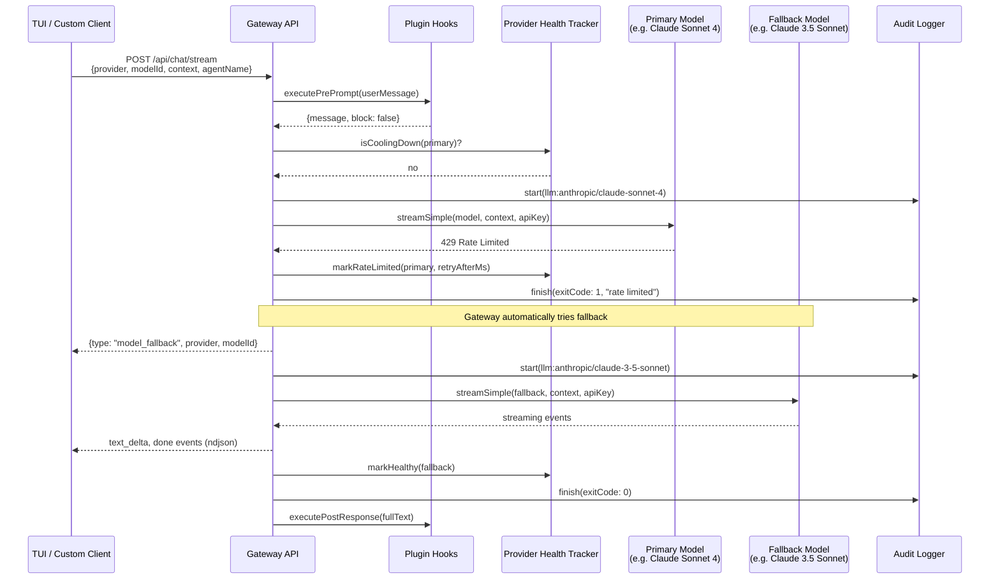

> **Key points:**
> - The client sends a single request — fallback is transparent
> - Each model attempt gets its own audit log entry
> - Rate-limit cooldowns are persisted in `~/.beige/data/provider-health.json` and survive gateway restarts
> - The `model_fallback` event lets the client update its UI if desired

## 10. Session Lifecycle

Sessions persist across gateway restarts. Each conversation gets its own `.jsonl` file.

### Telegram Session Model

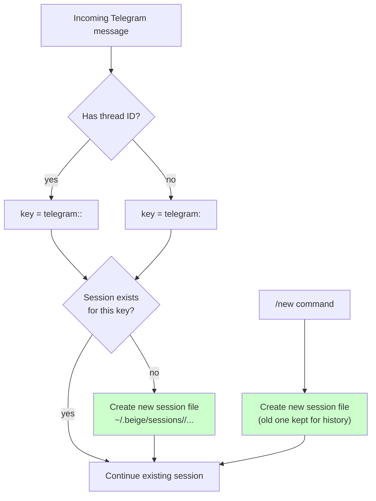

### TUI Session Commands

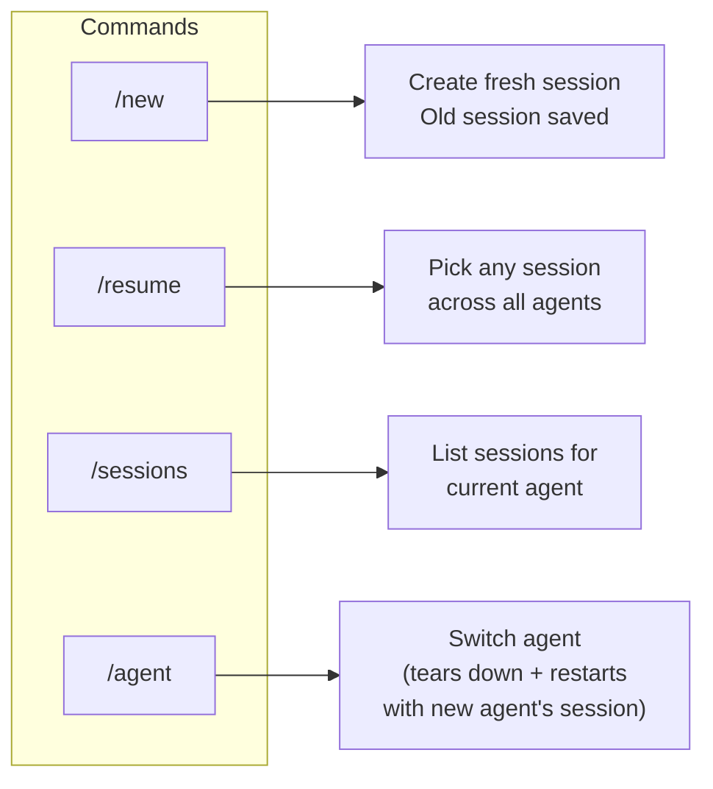

### Session Storage Layout

```text
~/.beige/
├── sessions/
│   ├── session-map.json          # Maps keys → session files
│   ├── assistant/
│   │   ├── 20260305-120000-a1b2c3.jsonl
│   │   └── 20260305-143000-d4e5f6.jsonl
│   └── travel/
│       └── 20260304-091500-g7h8i9.jsonl
```

## 11. Gateway Startup → Ready

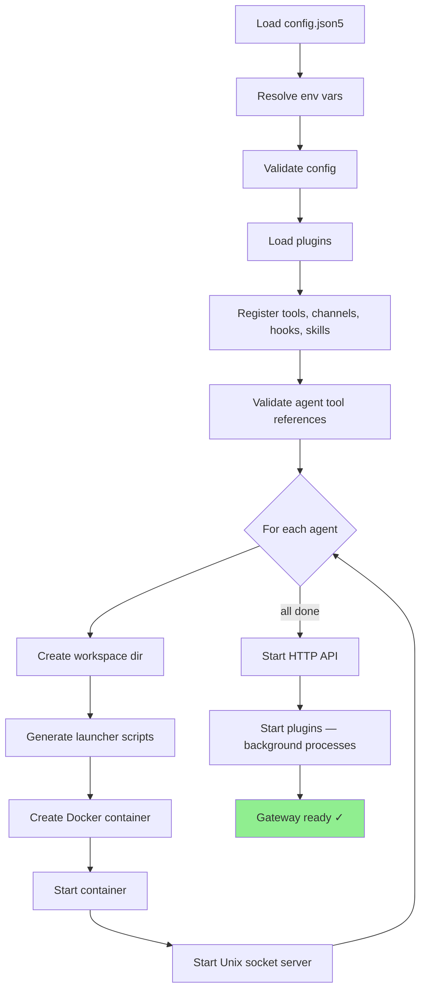