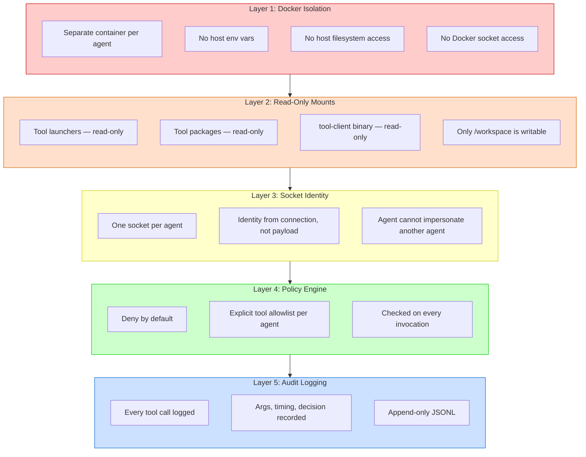
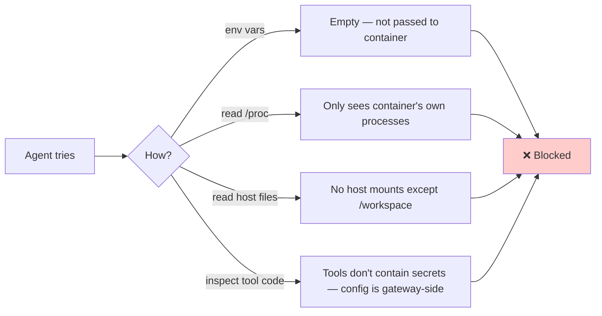
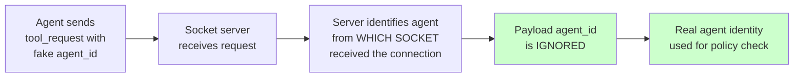
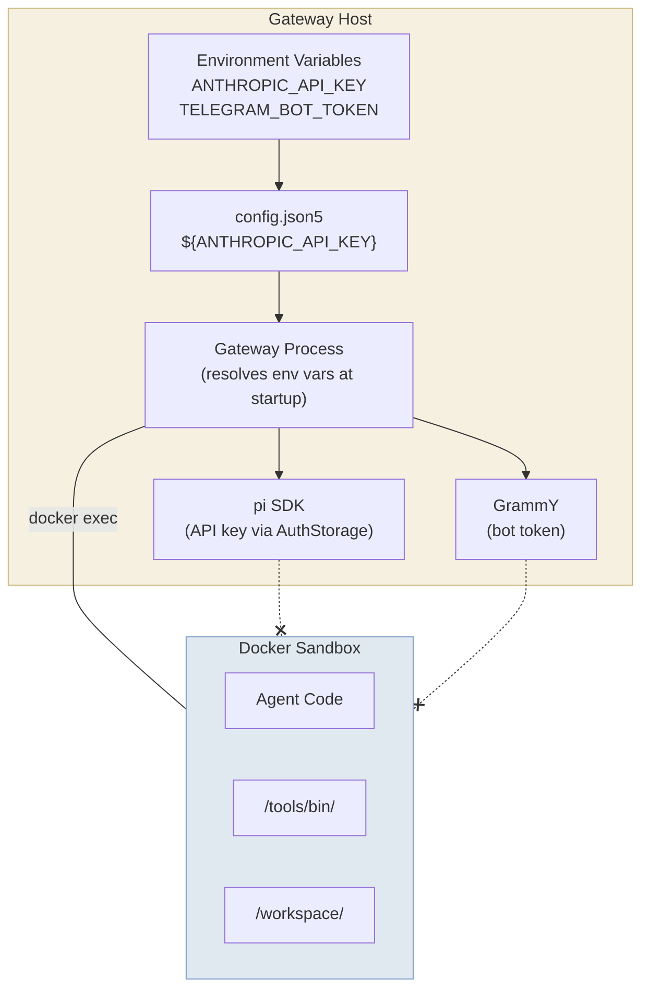

For a beginner-friendly overview, see [Security Overview](/security-overview).

---

Beige is designed with the assumption that **an agent might go rogue**. Every layer is built to contain damage even in the worst case.

## Defense in Depth



## What an Agent CAN Do

| Action | Allowed? | Mechanism |
|--------|----------|-----------|
| Read/write files in `/workspace` | ✅ | Writable bind mount |
| Execute code (any language) | ✅ | Deno, sh, python, etc. in sandbox |
| Call allowed tools via `$PATH` (plugin tools) | ✅ | Launcher → socket → policy → execute |
| Access the internet | ✅ | Container has network access (for now) |
| Read tool documentation | ✅ | Read-only mount at `/tools/packages/` |
| Install packages in sandbox | ✅ | Can run `apt-get`, `npm`, etc. inside container |
| Persist data across sessions | ✅ | `/workspace` is a persistent bind mount |

## What an Agent CANNOT Do

| Action | Prevented By |
|--------|-------------|
| Read gateway env vars / API keys | Docker isolation — no host env passed |
| Access host filesystem | Docker isolation — only explicit bind mounts |
| Modify tool code or launchers | Read-only mounts |
| Use tools not in its allowlist | Policy engine (deny by default) |
| Impersonate another agent | Socket identity (one socket per agent) |
| Access another agent's workspace | Separate containers, separate bind mounts |
| Access the Docker daemon | No Docker socket mount |
| Modify gateway config | Config lives on host, not in sandbox |
| Access audit logs | Logs are on host, not mounted |
| Bypass tool logging | All plugin tool calls route through gateway socket |

## Threat Model

### Threat: Agent tries to read API keys



### Threat: Agent spoofs identity to use another agent's tools



Each agent has its own Unix socket file. The gateway creates one socket per agent and mounts it into the corresponding container. The gateway knows which agent sent a request by which socket server received it — not by any field in the request payload.

### Threat: Agent modifies tool launcher to skip gateway

```mermaid
flowchart LR
    A[Agent tries to<br/>modify /tools/bin/ (read-only)] --> B[Write fails:<br/>read-only mount]
    A2[Agent tries to<br/>create in /tools/bin/ (read-only)] --> B2[Write fails:<br/>read-only mount]
    A3[Agent copies launcher<br/>to /workspace and edits] --> C[Edited copy can still<br/>only connect to<br/>/beige/gateway.sock]
    C --> D[Gateway still enforces<br/>policy on the socket]

    style B fill:#ffcccc
    style B2 fill:#ffcccc
    style D fill:#ccffcc
```

### Threat: Agent exfiltrates data via network

| Mitigation | Status |
|------------|--------|
| Network access logged via audit (exec calls) | ✅ Current |
| Network egress filtering / allowlist | 🔮 Future |
| MITM proxy for all sandbox traffic | 🔮 Future |
| DNS-based filtering | 🔮 Future |

> **Current stance:** Network is open. All `exec curl` / `exec wget` calls are logged as core tool calls. Future phases will add network-level controls.

### Threat: Agent escapes Docker container

This is a Docker-level concern, not Beige-specific. Mitigations:

- Use rootless Docker or Podman (future)
- Don't run containers as root (future hardening)
- Keep Docker and kernel updated
- Don't mount the Docker socket into containers (enforced)

## Secrets Flow



> Secrets exist **only** in the gateway process memory. They are resolved from environment variables at startup, used to configure the pi SDK and plugin channels, and **never** passed to any sandbox container.

## Audit Log

Every tool invocation produces a JSONL audit entry at `~/.beige/logs/audit.jsonl`.

```json
{"ts":"2026-03-05T12:00:00.000Z","agent":"travel","type":"core_tool","tool":"exec","args":["git commit trip:paris March 15"],"decision":"allowed","durationMs":45,"exitCode":0,"outputBytes":23}
{"ts":"2026-03-05T12:00:00.050Z","agent":"travel","type":"tool","tool":"git","args":["set","trip:paris","March 15"],"decision":"allowed","target":"gateway","durationMs":12,"exitCode":0,"outputBytes":2}
```

| Field | Description |
|-------|-------------|
| `ts` | ISO 8601 timestamp |
| `agent` | Agent name (derived from socket identity) |
| `type` | `core_tool` (LLM→gateway) or `tool` (sandbox→gateway socket) |
| `tool` | Tool name |
| `args` | Arguments (future: redaction rules for sensitive values) |
| `decision` | `allowed` or `denied` |
| `target` | Where the tool executes (`gateway` or `sandbox`) |
| `durationMs` | Execution time |
| `exitCode` | Process exit code |
| `outputBytes` | Size of output returned |
| `error` | Error message (if any) |
