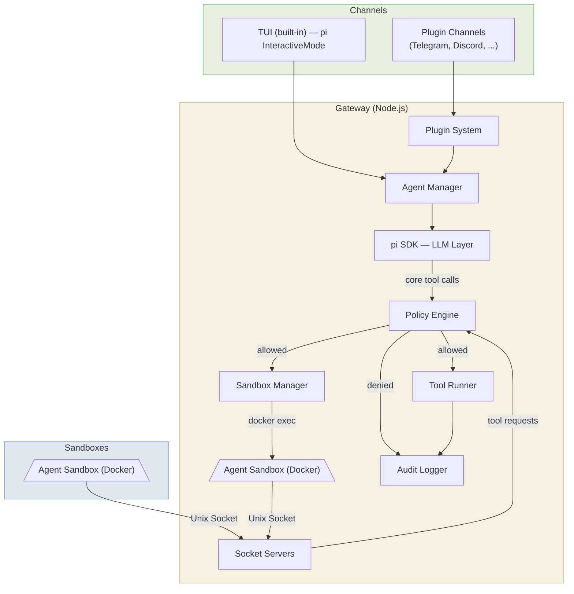
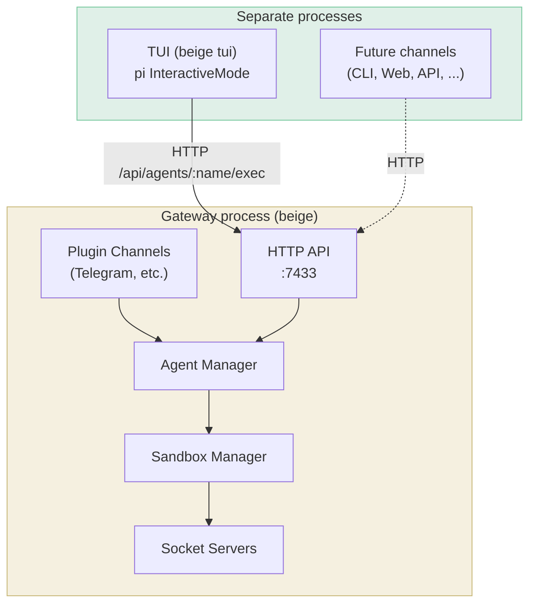
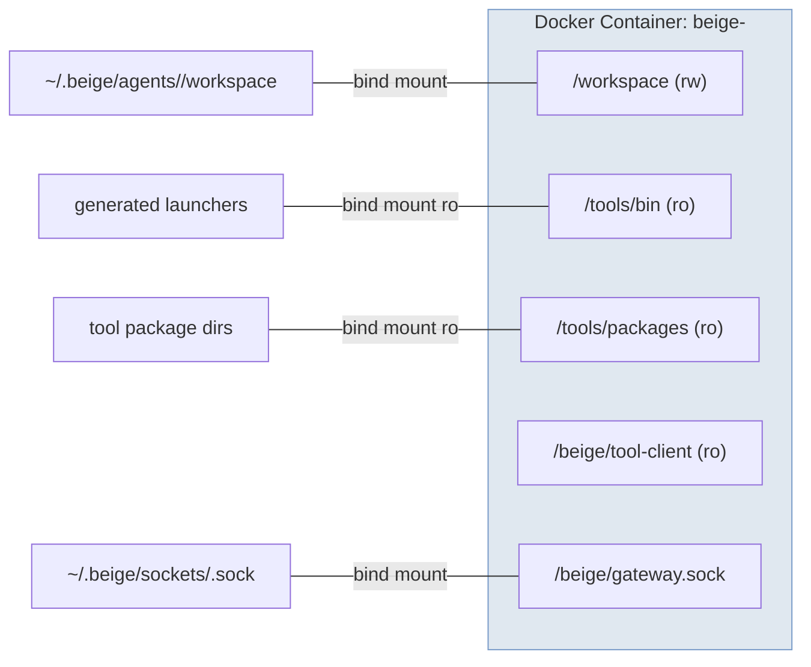
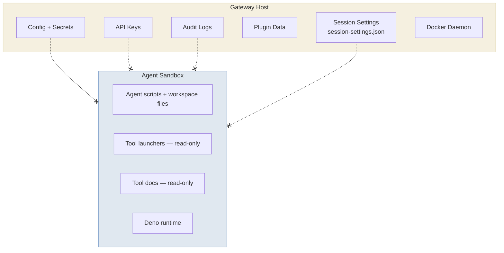
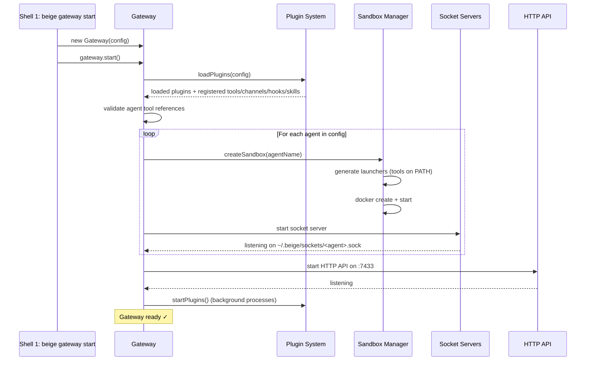
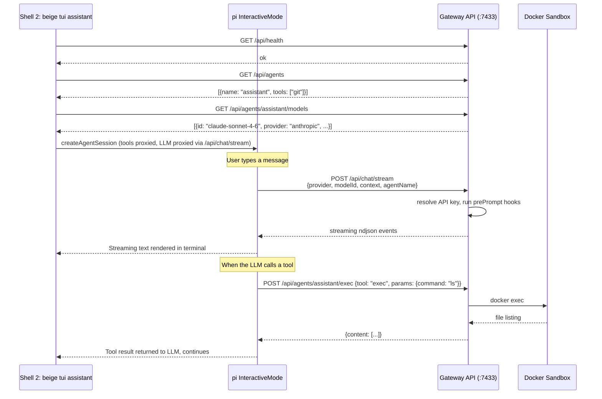
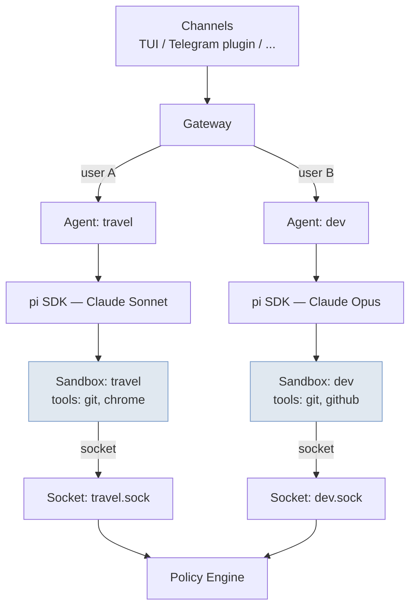

## High-Level Architecture

## Component Responsibilities

### Gateway Process

The gateway is the single host process. It never runs untrusted code — all agent computation happens inside sandboxes.

| Component | Responsibility |
|-----------|---------------|
| **Plugin System** | Loads plugins that provide tools, channels, hooks, and skills |
| **Agent Manager** | Manages pi SDK `AgentSession` instances. Multiple concurrent sessions per agent (one per channel/chat/thread), lazily initialized. Handles model fallback and rate-limit tracking |
| **pi SDK (LLM Layer)** | Makes LLM API calls (Anthropic, OpenAI/ZAI, etc). Owns the 4 core tool definitions |
| **Policy Engine** | Deny-by-default permission checks. Validates agent→tool access before every execution |
| **Audit Logger** | Appends JSONL entries for every tool invocation (core and custom) |
| **Sandbox Manager** | Creates/destroys Docker containers, generates tool launchers, runs `docker exec` |
| **Socket Servers** | One Unix domain socket per agent. Receives tool requests from sandbox launchers |
| **Tool Runner** | Executes gateway-hosted tool handlers (e.g. plugin) |

### Channels

The gateway always runs in its own process. The TUI (the only built-in channel) runs as a separate process. Other channels (Telegram, Discord, etc.) are provided by plugins and run in-process with the gateway.

| Channel | How it connects | Session model | Commands |
|---------|----------------|--------------|----------|
| **TUI** (built-in) | Separate process → gateway HTTP API | Persistent per agent (local pi sessions) | Full pi commands + `/beige-verbose` `/v` |
| **Telegram** (plugin) | In-process (GrammY) | Persistent per chat/thread | `/start` `/new` `/status` `/verbose` `/v` |

The TUI runs pi's `InteractiveMode` locally for the full pi experience (editor, streaming, model switching, compaction). LLM calls are proxied through the gateway's `/api/chat/stream` endpoint — the TUI never needs API keys. Tool execution (read, write, patch, exec) is proxied through the gateway's HTTP API to the sandbox.

### Sandbox (per agent)

Each agent gets its own Docker container. The container is long-lived (`sleep infinity`) and commands are executed via `docker exec`.

### What Lives Where

> ❌ Dashed-X lines = **no access**. Secrets, config, session settings, and logs never enter the sandbox.

## Startup Sequence

Then in a separate shell:

## Multi-Agent Setup

Multiple agents can run simultaneously, each with their own sandbox, socket, tools, and LLM model.

Each agent is fully isolated — different container, different socket, different tool permissions, potentially different LLM provider/model.
