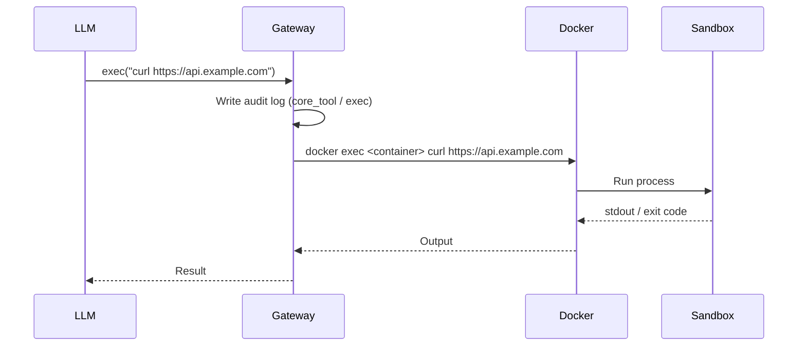
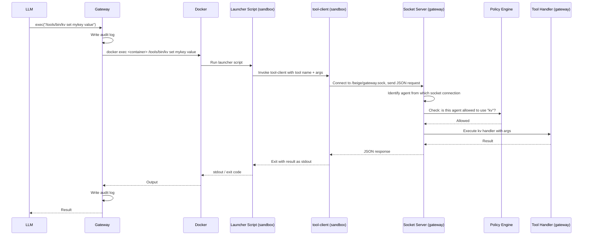

Every action an agent takes — reading a file, running a command, querying a database — is a tool call. The gateway is the single chokepoint through which all of them flow. This page walks through exactly what happens.

---

## Two Kinds of Tool Calls

There are two distinct paths depending on which tool is called:

| Type | Example | Path |
|------|---------|------|
| **Core tool** | `exec curl https://...` | Gateway → `docker exec` → sandbox → stdout back |
| **Custom tool** | `exec /tools/bin/kv get mykey` | Gateway → `docker exec` → launcher → socket → gateway tool handler → socket → stdout back |

Core tools (`read`, `write`, `patch`, `exec`) execute directly via `docker exec`. Custom tools (from tool packages) go through an extra hop: a launcher script inside the sandbox forwards the call back out through a Unix socket to the gateway, where the real handler runs.

---

## Core Tool Call

When the LLM calls `exec curl https://api.example.com`:



1. The LLM emits an `exec` tool call via the pi SDK
2. The gateway writes an audit log entry (`type: "core_tool"`, `tool: "exec"`)
3. The gateway runs `docker exec <container> curl https://api.example.com`
4. The process runs inside the sandbox; stdout and exit code are captured
5. The result is returned to the LLM

The sandbox has no special awareness of the gateway here — it simply runs a process.

---

## Custom Tool Call (Launcher + Socket)

Custom tools like `kv`, `jira`, or any toolkit tool take a different path. When the LLM calls `exec /tools/bin/kv set mykey value`:



**Step by step:**

1. The LLM calls `exec /tools/bin/kv set mykey value`
2. Gateway writes **audit log entry #1** (`type: "core_tool"`, `tool: "exec"`)
3. Gateway runs `docker exec <container> /tools/bin/kv set mykey value`
4. `/tools/bin/kv` is a **launcher script** generated by the gateway at startup — it's a thin shell wrapper that invokes `tool-client`
5. `tool-client` serialises the tool name and args as JSON and connects to `/beige/gateway.sock` — a Unix socket mounted read-write into the container
6. The **socket server** receives the connection; the agent's identity comes from *which socket file* was connected to, not from the payload
7. The **policy engine** checks whether this agent is permitted to invoke `kv`
8. If allowed, the **tool handler** runs on the gateway host (outside the sandbox), executes the kv logic, and returns the result
9. The result travels back through the socket → `tool-client` → launcher → `docker exec` → gateway
10. Gateway writes **audit log entry #2** (`type: "tool"`, `tool: "kv"`)
11. The LLM receives the result

Two audit log entries are always produced for a custom tool call: one for the `exec` that triggered it, one for the tool invocation itself.

---

## Why the Extra Hop?

Custom tool handlers run on the **gateway host**, not inside the sandbox. This is intentional:

- **Access to secrets** — a `jira` tool needs your Jira API key, which never enters the sandbox
- **Access to host resources** — a `kv` tool writes to `~/.beige/kv/`, which the sandbox cannot reach directly
- **Consistent identity enforcement** — the gateway always knows which agent is calling, regardless of what runs inside the container

The sandbox is an isolated execution environment. The gateway is the only entity that can reach the outside world on the agent's behalf.

---

## Policy Enforcement

The policy engine runs on every custom tool call, before the handler executes:

- If the agent's config lists `allowedTools: ["kv", "jira"]`, only those tools are permitted
- All other tool calls are rejected and the rejection is written to the audit log
- Core tools (`read`, `write`, `patch`, `exec`) are always available — they are controlled by the Docker sandbox itself

---

## Audit Log

Every tool call produces at least one audit log entry at `~/.beige/logs/gateway.log`:

```json
{
  "ts": "2025-01-15T10:23:45.123Z",
  "agent": "assistant",
  "type": "tool",
  "tool": "kv",
  "args": { "action": "set", "key": "mykey", "value": "value" },
  "decision": "allow",
  "durationMs": 12,
  "exitCode": 0
}
```

`decision` is either `"allow"` or `"deny"`. Denied calls include an `error` field explaining why.
