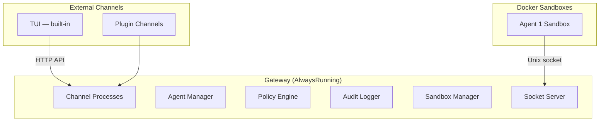

<Frame>
  
</Frame>

Beige is a secure, open-source, sandboxed agent system where AI agents write and execute code inside Docker containers. The gateway orchestrates LLM calls, enforces policies, audit-logs every tool invocation, and routes tool execution.

## Key Features

### What's common to tools like [OpenClaw](https://openclaw.ai/)

- **Plugins** — Extensible plugin system for tools, channels, hooks, and skills
- **Channels** — Interact via TUI (built-in), Telegram (plugin), HTTP API, or custom channels
- **Skills** — Read-only knowledge packages for agent context
- **Policy Enforcement** — Fine-grained control over what agents can do
- **Audit Logging** — Every tool invocation is logged for accountability

### What's _different_

- **[Tools become CLI executables](/why-beige#-true-autonomy)** — Agents write scripts that call tools directly, eliminating round-trips through the LLM
- **Docker Sandboxing — always** — All code execution happens in isolated containers with no escape hatch. Communication to the gateway via sockets.
- **Nothing out-of-the-box** — You configure agents the way YOU want

## Why?
Why build a new agent system if [Openclaw](https://openclaw.ai/), [Picoclaw](https://github.com/sipeed/picoclaw) and others already exist?

What's so different with Beige?

Find out on [Why Beige](/why-beige).

## How It Works

Beige uses a **two-host model**:

**The Gateway** is the orchestrator. It loads plugins, manages Docker containers, routes tool calls, enforces policies (deny by default), logs every action, and serves channels.

**The Sandbox** is where each agent runs — an isolated Docker container with a writable `/workspace`, plugin tools on `$PATH`, read-only skill mounts, and no access to host secrets or environment variables.

## Next Steps

<CardGroup cols={2}>
  <Card icon="download" href="/installation" title="Installation">
    Install Beige, configure your first agent, and run it
  </Card>
  <Card icon="shield" href="/why-beige" title="Why Beige">
    The motivation, inspiration, and use cases behind Beige
  </Card>
  <Card icon="sitemap" href="/gateway" title="The Gateway">
    Deep dive into architecture and the security model
  </Card>
  <Card icon="sliders" href="/agents/configuration" title="Config Reference">
    Complete config.json5 reference — all fields and validation rules
  </Card>
</CardGroup>
