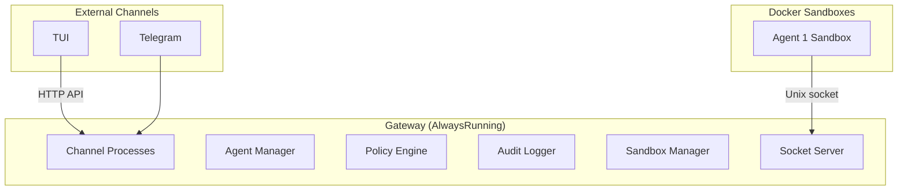

<Frame>
  
</Frame>

Beige is a secure, open-source, sandboxed agent system with a **special twist to tools**.

## Key Features
Here's what's _different_ from other tools like [Openclaw](https://openclaw.ai/):
- **LLM calls (almost) NO TOOLS** — LLMs are good at writing code. LLMs only call `EXEC`
- **Docker Sandboxing - always** — All code execution happens in isolated containers
- **Nothing out-of-the-box** - You configure the agents the way YOU want

In addition to that, there are also common features:
- **Policy Enforcement** — Fine-grained control over what agents can do
- **Audit Logging** — Every tool invocation is logged for accountability
- **Multi-Channel** — Interact via TUI, Telegram, the HTTP API or any custom channel

## Why?
Why build a new agent system if [Openclaw](https://openclaw.ai/), [Picoclaw](https://github.com/sipeed/picoclaw) and others already exist?

What's so different with Beige?

Find out on [Why Beige](/why-beige).

## How It Works

Beige uses a **two-host model**:

**The Gateway** is the orchestrator. It manages Docker containers, routes tool calls, enforces policies (deny by default), logs every action, and connects and listens to external channels.

**The Sandbox** is where each agent run [core capabilities](/tools/core-capabilities) — an isolated Docker container with a writable `/workspace`, read-only tool mounts, and no access to host secrets or environment variables.

## Next Steps

<CardGroup cols={2}>
  <Card icon="download" href="/installation" title="Installation">
    Install Beige, configure your first agent, and run it
  </Card>
  <Card icon="shield" href="/why-beige" title="Why Beige">
    The motivation, inspiration, and use cases behind Beige
  </Card>
  <Card icon="sitemap" href="/gateway" title="The Gateway">
    Deep dive into architecture and the security model
  </Card>
  <Card icon="sliders" href="/agents/configuration" title="Config Reference">
    Complete config.json5 reference — all fields and validation rules
  </Card>
</CardGroup>
