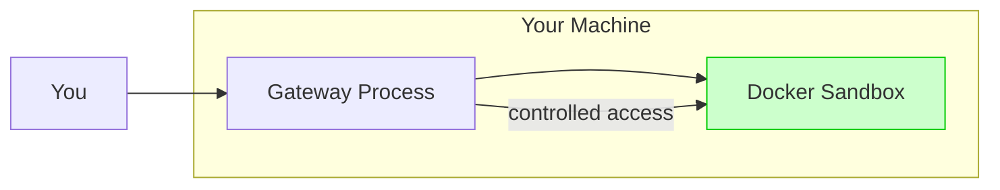
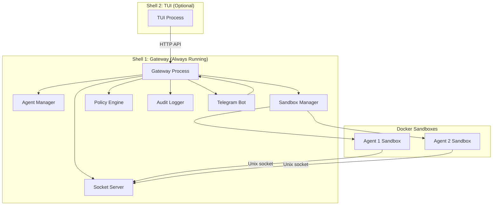

<Frame>
  
</Frame>

Beige is a secure, open-source, sandboxed agent system with a **special twist to tools**. AI agents write and execute code inside Docker containers. The gateway orchestrates LLM calls, enforces policies, audit-logs every tool invocation, and routes tool execution.

**In short:** Your AI assistant runs in a sandbox, not on your machine.

## Key Features

- **Docker Sandboxing** — All code execution happens in isolated containers
- **Policy Enforcement** — Fine-grained control over what agents can do
- **Audit Logging** — Every tool invocation is logged for accountability
- **Multi-Channel** — Interact via TUI, Telegram, or the HTTP API
- **Minimal by Design** — Exactly 4 core tools; everything else composes through `exec`

## How It Works

Beige uses a **two-process model**:

**The Gateway** is the orchestrator. It manages Docker containers, routes tool calls through Unix sockets, enforces policies (deny by default), logs every action, and exposes an HTTP API for external channels.

**The Sandbox** is where each agent runs — an isolated Docker container with a writable `/workspace`, read-only tool mounts, and no access to host secrets or environment variables.

## Next Steps

<CardGroup cols={2}>
  <Card icon="download" href="/installation" title="Installation">
    Install Beige, configure your first agent, and run it
  </Card>
  <Card icon="shield" href="/security-overview" title="Security Overview">
    What agents can and cannot do, and why
  </Card>
  <Card icon="sitemap" href="/gateway" title="The Gateway">
    Deep dive into architecture and the security model
  </Card>
  <Card icon="sliders" href="/agents/configuration" title="Config Reference">
    Complete config.json5 reference — all fields and validation rules
  </Card>
</CardGroup>
