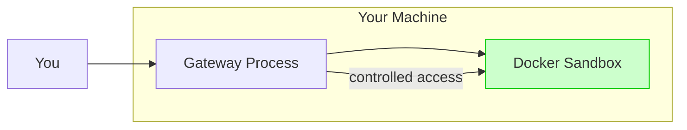
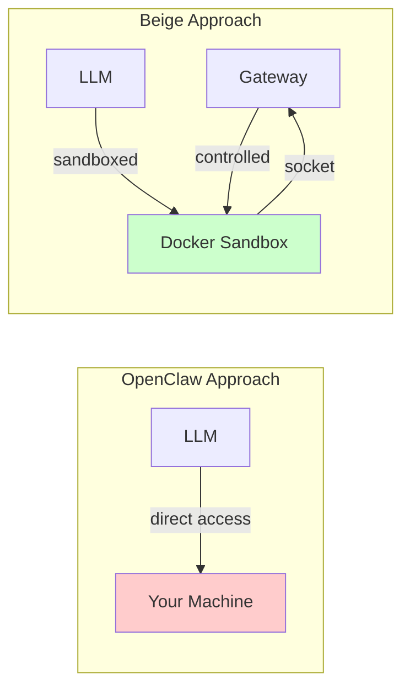
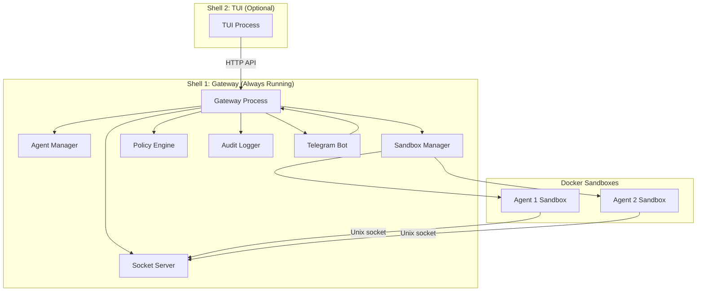
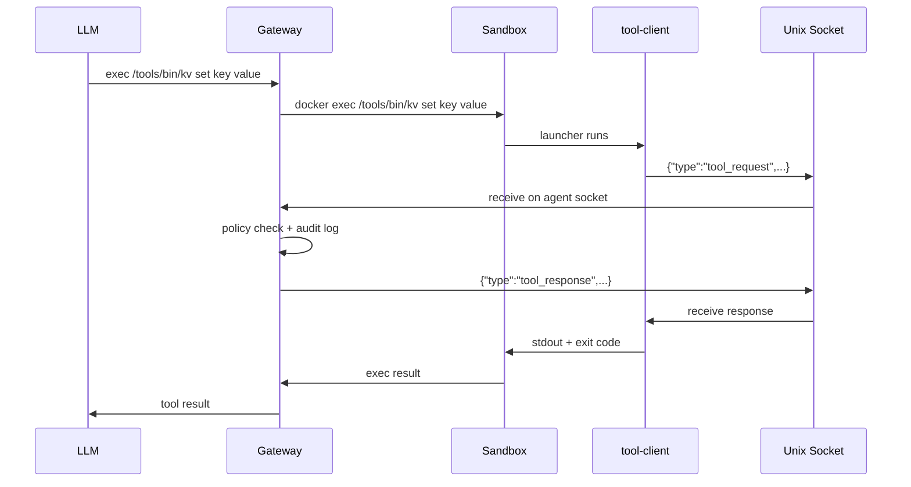
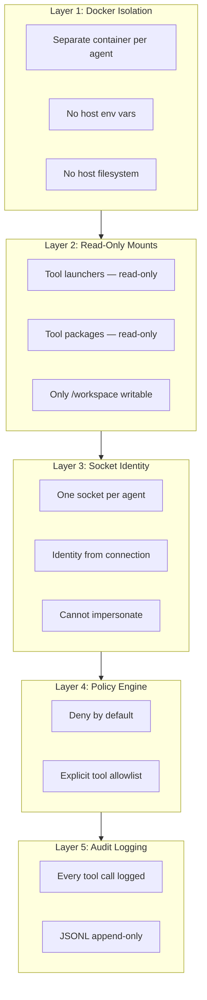

Beige is a secure, open-source, sandboxed agent system where AI agents write and execute code inside Docker containers. The gateway orchestrates LLM calls, enforces policies, audit-logs every tool invocation, and routes tool execution.

**In short:** Your AI assistant runs in a sandbox, not on your machine.



---

## Why We Built This

Existing solutions like [OpenClaw](https://openclaw.ai) are powerful but come with significant trade-offs:

### 🛡️ Sandboxed by Default

**The Problem:** OpenClaw runs directly on your machine. The agent has full access to your filesystem, environment variables, and can execute any command. A rogue or confused agent could delete files, expose API keys, or worse.

**Our Solution:** Every Beige agent runs in its own Docker container. The agent can only access what you explicitly allow. No host environment variables, no direct filesystem access, no escape hatch.



### 🧹 Minimal, Not Cluttered

**The Problem:** Many agent systems expose dozens or hundreds of tools directly to the LLM. This bloats the context window, confuses the model, and makes the system harder to understand.

**Our Solution:** Beige has exactly **4 core tools**: `read`, `write`, `patch`, `exec`. Everything else composes through `exec`. The agent can write scripts that chain tools together, keeping the interface simple while remaining powerful.

### ⚡ True Autonomy

**The Problem:** Traditional tool-calling requires the LLM to invoke tools one at a time. Each result goes back through the model, wasting tokens and time. Complex workflows require hundreds of individual tool calls.

**Our Solution:** Beige agents can write code. Instead of calling a tool 50 times, the agent writes a script that calls the tool 50 times in a loop. The LLM only sees the final result. This is the insight from [Cloudflare's "Code Mode"](https://blog.cloudflare.com/code-mode/) — LLMs are better at writing code to call APIs than calling APIs directly.

```bash
# Traditional approach: 50 tool calls through the LLM
exec /tools/bin/kv get user:1
exec /tools/bin/kv get user:2
exec /tools/bin/kv get user:3
# ... 47 more calls

# Beige approach: 1 script, 1 result
exec deno run - <<'EOF'
const users = [];
for (let i = 1; i <= 50; i++) {
  const result = await exec(`/tools/bin/kv get user:${i}`);
  users.push(JSON.parse(result));
}
console.log(JSON.stringify(users));
EOF
```

---

## Inspiration

Beige builds on ideas from two key blog posts:

### "What if you don't need MCP?"

Mario Zechner's [blog post](https://mariozechner.at/posts/2025-11-02-what-if-you-dont-need-mcp/) argues that MCP (Model Context Protocol) servers often add unnecessary complexity:

- **Tool bloat:** Popular MCP servers expose 20-30 tools, consuming thousands of tokens
- **Not composable:** Results must go through the agent's context
- **Hard to extend:** Modifying an MCP server requires understanding its codebase

**The alternative:** Simple CLI tools with READMEs. The agent reads the README, then uses Bash to invoke the tools. This is more token-efficient, more composable, and easier to customize.

Beige embraces this philosophy: tools are simple executables with documentation mounted into the sandbox.

### "Code Mode: the better way to use MCP"

Cloudflare's [blog post](https://blog.cloudflare.com/code-mode/) shows that LLMs are better at writing code to call tools than calling tools directly:

> LLMs have seen a lot of code. They have not seen a lot of "tool calls".

When an LLM writes code to orchestrate tool calls:
- **Multiple calls** happen in one execution, not through the context
- **Complex logic** (loops, conditionals) is natural in code
- **Results** are combined and filtered before reaching the LLM

Beige gives agents a full TypeScript/Deno runtime in the sandbox, enabling this code-first approach.

---

## Use Cases

Beige is designed for scenarios where you need an AI agent that can actually **do** things, safely:

### Travel Assistant

An agent that researches and plans trips:
- Browses websites (browser automation with residential IP)
- Takes screenshots of booking pages
- Writes `.md` files with itineraries to a shared folder (Google Drive → Obsidian)
- **Sandboxed:** Can't access your browser credentials or personal files

### Browser Automation

An agent that automates web tasks:
- Logs in manually once (agent inherits your logged-in session)
- Navigates, scrapes, fills forms
- **Sandboxed:** Never sees your passwords or session cookies

### CLI Tool Orchestration

An agent that uses command-line tools:
- Drafts messages via `slack-cli`
- Manages GitHub repos via `gh`
- **Sandboxed:** Cannot access CLI config files with API keys

### Development Environment

An agent that writes and runs code:
- Full TypeScript/Node.js/Deno environment
- Runs tests, starts dev servers, makes git commits
- **Sandboxed:** Can't push to protected branches, can't access host SSH keys

### Multi-Agent Collaboration

An agent that spawns sub-agents:
- Orchestrates multiple specialized agents
- Distributes tasks, aggregates results
- **Governed:** Gateway enforces concurrency limits and policies

### Self-Improvement & Experimentation

An agent that iterates on itself:
- Installs packages, tries new tools
- Modifies local configs within its workspace
- **Sandboxed:** Can't break your actual machine

---

## How It Works

Beige uses a **two-process model**:



### The Gateway

The gateway is the orchestrator. It:
- Manages Docker containers (one per agent)
- Routes tool calls through Unix sockets
- Enforces policies (deny by default)
- Logs every action for audit
- Exposes an HTTP API for external channels

### The Sandbox

Each agent runs in its own Docker container:
- **Isolated:** No access to host env vars, secrets, or files
- **Writable workspace:** `/workspace` persists across sessions
- **Read-only tools:** `/tools/bin/` and `/tools/packages/` cannot be modified
- **Socket access:** Only way to call gateway tools

### The Socket Protocol

When an agent wants to use a tool:



---

## Security Overview

Beige assumes **an agent might go rogue**. Every layer is designed to contain damage:



### What an Agent CAN Do

| Action | Allowed? | Mechanism |
|--------|----------|-----------|
| Read/write files in `/workspace` | ✅ | Writable bind mount |
| Execute code (TypeScript, etc.) | ✅ | Deno runtime in sandbox |
| Call allowed tools | ✅ | Launcher → socket → policy → execute |
| Access the internet | ✅ | Container has network access |
| Read tool documentation | ✅ | Read-only mount at `/tools/packages/` |
| Persist data across sessions | ✅ | `/workspace` is persistent |

### What an Agent CANNOT Do

| Action | Prevented By |
|--------|-------------|
| Read gateway env vars / API keys | Docker isolation |
| Access host filesystem | Docker isolation |
| Modify tool code or launchers | Read-only mounts |
| Use tools not in its allowlist | Policy engine |
| Impersonate another agent | Socket identity |
| Access another agent's workspace | Separate containers |
| Access the Docker daemon | No Docker socket mount |
| Bypass tool logging | All calls route through gateway |

For a deeper dive into the security model, see [The Gateway](/gateway#security-model).

---

## Quick Start

Get Beige running in under 5 minutes:

```bash
# Install
npm install -g matthias-hausberger/beige

# Setup (creates ~/.beige/ with default config)
beige setup

# Set your API key
export ANTHROPIC_API_KEY="sk-ant-..."

# Start the gateway
beige gateway start

# In another terminal, start the TUI
beige tui
```

For detailed installation instructions, see [Getting Started](/getting-started).

---

## Minimal Config Example

The smallest config that works:

```json5
{
  llm: {
    providers: {
      anthropic: { apiKey: "${ANTHROPIC_API_KEY}" },
    },
  },
  
  tools: {
    kv: {
      path: "~/.beige/tools/kv",  // Bundled tool
      target: "gateway",
    },
  },
  
  agents: {
    assistant: {
      model: { provider: "anthropic", model: "claude-sonnet-4-20250514" },
      tools: ["kv"],
    },
  },
}
```

For the full config reference, see [Agents](/agents).

---

## Next Steps

- **[Getting Started](/getting-started)** — Install and run Beige
- **[The Gateway](/gateway)** — Deep dive into architecture and security
- **[Agents](/agents)** — Configure providers, models, and tools
- **[Channels & Tools](/channels-and-tools)** — TUI, Telegram, and extensibility
