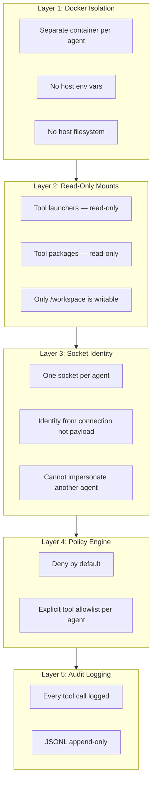

Beige assumes **an agent might go rogue**. Every layer is designed to contain damage even in the worst case.

## What an Agent CAN Do

| Action | Allowed? | Mechanism |
|--------|----------|-----------|
| Read/write files in `/workspace` | ✅ | Writable bind mount |
| Execute code (TypeScript, Deno, etc.) | ✅ | Deno runtime in sandbox |
| Call allowed tools | ✅ | Launcher → socket → policy → execute |
| Access the internet | ✅ | Container has network access |
| Read tool documentation | ✅ | Read-only mount at `/tools/packages/` |
| Persist data across sessions | ✅ | `/workspace` is persistent |

## What an Agent CANNOT Do

| Action | Prevented By |
|--------|-------------|
| Read gateway env vars or API keys | Docker isolation |
| Access host filesystem | Docker isolation |
| Modify tool code or launchers | Read-only mounts |
| Use tools not in its allowlist | Policy engine |
| Impersonate another agent | Socket identity |
| Access another agent's workspace | Separate containers |
| Access the Docker daemon | No Docker socket mount |
| Bypass tool logging | All calls route through gateway |

## The Defense Layers in Detail

### Layer 1: Docker Isolation

Each agent runs in a separate Docker container. The container has no access to:
- Host environment variables (no leaked API keys)
- The host filesystem (no `~/.ssh`, no `~/.aws`)
- Other agents' containers

### Layer 2: Read-Only Mounts

Tool binaries and packages are mounted read-only into the sandbox. Even if an agent tries to modify a tool, it can't. The only writable location is `/workspace`.

### Layer 3: Socket Identity

The gateway assigns one Unix socket per agent. When a tool call arrives, the gateway knows which agent sent it from the connection itself — not from anything in the payload. An agent cannot forge its own identity.

### Layer 4: Policy Engine

The gateway maintains an explicit allowlist of tools per agent. Tool calls for tools not on the list are denied before execution. The default is deny — an agent with an empty `tools` array can call nothing.

### Layer 5: Audit Logging

Every tool invocation is appended to `~/.beige/logs/audit.jsonl` with a timestamp, agent name, tool name, arguments, and result. The log is append-only — agents cannot modify past entries.

---

For an even deeper technical dive, see [The Gateway → Security Model](/gateway/security-model).
