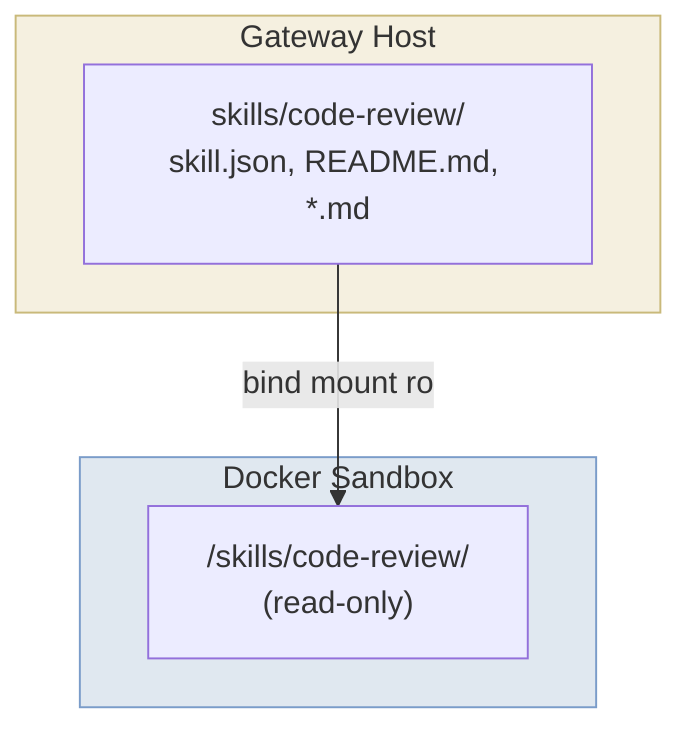

Skills provide specialized knowledge and context to agents. Unlike tools (which are executables), skills are read-only documentation.

## Overview

A skill is a directory with a manifest and documentation:

```
skills/code-review/
├── skill.json            # Manifest: name, description, dependencies
├── README.md             # Main documentation (referenced in system prompt)
├── security-checklist.md # Supporting documentation
└── quality-guide.md      # Supporting documentation
```

### skill.json — Manifest

```json
{
  "name": "code-review",
  "description": "Code review guidelines and checklists",
  "contextFile": "README.md",
  "requires": {
    "tools": ["git"],
    "skills": ["testing"]
  }
}
```

| Field | Required | Description |
|-------|----------|-------------|
| `name` | Yes | Skill identifier (used in config) |
| `description` | Yes | Short description (included in LLM system prompt) |
| `contextFile` | No | Main documentation file (default: `"README.md"`) |
| `requires` | No | Dependencies on tools and other skills |

### README.md — Documentation

The README is the entry point for the skill's documentation. It should provide:
- Overview of what the skill covers
- When to use it
- Links to supporting files for detailed content

The agent reads this file when the skill is relevant:

```
exec cat /skills/code-review/README.md
```

### Supporting Files

Skills can include any number of supporting files that the README references:

```
exec cat /skills/code-review/security-checklist.md
exec cat /skills/code-review/quality-guide.md
```

## How Skills Are Mounted



For each skill in an agent's config, the gateway bind-mounts the skill directory into the sandbox at `/skills/<name>/` (read-only).

## System Prompt Integration

Skills appear in the system prompt after tools:

```markdown
## Available Tools
[tool descriptions]

## Available Skills
Skills provide specialized knowledge. Read their documentation in `/skills/<name>/`.

### code-review
Code review guidelines and checklists — see /skills/code-review/

### testing
Testing best practices and strategies — see /skills/testing/
```

Only the **name** and **description** are included. The agent reads the full documentation on demand.

## Skill Dependencies

Skills can declare dependencies on tools and other skills:

```json
{
  "name": "advanced-testing",
  "description": "Advanced testing strategies",
  "requires": {
    "tools": ["exec"],
    "skills": ["testing-basics"]
  }
}
```

The gateway validates dependencies when creating an agent session:
- Required tools must be in the agent's `tools` list
- Required skills must be in the agent's `skills` list

If dependencies aren't met, the gateway fails to start with a clear error message.

## Configuration

Register skills in `config.json5` and assign them to agents:

```json5
{
  skills: {
    "code-review": { path: "./skills/code-review" },
    "testing": { path: "./skills/testing" },
    "git-workflow": { path: "./skills/git-workflow" },
  },

  agents: {
    assistant: {
      model: { provider: "anthropic", model: "claude-sonnet-4-6" },
      tools: ["git"],
      skills: ["code-review", "testing"],
    },

    reviewer: {
      model: { provider: "anthropic", model: "claude-sonnet-4-6" },
      tools: ["git"],
      skills: ["code-review", "git-workflow"],  // git-workflow requires git tool
    },
  },
}
```

## Writing a New Skill

### Step 1: Create the package

```
skills/my-skill/
├── skill.json
└── README.md
```

### Step 2: Write the manifest

```json
{
  "name": "my-skill",
  "description": "Description that appears in the system prompt"
}
```

### Step 3: Write the documentation

```markdown
# My Skill

Brief introduction to the skill.

## When to Use

Describe scenarios where this skill is relevant.

## Guidelines

- Guideline 1
- Guideline 2

## Further Reading

See [detailed-guide.md](./detailed-guide.md) for more information.
```

### Step 4: Add supporting files (optional)

```markdown
# Detailed Guide

In-depth content that the agent reads when needed.
```

### Step 5: Register in config

```json5
{
  skills: {
    "my-skill": { path: "./skills/my-skill" },
  },
  agents: {
    assistant: {
      // ...
      skills: ["my-skill"],
    },
  },
}
```

### Step 6: Restart the gateway

```bash
beige gateway restart
```

The agent now has access to the skill and can read its documentation when relevant.

## Example: Code Review Skill

See `skills/code-review/` in this repository for a complete example with:
- `skill.json` — Manifest with description
- `README.md` — Main documentation with overview and links
- `security-checklist.md` — Detailed security checklist
- `quality-guide.md` — Code quality guidelines

## Skills vs Tools

| Aspect | Tools | Skills |
|--------|-------|--------|
| Purpose | Do things | Know things |
| Type | Executables | Documentation |
| Location | On `$PATH` (via `/tools/bin/`) | `/skills/<name>/` |
| Invocation | `exec <name> [args]` | `exec cat /skills/<name>/README.md` |
| System prompt | Description + commands | Name + description only |
| Best for | Actions, integrations | Knowledge, guidelines, patterns |

Use **tools** when the agent needs to perform actions. Use **skills** when the agent needs domain expertise.
