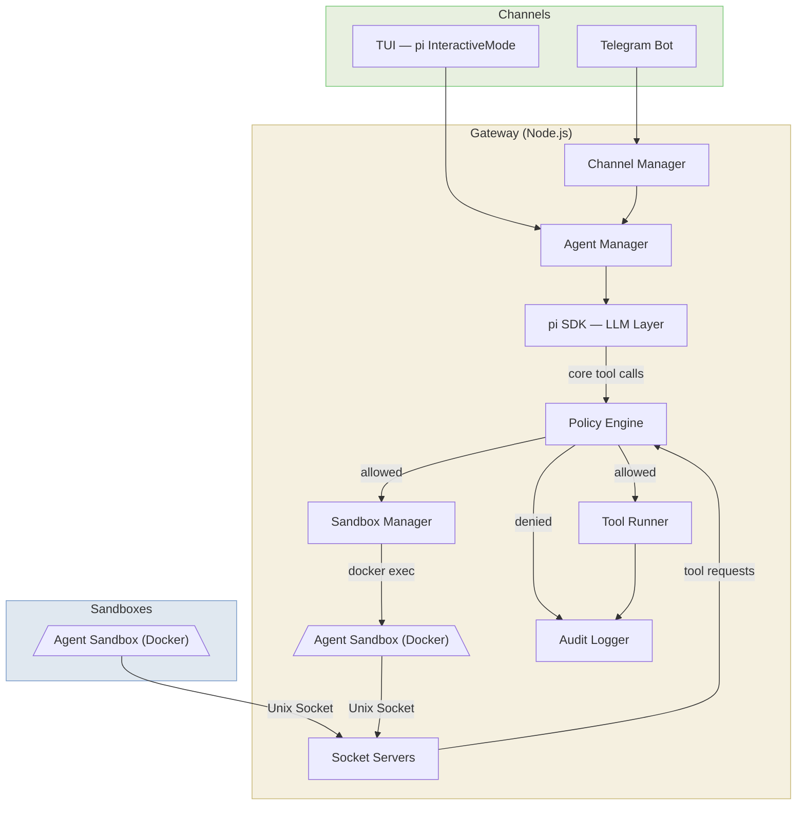
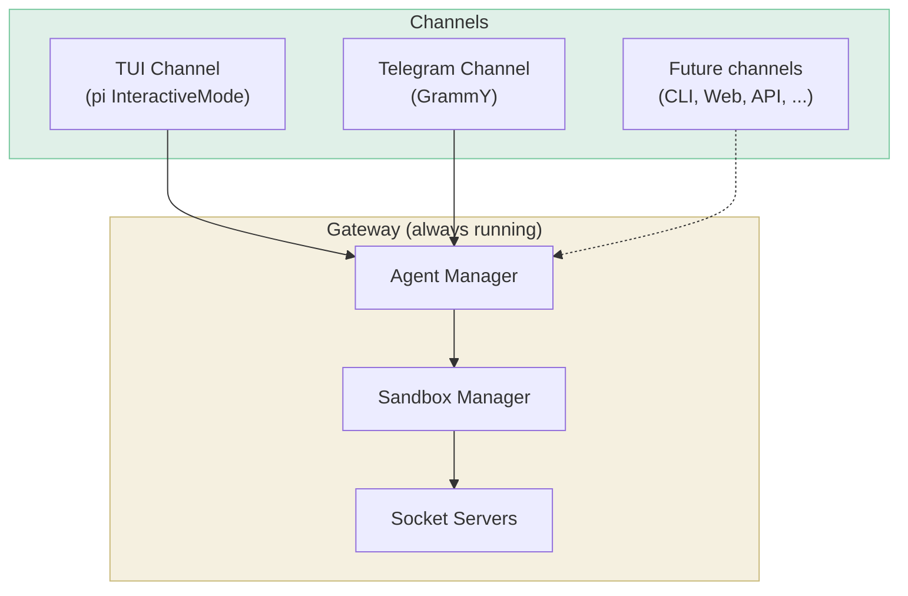
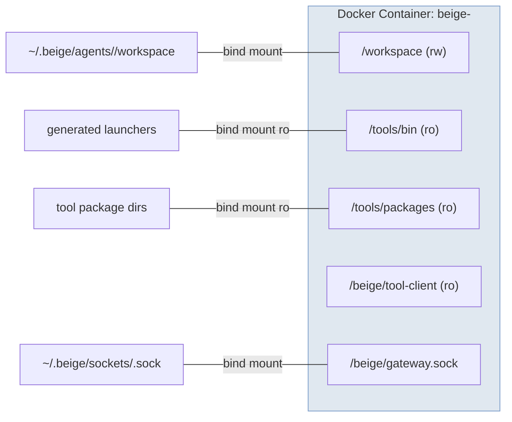
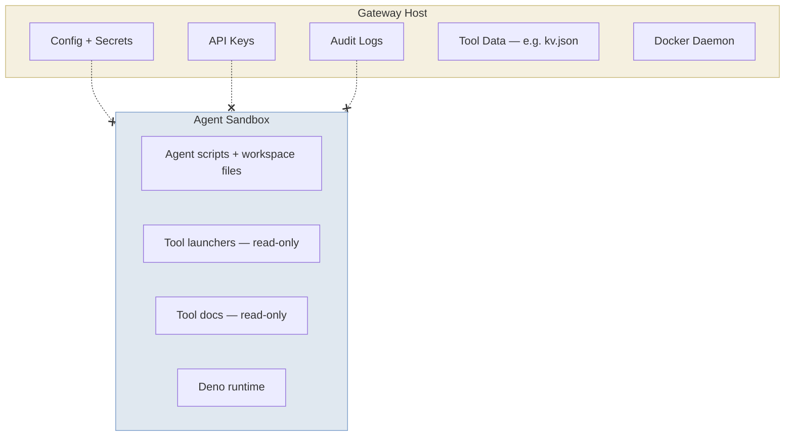
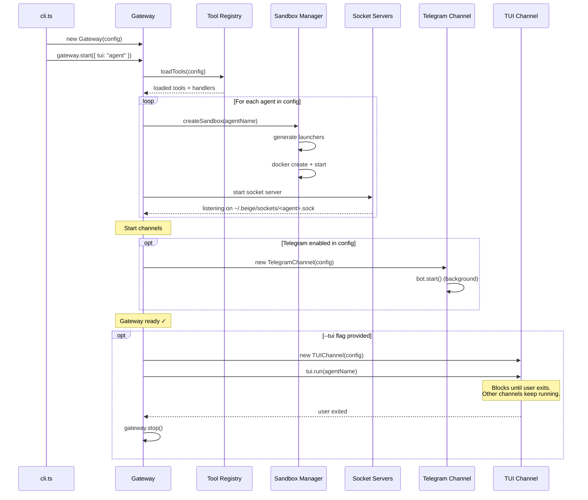
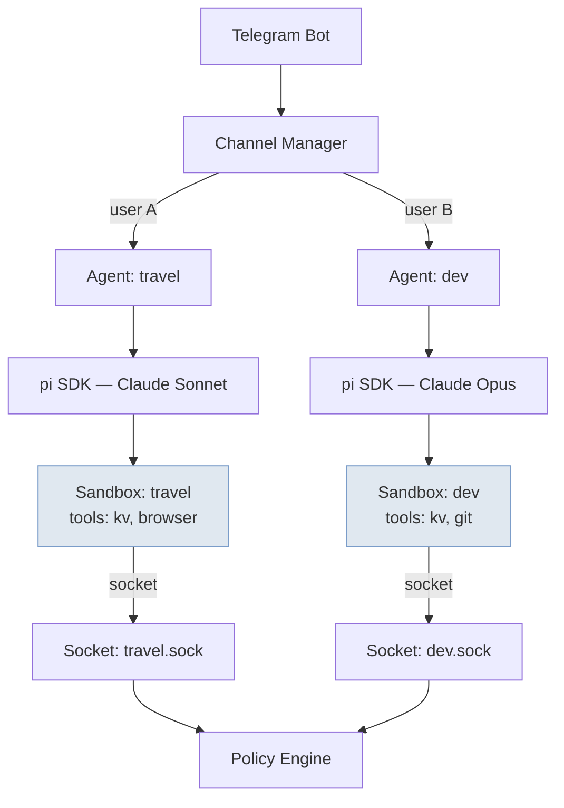

# System Overview

## High-Level Architecture

## Component Responsibilities

### Gateway Process

The gateway is the single host process. It never runs untrusted code — all agent computation happens inside sandboxes.

| Component | Responsibility |
|-----------|---------------|
| **Channel Manager** | Receives user messages from Telegram (or future CLI), routes to the correct agent |
| **Agent Manager** | Manages pi SDK `AgentSession` instances. One session per agent, lazily initialized |
| **pi SDK (LLM Layer)** | Makes LLM API calls (Anthropic, OpenAI/ZAI, etc). Owns the 4 core tool definitions |
| **Policy Engine** | Deny-by-default permission checks. Validates agent→tool access before every execution |
| **Audit Logger** | Appends JSONL entries for every tool invocation (core and custom) |
| **Sandbox Manager** | Creates/destroys Docker containers, generates tool launchers, runs `docker exec` |
| **Socket Servers** | One Unix domain socket per agent. Receives tool requests from sandbox launchers |
| **Tool Runner** | Executes gateway-hosted tool handlers (e.g. KV store) |

### Channels

The gateway always runs. Channels are interfaces plugged into it. Multiple channels can be active simultaneously.

| Channel | Enabled via | Session model | Commands |
|---------|-------------|--------------|----------|
| **TUI** | `beige --tui [agent]` | Persistent per agent, auto-continues most recent | `/new` `/resume` `/sessions` `/agent` |
| **Telegram** | `channels.telegram.enabled: true` in config | Persistent per chat/thread | `/new` `/status` |

The TUI channel reuses [pi's `InteractiveMode`](https://github.com/badlogic/pi-mono) — you get the full pi experience (editor, streaming, history, model switching) with beige's sandboxed core tools underneath. When TUI is active, other channels (e.g. Telegram) continue running in the background.

### Sandbox (per agent)

Each agent gets its own Docker container. The container is long-lived (`sleep infinity`) and commands are executed via `docker exec`.

### What Lives Where

> ❌ Dashed-X lines = **no access**. Secrets, config, and logs never enter the sandbox.

## Startup Sequence

## Multi-Agent Setup

Multiple agents can run simultaneously, each with their own sandbox, socket, tools, and LLM model.

Each agent is fully isolated — different container, different socket, different tool permissions, potentially different LLM provider/model.
