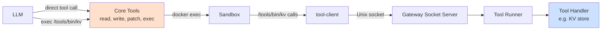
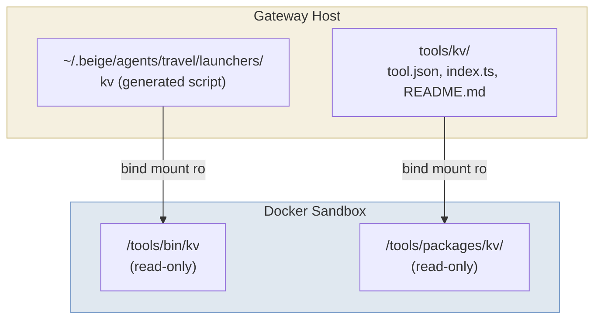
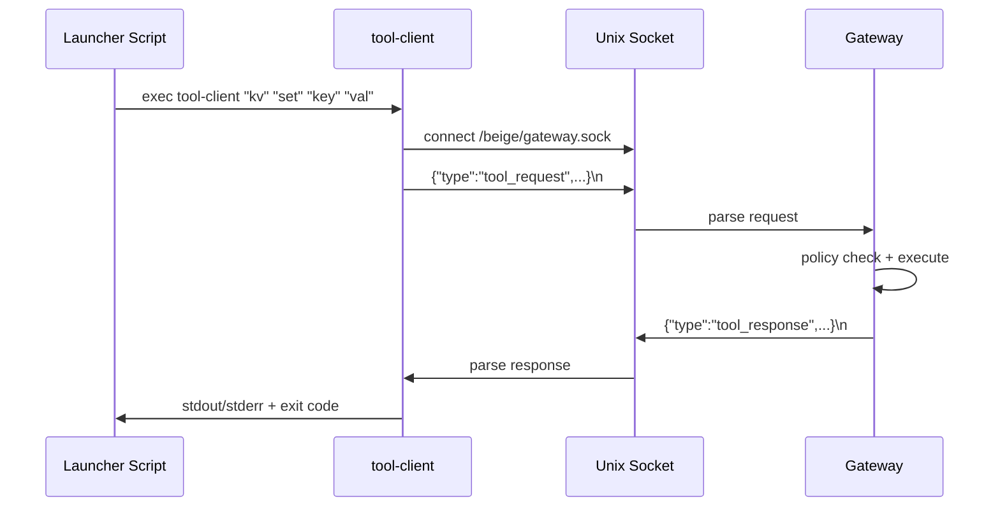

> **导航 / Navigation:** [← Back to Channels & Tools](/channels-and-tools) | [Introduction](/introduction)

For a beginner-friendly guide, see [Channels & Tools → Tools](/channels-and-tools#part-b-tools).

---

# Tools

## Terminology

Beige has two kinds of tools:

| Term | What it is | Who calls it |
|------|-----------|-------------|
| **Core Tools** | `read`, `write`, `patch`, `exec` — built into the gateway as pi SDK `ToolDefinition` objects | The LLM calls these directly |
| **Tools** | Executables in `/tools/bin/` inside the sandbox, backed by tool packages | The LLM calls these via `exec /tools/bin/<name>` |



## Core Tools

The LLM has exactly 4 tools available. Everything else composes through `exec`.

### `read`

Read a file from the sandbox filesystem.

| Parameter | Type | Description |
|-----------|------|-------------|
| `path` | string | File path (relative to `/workspace` or absolute) |
| `offset` | number? | Start line (1-indexed) |
| `limit` | number? | Max lines to read |

### `write`

Write content to a file. Creates parent directories.

| Parameter | Type | Description |
|-----------|------|-------------|
| `path` | string | File path |
| `content` | string | File content |

### `patch`

Find-and-replace in a file. The `oldText` must match exactly.

| Parameter | Type | Description |
|-----------|------|-------------|
| `path` | string | File path |
| `oldText` | string | Exact text to find |
| `newText` | string | Replacement text |

### `exec`

Execute any command in the sandbox.

| Parameter | Type | Description |
|-----------|------|-------------|
| `command` | string | Shell command (runs via `sh -c`) |
| `timeout` | number? | Timeout in seconds (default: 120) |

## Tool Packages

A tool package is a directory with a standard structure:

```
tools/my-tool/
├── tool.json     # Manifest: name, description, commands, target
├── index.ts      # Handler implementation (for gateway-targeted tools)
└── README.md     # Documentation (mounted into sandbox for agent context)
```

### tool.json — Manifest

```json
{
  "name": "kv",
  "description": "Simple key-value store. Store and retrieve values by key.",
  "commands": [
    "set <key> <value>  — Store a value",
    "get <key>          — Retrieve a value",
    "del <key>          — Delete a key",
    "list               — List all keys"
  ],
  "target": "gateway",
  "config": {
    "allowCommands": {
      "type": "string | string[]",
      "description": "Whitelist of permitted commands. Defaults to all commands when absent.",
      "example": ["get", "list"]
    },
    "denyCommands": {
      "type": "string | string[]",
      "description": "Blacklist of blocked commands. Takes precedence over allowCommands.",
      "example": ["del"]
    }
  }
}
```

| Field | Description |
|-------|-------------|
| `name` | Tool identifier (used in config, launchers, audit logs) |
| `description` | Short description (included in LLM system prompt) |
| `commands` | List of available commands with usage hints |
| `target` | Where the handler executes: `"gateway"` or `"sandbox"` |

### index.ts — Handler

For **gateway-targeted** tools, `index.ts` exports a `createHandler` factory.

Tool packages are **self-contained** — they must not import from the beige source tree
(`../../src/…`), because when installed via `npm install -g` the tool lives at
`~/.beige/tools/<name>/` with no source tree nearby. Define the `ToolHandler` type
inline (it is a pure type with no runtime footprint):

```typescript
// Tool packages must be self-contained — no imports from the beige source tree.
type ToolHandler = (
  args: string[],
  config?: Record<string, unknown>
) => Promise<{ output: string; exitCode: number }>;

export function createHandler(config: Record<string, unknown>): ToolHandler {
  // config comes from the tool's config in config.json5
  return async (args: string[]) => {
    const command = args[0];
    // ... handle command ...
    return {
      output: "result string",
      exitCode: 0,
    };
  };
}
```

### README.md — Documentation

The README is mounted into the sandbox at `/tools/packages/<name>/README.md`. The agent can read this to learn how to use the tool:

```
exec cat /tools/packages/kv/README.md
```

## How Tools Are Mounted



## Tool Launchers

For each tool in an agent's config, the gateway generates a launcher script at
`~/.beige/agents/<agent>/launchers/<tool>`:

```bash
#!/bin/sh
# Auto-generated by beige gateway. DO NOT EDIT.
# Tool: kv | Target: gateway
exec /beige/tool-client "kv" "$@"
```

The launcher calls `/beige/tool-client`, a Deno script mounted read-only that:

1. Connects to `/beige/gateway.sock` (Unix domain socket)
2. Sends a JSON request: `{"type":"tool_request","tool":"kv","args":[...]}`
3. Reads the JSON response
4. Prints output to stdout (or error to stderr)
5. Exits with the response's exit code

## Socket Protocol

Tool launchers communicate with the gateway over a simple newline-delimited JSON protocol.

### Request (sandbox → gateway)

```json
{"type":"tool_request","tool":"kv","args":["set","mykey","myvalue"]}
```

### Response (gateway → sandbox)

Success:
```json
{"type":"tool_response","success":true,"output":"OK: mykey = myvalue","exitCode":0}
```

Error:
```json
{"type":"tool_response","success":false,"error":"Permission denied: tool 'kv' not allowed","exitCode":1}
```



## Writing a New Tool

### Step 1: Create the package

```
tools/my-tool/
├── tool.json
├── index.ts
└── README.md
```

### Step 2: Implement the handler

```typescript
// tools/my-tool/index.ts
// Define ToolHandler inline — no imports from the beige source tree.
type ToolHandler = (
  args: string[],
  config?: Record<string, unknown>
) => Promise<{ output: string; exitCode: number }>;

export function createHandler(config: Record<string, unknown>): ToolHandler {
  return async (args) => {
    const [command, ...rest] = args;

    switch (command) {
      case "hello":
        return { output: `Hello, ${rest[0] || "world"}!`, exitCode: 0 };
      default:
        return { output: `Unknown command: ${command}`, exitCode: 1 };
    }
  };
}
```

### Step 3: Register in config

```json5
{
  tools: {
    "my-tool": {
      path: "./tools/my-tool",
      target: "gateway",
      config: {
        // optional tool-specific config
      },
    },
  },
  agents: {
    assistant: {
      // ...
      tools: ["my-tool"],   // grant access
    },
  },
}
```

### Step 4: Restart the gateway

The gateway will:
1. Load the tool manifest and handler
2. Generate a launcher for each agent that has access
3. Mount the launcher and package into the sandbox
4. Register the handler in the tool runner

The agent can now use it:
```
exec /tools/bin/my-tool hello Claude
→ Hello, Claude!
```

## Tool Execution Targets

| Target | Where it runs | Current support |
|--------|--------------|----------------|
| `gateway` | On the gateway host process | ✅ Phase 1 |
| `sandbox` | Inside the agent's Docker container | 🔮 Future |
| `node` | On a remote machine | 🔮 Future |

For **gateway-targeted** tools, the handler runs in the gateway Node.js process. This is appropriate for tools that need access to host resources (databases, APIs, filesystem) that shouldn't be exposed to the sandbox.

For **sandbox-targeted** tools (future), the handler would run inside the container. The gateway still logs and policy-checks the call, but execution happens in the sandbox. This is useful for tools that need the sandbox environment (e.g., code analysis tools that need the workspace context).

## Config-Driven Tool Variants

The same tool package can be registered multiple times with different names, targets, and configs:

```json5
{
  tools: {
    "slack": {
      path: "./tools/slack",
      target: "gateway",
      config: { allowedChannels: ["#general"] },
    },
    "slack-unrestricted": {
      path: "./tools/slack",
      target: "gateway",
      config: { allowedChannels: ["*"] },
    },
  },
   agents: {
     intern: { tools: ["slack"] },            // restricted
     admin:  { tools: ["slack-unrestricted"] }, // full access
   },
 }
```

## Distributing Tools via Toolkits

For sharing tools with others or managing multiple related tools, use **toolkits**. A toolkit is a collection of tools that can be installed from npm, GitHub, or local paths.

```bash
# Install a toolkit
beige install @myorg/communication-tools

# List installed toolkits
beige toolkit list
```

See [Toolkits](./toolkits.md) for the full guide on creating, publishing, and installing toolkits.
