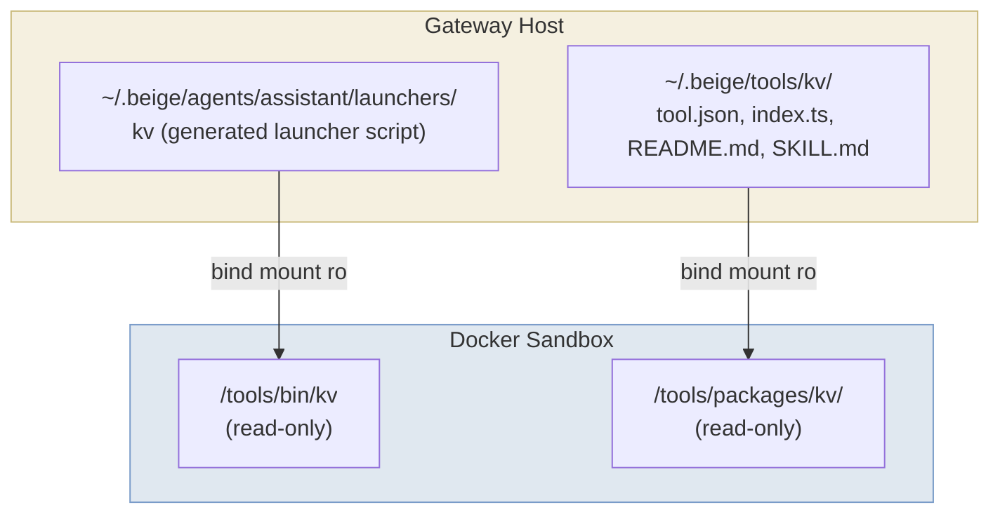

A tool is a directory containing a manifest (`tool.json`), a handler (`index.ts`), and documentation (`README.md` + `SKILL.md`). The gateway mounts each tool into the sandbox as an executable at `/tools/bin/<name>`.

---

## Tool Package Structure

```
tools/my-tool/
├── tool.json      # Manifest: name, description, commands, target
├── package.json   # Optional: npm dependencies for this tool
├── index.ts       # Handler (runs on the gateway host)
├── README.md      # User/developer documentation (overview, config, prerequisites)
└── SKILL.md       # Agent usage guide (examples, workflows, calling conventions)
```

---

## tool.json — Manifest

```json
{
  "name": "kv",
  "description": "Simple key-value store. Store and retrieve values by key.",
  "commands": [
    "set <key> <value>  — Store a value",
    "get <key>          — Retrieve a value",
    "del <key>          — Delete a key",
    "list               — List all keys"
  ],
  "target": "gateway"
}
```

| Field | Required | Description |
|-------|----------|-------------|
| `name` | Yes | Tool identifier — used in config, launchers, audit logs, and `/tools/bin/` |
| `description` | Yes | Short description included in the LLM's system prompt |
| `commands` | No | Usage hints shown in the system prompt |
| `target` | Yes | Where the handler executes: `"gateway"` (current) or `"sandbox"` (future) |

---

## package.json — Dependencies (Optional)

If your tool needs npm packages at runtime, add a `package.json` with `dependencies`:

```json
{
  "name": "@beige/tool-my-tool",
  "dependencies": {
    "some-api-client": "1.2.3"
  }
}
```

When the tool is installed via `beige tools install`, the installer runs `npm install --production` in the tool's directory automatically.

<Note>
Pin exact versions (e.g., `"1.2.3"` not `"^1.2.3"`) for reproducibility, since lockfiles are not included when tools are installed.
</Note>

---

## index.ts — Handler

Tool handlers export a `createHandler` factory function. The handler receives an array of string arguments and returns `{ output, exitCode }`.

**Important:** Tool packages must be **self-contained** — do not import from the Beige source tree. Installed tools live at `~/.beige/tools/<name>/` with no source tree available.

```typescript
// tools/my-tool/index.ts

// Define types inline — no imports from beige source
type ToolHandler = (
  args: string[],
  config?: Record<string, unknown>
) => Promise<{ output: string; exitCode: number }>;

export function createHandler(config: Record<string, unknown>): ToolHandler {
  return async (args: string[]) => {
    const [command, ...rest] = args;

    switch (command) {
      case "greet":
        return { output: `Hello, ${rest[0] || "world"}!`, exitCode: 0 };

      case "shout":
        return { output: rest.join(" ").toUpperCase(), exitCode: 0 };

      default:
        return {
          output: `Unknown command: ${command}\nUsage: my-tool greet [name] | my-tool shout [text]`,
          exitCode: 1,
        };
    }
  };
}
```

The `config` parameter receives the `config` field from `config.json5` for this tool.

---

## Documentation: README.md + SKILL.md

Each tool has two documentation files, both mounted into the sandbox at `/tools/packages/<name>/`:

| File | Audience | Purpose |
|---|---|---|
| `README.md` | **Users / developers** | Overview, prerequisites, configuration reference, setup instructions |
| `SKILL.md` | **AI agents** | Usage examples, calling conventions, practical workflows |

Agents are instructed to read `SKILL.md` first when using a tool:

```bash
exec cat /tools/packages/kv/SKILL.md    # agent reads this first
exec cat /tools/packages/kv/README.md   # for config details if needed
```

### SKILL.md — Agent Usage Guide

Write `SKILL.md` as a practical guide for the agent:

```markdown
# My Tool — Usage Guide

## Calling Convention

\`\`\`sh
/tools/bin/my-tool <command> [args...]
\`\`\`

## Examples

\`\`\`sh
# Greet someone
/tools/bin/my-tool greet Alice

# Shout text in uppercase
/tools/bin/my-tool shout hello world
\`\`\`
```

### skills/ subfolder (optional)

For complex tools with many capabilities, create a `skills/` subfolder with specialized guides:

```
tools/chrome/
├── SKILL.md              # Main agent guide, references skills/
└── skills/
    ├── navigation.md
    ├── interaction.md
    └── network-performance.md
```

---

## How Tools Are Mounted



The gateway generates a launcher script for each tool:

```bash
#!/bin/sh
# Auto-generated by beige gateway. DO NOT EDIT.
# Tool: kv | Target: gateway
exec /beige/tool-client "kv" "$@"
```

---

## Step-by-Step: Creating a New Tool

### Step 1: Create the package

```
tools/my-tool/
├── tool.json
├── index.ts
├── README.md
└── SKILL.md
```

### Step 2: Write the manifest

```json
{
  "name": "my-tool",
  "description": "Does something useful",
  "commands": ["run <input>  — Process input"],
  "target": "gateway"
}
```

### Step 3: Implement the handler

```typescript
type ToolHandler = (
  args: string[],
  config?: Record<string, unknown>
) => Promise<{ output: string; exitCode: number }>;

export function createHandler(config: Record<string, unknown>): ToolHandler {
  return async (args: string[]) => {
    const [command, ...rest] = args;
    if (command === "run") {
      return { output: `Processed: ${rest.join(" ")}`, exitCode: 0 };
    }
    return { output: `Unknown command: ${command}`, exitCode: 1 };
  };
}
```

### Step 4: Register in config

For local development, register the tool with an explicit path:

```json5
{
  tools: {
    "my-tool": {
      path: "./tools/my-tool",
      target: "gateway",
    },
  },
  agents: {
    assistant: {
      tools: ["my-tool"],
    },
  },
}
```

Or install it and skip the path/target:

```bash
beige tools install ./tools/my-tool
```

```json5
{
  agents: {
    assistant: {
      tools: ["my-tool"],
    },
  },
}
```

### Step 5: Restart the gateway

```bash
beige gateway restart
```

---

## Execution Targets

| Target | Where it runs | Status |
|--------|--------------|--------|
| `gateway` | On the gateway host process | ✅ Available |
| `sandbox` | Inside the agent's Docker container | 🔮 Future |

Gateway-targeted tools are appropriate for anything requiring host resources: databases, external APIs, host filesystem access that the agent shouldn't reach directly.
