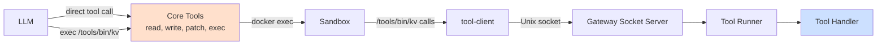
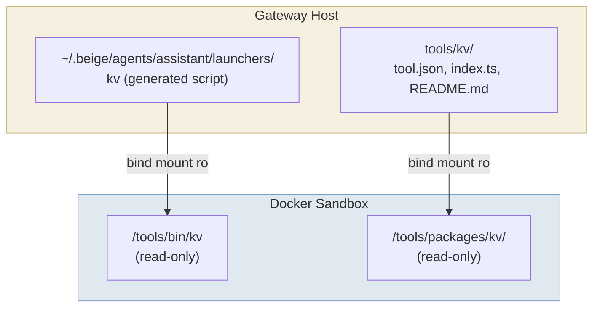

Every agent has exactly 4 core tools. Everything else composes through `exec`.



## The 4 Core Tools

### `read`

Read a file from the sandbox filesystem.

| Parameter | Type | Description |
|-----------|------|-------------|
| `path` | string | File path (relative to `/workspace` or absolute) |
| `offset` | number? | Start line (1-indexed) |
| `limit` | number? | Max lines to read |

### `write`

Write content to a file. Creates parent directories automatically.

| Parameter | Type | Description |
|-----------|------|-------------|
| `path` | string | File path |
| `content` | string | File content |

### `patch`

Find-and-replace in a file. The `oldText` must match exactly.

| Parameter | Type | Description |
|-----------|------|-------------|
| `path` | string | File path |
| `oldText` | string | Exact text to find |
| `newText` | string | Replacement text |

### `exec`

Execute any command in the sandbox.

| Parameter | Type | Description |
|-----------|------|-------------|
| `command` | string | Shell command (runs via `sh -c`) |
| `timeout` | number? | Timeout in seconds (default: 120) |

---

## Tool Package Format

A tool package is a directory with a standard structure:

```
tools/my-tool/
├── tool.json     # Manifest: name, description, commands, target
├── index.ts      # Handler implementation (gateway-targeted tools)
└── README.md     # Documentation (mounted into sandbox for agent context)
```

### tool.json — Manifest

```json
{
  "name": "kv",
  "description": "Simple key-value store. Store and retrieve values by key.",
  "commands": [
    "set <key> <value>  — Store a value",
    "get <key>          — Retrieve a value",
    "del <key>          — Delete a key",
    "list               — List all keys"
  ],
  "target": "gateway"
}
```

| Field | Description |
|-------|-------------|
| `name` | Tool identifier (used in config, launchers, audit logs) |
| `description` | Short description (included in LLM system prompt) |
| `commands` | List of available commands with usage hints |
| `target` | Where the handler executes: `"gateway"` or `"sandbox"` |

### index.ts — Handler

For **gateway-targeted** tools, `index.ts` exports a `createHandler` factory. Tool packages must be **self-contained** — no imports from the beige source tree, since installed tools live at `~/.beige/tools/<name>/` with no source tree nearby:

```typescript
// Define ToolHandler inline — no imports from the beige source tree.
type ToolHandler = (
  args: string[],
  config?: Record<string, unknown>
) => Promise<{ output: string; exitCode: number }>;

export function createHandler(config: Record<string, unknown>): ToolHandler {
  return async (args: string[]) => {
    const command = args[0];
    switch (command) {
      case "hello":
        return { output: `Hello, ${args[1] || "world"}!`, exitCode: 0 };
      default:
        return { output: `Unknown command: ${command}`, exitCode: 1 };
    }
  };
}
```

### README.md — Documentation

The README is mounted into the sandbox at `/tools/packages/<name>/README.md`. The agent reads it to learn how to use the tool:

```
exec cat /tools/packages/kv/README.md
```

---

## How Tools Are Mounted



For each tool in an agent's config, the gateway generates a launcher script:

```bash
#!/bin/sh
# Auto-generated by beige gateway. DO NOT EDIT.
# Tool: kv | Target: gateway
exec /beige/tool-client "kv" "$@"
```

The launcher calls `tool-client`, a Deno script that connects to the gateway Unix socket, sends a JSON request, and returns the result.

---

## Socket Protocol

Tool launchers communicate with the gateway over newline-delimited JSON.

**Request (sandbox → gateway):**
```json
{"type":"tool_request","tool":"kv","args":["set","mykey","myvalue"]}
```

**Response (gateway → sandbox):**
```json
{"type":"tool_response","success":true,"output":"OK: mykey = myvalue","exitCode":0}
```

---

## Writing a New Tool

### Step 1: Create the package

```
tools/my-tool/
├── tool.json
├── index.ts
└── README.md
```

### Step 2: Implement the handler

```typescript
// tools/my-tool/index.ts
type ToolHandler = (
  args: string[],
  config?: Record<string, unknown>
) => Promise<{ output: string; exitCode: number }>;

export function createHandler(config: Record<string, unknown>): ToolHandler {
  return async (args) => {
    const [command, ...rest] = args;
    switch (command) {
      case "run":
        return { output: `Running with: ${rest.join(" ")}`, exitCode: 0 };
      default:
        return { output: `Unknown command: ${command}`, exitCode: 1 };
    }
  };
}
```

### Step 3: Register in config

```json5
{
  tools: {
    "my-tool": {
      path: "./tools/my-tool",
      target: "gateway",
    },
  },
  agents: {
    assistant: {
      tools: ["my-tool"],
    },
  },
}
```

### Step 4: Restart the gateway

```bash
beige gateway restart
```

The agent can now invoke it:

```
exec /tools/bin/my-tool run hello
→ Running with: hello
```

---

## Config-Driven Tool Variants

The same tool package can be registered multiple times with different configs:

```json5
{
  tools: {
    "slack": {
      path: "./tools/slack",
      target: "gateway",
      config: { allowedChannels: ["#general"] },
    },
    "slack-unrestricted": {
      path: "./tools/slack",
      target: "gateway",
      config: { allowedChannels: ["*"] },
    },
  },
  agents: {
    intern: { tools: ["slack"] },
    admin:  { tools: ["slack-unrestricted"] },
  },
}
```

---

## Execution Targets

| Target | Where it runs | Status |
|--------|--------------|--------|
| `gateway` | On the gateway host process | ✅ Available |
| `sandbox` | Inside the agent's Docker container | 🔮 Future |

Gateway-targeted tools are appropriate for tools that need access to host resources (databases, APIs, filesystem) that shouldn't be exposed to the sandbox directly.
