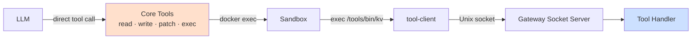
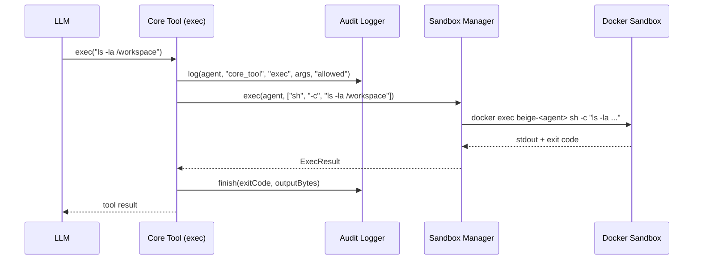

Every agent has exactly 4 core tools. These are the only tools the LLM calls directly — everything else composes through `exec`.



---

## The 4 Core Tools

### `read`

Read a file from the sandbox filesystem.

| Parameter | Type | Description |
|-----------|------|-------------|
| `path` | string | File path (relative to `/workspace` or absolute) |
| `offset` | number? | Start line, 1-indexed |
| `limit` | number? | Maximum lines to read |

### `write`

Write content to a file. Parent directories are created automatically.

| Parameter | Type | Description |
|-----------|------|-------------|
| `path` | string | File path |
| `content` | string | File content |

### `patch`

Find-and-replace in a file. The `oldText` must match exactly — the call fails if no exact match is found.

| Parameter | Type | Description |
|-----------|------|-------------|
| `path` | string | File path |
| `oldText` | string | Exact text to find |
| `newText` | string | Replacement text |

### `exec`

Execute any command inside the sandbox. The command runs via `sh -c`, so shell syntax works.

| Parameter | Type | Description |
|-----------|------|-------------|
| `command` | string | Shell command |
| `timeout` | number? | Timeout in seconds (default: 120) |

---

## How Core Tools Execute

Core tools run via `docker exec` — the gateway never executes commands on the host directly. All computation happens inside the sandbox container.



---

## Calling Tools via `exec`

Custom tools (like `kv`) are not called directly by the LLM — they're invoked via `exec`:

```bash
exec /tools/bin/kv set mykey myvalue
exec /tools/bin/kv get mykey
exec cat /tools/packages/kv/README.md   # read tool documentation
```

When the sandbox runs `/tools/bin/kv`, it triggers the double-routing flow:

1. The launcher script calls `tool-client` inside the container
2. `tool-client` connects to the Unix socket at `/beige/gateway.sock`
3. The gateway socket server receives the request, identifies the agent, policy-checks, and executes the handler
4. The result flows back through the socket to stdout in the sandbox
5. `docker exec` returns the output to the LLM

This means **every** custom tool call is policy-checked and audit-logged, regardless of how it's invoked inside the sandbox.

---

## Socket Protocol

Tool launchers communicate with the gateway over newline-delimited JSON on the Unix socket.

**Request (sandbox → gateway):**
```json
{"type":"tool_request","tool":"kv","args":["set","mykey","myvalue"]}
```

**Response (gateway → sandbox) — success:**
```json
{"type":"tool_response","success":true,"output":"OK: mykey = myvalue","exitCode":0}
```

**Response — error:**
```json
{"type":"tool_response","success":false,"error":"Permission denied: tool 'kv' not in allowlist","exitCode":1}
```

---

## Writing Your Own Tools

To create a custom tool, see [Build Your Own Tools](/tools/ecosystem/build-tools).
