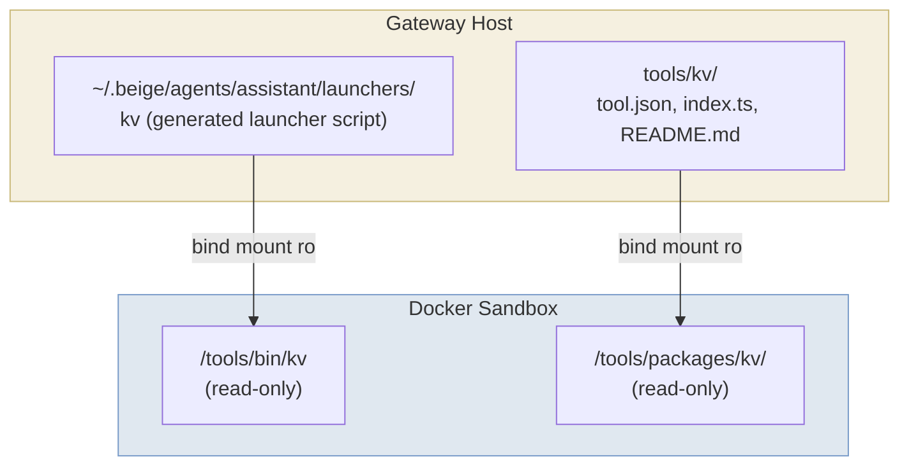

A tool is a directory containing a manifest (`tool.json`), a handler (`index.ts`), and documentation (`README.md`). The gateway mounts each tool into the sandbox as an executable at `/tools/bin/<name>`.

---

## Tool Package Structure

```
tools/my-tool/
├── tool.json     # Manifest: name, description, commands, target
├── index.ts      # Handler (runs on the gateway host)
└── README.md     # Documentation (mounted into sandbox for agent context)
```

---

## tool.json — Manifest

```json
{
  "name": "kv",
  "description": "Simple key-value store. Store and retrieve values by key.",
  "commands": [
    "set <key> <value>  — Store a value",
    "get <key>          — Retrieve a value",
    "del <key>          — Delete a key",
    "list               — List all keys"
  ],
  "target": "gateway"
}
```

| Field | Description |
|-------|-------------|
| `name` | Tool identifier — used in config, launchers, audit logs, and `/tools/bin/` |
| `description` | Short description included in the LLM's system prompt |
| `commands` | Usage hints shown in the system prompt |
| `target` | Where the handler executes: `"gateway"` (current) or `"sandbox"` (future) |

---

## index.ts — Handler

Tool handlers export a `createHandler` factory function. The handler receives an array of string arguments (the command and its arguments) and returns `{ output, exitCode }`.

**Important:** Tool packages must be **self-contained** — do not import from the Beige source tree. Installed tools live at `~/.beige/tools/<name>/` with no source tree available.

```typescript
// tools/my-tool/index.ts

// Define types inline — no imports from beige source
type ToolHandler = (
  args: string[],
  config?: Record<string, unknown>
) => Promise<{ output: string; exitCode: number }>;

export function createHandler(config: Record<string, unknown>): ToolHandler {
  return async (args: string[]) => {
    const [command, ...rest] = args;

    switch (command) {
      case "greet":
        return { output: `Hello, ${rest[0] || "world"}!`, exitCode: 0 };

      case "shout":
        return { output: rest.join(" ").toUpperCase(), exitCode: 0 };

      default:
        return {
          output: `Unknown command: ${command}\nUsage: my-tool greet [name] | my-tool shout [text]`,
          exitCode: 1,
        };
    }
  };
}
```

The `config` parameter receives the `config` field from `config.json5` for this tool (useful for per-tool settings like API keys or allowed channels).

---

## README.md — Documentation

The README is mounted into the sandbox at `/tools/packages/<name>/README.md`. The agent reads it to learn how to use the tool:

```bash
exec cat /tools/packages/kv/README.md
```

Write your README as if explaining the tool to the LLM:

```markdown
# My Tool

Brief description of what this tool does.

## Commands

- `my-tool greet [name]` — Greet someone
- `my-tool shout [text]` — Shout the text in uppercase

## Examples

\`\`\`
exec /tools/bin/my-tool greet Alice
→ Hello, Alice!

exec /tools/bin/my-tool shout hello world
→ HELLO WORLD
\`\`\`
```

---

## How Tools Are Mounted



The gateway generates a launcher script for each tool:

```bash
#!/bin/sh
# Auto-generated by beige gateway. DO NOT EDIT.
# Tool: kv | Target: gateway
exec /beige/tool-client "kv" "$@"
```

The launcher calls `tool-client` — a Deno script baked into the sandbox image that connects to the gateway Unix socket, sends the request, and returns the result.

---

## Step-by-Step: Creating a New Tool

### Step 1: Create the package

```
tools/my-tool/
├── tool.json
├── index.ts
└── README.md
```

### Step 2: Write the manifest

```json
{
  "name": "my-tool",
  "description": "Does something useful",
  "commands": ["run <input>  — Process input"],
  "target": "gateway"
}
```

### Step 3: Implement the handler

```typescript
// tools/my-tool/index.ts
type ToolHandler = (
  args: string[],
  config?: Record<string, unknown>
) => Promise<{ output: string; exitCode: number }>;

export function createHandler(config: Record<string, unknown>): ToolHandler {
  return async (args: string[]) => {
    const [command, ...rest] = args;
    if (command === "run") {
      return { output: `Processed: ${rest.join(" ")}`, exitCode: 0 };
    }
    return { output: `Unknown command: ${command}`, exitCode: 1 };
  };
}
```

### Step 4: Register in config

```json5
{
  tools: {
    "my-tool": {
      path: "./tools/my-tool",
      target: "gateway",
    },
  },
  agents: {
    assistant: {
      model: { provider: "anthropic", model: "claude-sonnet-4-6" },
      tools: ["my-tool"],
    },
  },
}
```

### Step 5: Restart the gateway

```bash
beige gateway restart
```

The agent can now invoke the tool:

```
exec cat /tools/packages/my-tool/README.md   # learn how to use it
exec /tools/bin/my-tool run hello
→ Processed: hello
```

---

## Config-Driven Tool Variants

The same tool package can be registered multiple times with different configs:

```json5
{
  tools: {
    "slack": {
      path: "./tools/slack",
      target: "gateway",
      config: { allowedChannels: ["#general"] },
    },
    "slack-admin": {
      path: "./tools/slack",
      target: "gateway",
      config: { allowedChannels: ["*"] },
    },
  },
  agents: {
    intern: { tools: ["slack"] },
    admin:  { tools: ["slack-admin"] },
  },
}
```

The `config` object is passed to `createHandler(config)` at startup.

---

## Execution Targets

| Target | Where it runs | Status |
|--------|--------------|--------|
| `gateway` | On the gateway host process | ✅ Available |
| `sandbox` | Inside the agent's Docker container | 🔮 Future |

Gateway-targeted tools are appropriate for anything requiring host resources: databases, external APIs, host filesystem access that the agent shouldn't reach directly.

---

## Distributing Tools as Toolkits

To package and share multiple tools together, see [Toolkits](/tools/toolkits).
