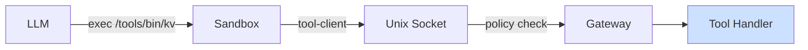

Tools are executables mounted into the agent's sandbox that give it the ability to act on the world — read files, store data, call APIs, send messages, and more.



## Two Kinds of Tools

| | Core Tools | Custom Tools |
|---|---|---|
| **What** | `read`, `write`, `patch`, `exec` — built into the gateway | Executables at `/tools/bin/<name>` backed by tool packages |
| **How LLM calls them** | Direct tool call | `exec /tools/bin/<name> <args>` |
| **Defined by** | Beige itself | You, or installed from a toolkit |

## In This Section

<CardGroup cols={2}>
  <Card icon="wrench" href="/tools/core-capabilities" title="Core Capabilities">
    The 4 built-in tools every agent has: read, write, patch, exec
  </Card>
  <Card icon="box" href="/tools/toolkits" title="Toolkits">
    Install, create, and share collections of tools
  </Card>
</CardGroup>

## How Tools Are Mounted

For each tool in an agent's config, the gateway generates a launcher script and bind-mounts it read-only into the sandbox:

```
~/.beige/agents/<agent>/launchers/kv   →   /tools/bin/kv      (read-only)
tools/kv/                              →   /tools/packages/kv/ (read-only)
```

The agent calls a tool by running the launcher. The launcher connects to the gateway over a Unix socket, the gateway policy-checks and executes the handler, and returns the result.

## Adding a Tool to an Agent

Register the tool in `config.json5` and add it to the agent's `tools` list:

```json5
{
  tools: {
    kv: {
      path: "~/.beige/tools/kv",
      target: "gateway",
    },
  },
  agents: {
    assistant: {
      tools: ["kv"],
    },
  },
}
```

The agent can then read the tool's docs and invoke it:

```
exec cat /tools/packages/kv/README.md
exec /tools/bin/kv set mykey myvalue
exec /tools/bin/kv get mykey
```
