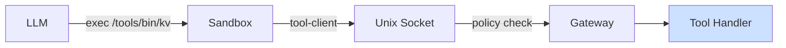

Tools are executables mounted into the agent's sandbox that give it the ability to act on the world — read files, store data, call APIs, send messages, and more.



## Two Kinds of Tools

| | Core Tools | Custom Tools |
|---|---|---|
| **What** | `read`, `write`, `patch`, `exec` — built into the gateway | Executables at `/tools/bin/<name>` backed by tool packages |
| **How LLM calls them** | Direct tool call | `exec /tools/bin/<name> <args>` |
| **Defined by** | Beige itself | You, or installed via `beige tools install` |

## In This Section

<CardGroup cols={2}>
  <Card icon="wrench" href="/tools/core-capabilities" title="Core Capabilities">
    The 4 built-in tools every agent has: read, write, patch, exec
  </Card>
  <Card icon="download" href="/tools/installing" title="Installing Tools">
    Install tools from npm, GitHub, or local directories
  </Card>
  <Card icon="pen-to-square" href="/tools/building/index" title="Build Your Own Tools">
    Create custom tools: handler format, manifest, documentation
  </Card>
  <Card icon="list" href="/tools/managing" title="Managing Tools">
    List, update, remove, and configure installed tools
  </Card>
</CardGroup>

## How Tools Are Mounted

For each tool in an agent's config, the gateway generates a launcher script and bind-mounts it read-only into the sandbox:

```
~/.beige/tools/kv/                         →   /tools/packages/kv/ (read-only)
~/.beige/agents/<agent>/launchers/kv       →   /tools/bin/kv       (read-only)
```

The agent calls a tool by running the launcher. The launcher connects to the gateway over a Unix socket, the gateway policy-checks and executes the handler, and returns the result.

The tool's entire directory is mounted read-only at `/tools/packages/<name>/`, giving agents access to both `SKILL.md` (usage guide) and `README.md` (reference documentation).

## Adding a Tool to an Agent

Install a tool, then add it to the agent's `tools` list in `config.json5`:

```json5
{
  agents: {
    assistant: {
      tools: ["kv", "github", "chrome"],
    },
  },
}
```

Installed tools are auto-discovered — no need to specify `path` or `target`. If you need to pass config to a tool, add an entry to the `tools` section:

```json5
{
  tools: {
    github: {
      config: { allowedCommands: ["repo", "issue", "pr"] },
    },
  },
  agents: {
    assistant: {
      tools: ["github"],
    },
  },
}
```

For all tool config fields, see the [Config Reference](/agents/configuration).

### Per-Agent Config Overrides

If different agents need different configs for the same tool, use `toolConfigs` to override config per agent. The override is deep-merged with the top-level `tools.<name>.config`:

```json5
{
  tools: {
    slack: { config: { denyCommands: ["messages send"] } },
  },
  agents: {
    reader:  { tools: ["slack"] },                          // uses base config
    writer:  { tools: ["slack"], toolConfigs: {              // overrides merged in
      slack: { denyCommands: [] },
    }},
  },
}
```

See the [Config Reference](/agents/configuration#agentstoolconfigs) for details on the merge behavior.

The agent can then read the tool's docs and invoke it:

```
exec cat /tools/packages/kv/SKILL.md      # learn how to use it
exec /tools/bin/kv set mykey myvalue
exec /tools/bin/kv get mykey
```
