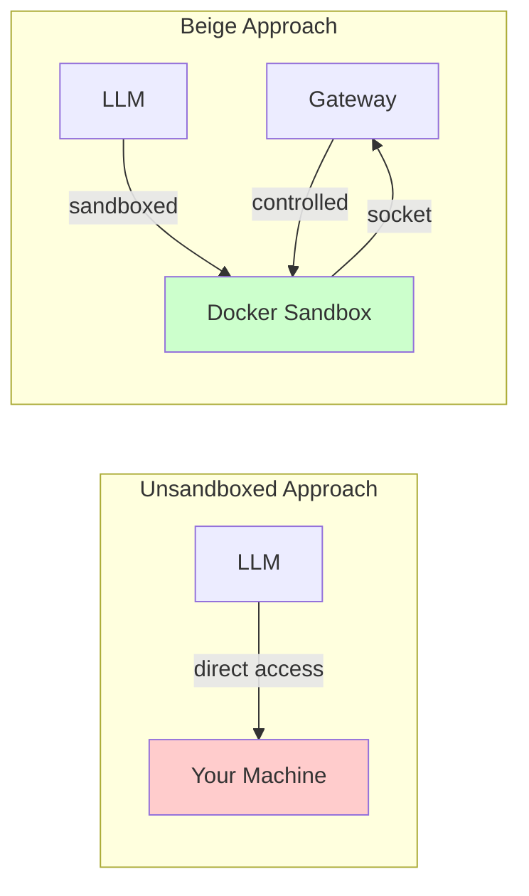

## Why We Built This

Existing solutions like [OpenClaw](https://openclaw.ai) are powerful but come with significant trade-offs:

### 🛡️ Sandboxed by Default

**The Problem:** Many agent systems run directly on your machine. The agent has full access to your filesystem, environment variables, and can execute any command. A rogue or confused agent could delete files, expose API keys, or worse.

**Our Solution:** Every Beige agent runs in its own Docker container. The agent can only access what you explicitly allow. No host environment variables, no direct filesystem access, no escape hatch.



### 🧹 Minimal, Not Cluttered

**The Problem:** Many agent systems expose dozens or hundreds of tools directly to the LLM. This bloats the context window, confuses the model, and makes the system harder to understand.

**Our Solution:** Beige has exactly **4 core tools**: `read`, `write`, `patch`, `exec`. Everything else composes through `exec`. The agent can write scripts that chain tools together — keeping the interface simple while remaining powerful.

### ⚡ True Autonomy

**The Problem:** Traditional tool-calling requires the LLM to invoke tools one at a time. Each result goes back through the model, wasting tokens and time. Complex workflows require hundreds of individual tool calls.

**Our Solution:** Beige agents can write and run code. Instead of calling a tool 50 times, the agent writes a script that does it in a loop. The LLM only sees the final result.

```bash
# Traditional approach: 50 tool calls through the LLM
exec /tools/bin/kv get user:1
exec /tools/bin/kv get user:2
# ... 48 more calls

# Beige approach: 1 script, 1 result
exec deno run - <<'EOF'
const users = [];
for (let i = 1; i <= 50; i++) {
  const result = await exec(`/tools/bin/kv get user:${i}`);
  users.push(JSON.parse(result));
}
console.log(JSON.stringify(users));
EOF
```

---

## Inspiration

Beige builds on ideas from two key blog posts:

### "What if you don't need MCP?"

Mario Zechner's [blog post](https://mariozechner.at/posts/2025-11-02-what-if-you-dont-need-mcp/) argues that MCP servers often add unnecessary complexity:

- **Tool bloat:** Popular MCP servers expose 20–30 tools, consuming thousands of tokens
- **Not composable:** Results must go through the agent's context
- **Hard to extend:** Modifying an MCP server requires understanding its codebase

**The alternative:** Simple CLI tools with READMEs. The agent reads the README, then uses `exec` to invoke the tools. This is more token-efficient, more composable, and easier to customize.

Beige embraces this philosophy: tools are simple executables with documentation mounted read-only into the sandbox.

### "Code Mode: the better way to use MCP"

Cloudflare's [blog post](https://blog.cloudflare.com/code-mode/) shows that LLMs are better at writing code to call tools than calling tools directly:

> LLMs have seen a lot of code. They have not seen a lot of "tool calls".

When an LLM writes code to orchestrate tool calls:
- **Multiple calls** happen in one execution, not round-tripped through context
- **Complex logic** (loops, conditionals, error handling) is natural in code
- **Results** are combined and filtered before reaching the LLM

Beige gives agents a full TypeScript/Deno runtime in the sandbox, enabling this code-first approach by default.

---

## Use Cases

Beige is designed for scenarios where you need an AI agent that can actually **do** things, safely:

### Travel Assistant

An agent that researches and plans trips:
- Browses websites (browser automation with residential IP)
- Takes screenshots of booking pages
- Writes `.md` files with itineraries to a shared folder (Google Drive → Obsidian)
- **Sandboxed:** Can't access your browser credentials or personal files

### Browser Automation

An agent that automates web tasks:
- Logs in manually once (agent inherits your logged-in session)
- Navigates, scrapes, fills forms
- **Sandboxed:** Never sees your passwords or session cookies

### CLI Tool Orchestration

An agent that uses command-line tools:
- Drafts messages via `slack-cli`
- Manages GitHub repos via `gh`
- **Sandboxed:** Cannot access CLI config files with API keys

### Development Environment

An agent that writes and runs code:
- Full TypeScript/Node.js/Deno environment
- Runs tests, starts dev servers, makes git commits
- **Sandboxed:** Can't push to protected branches, can't access host SSH keys

### Multi-Agent Collaboration

An agent that spawns and coordinates sub-agents:
- Distributes tasks, aggregates results
- **Governed:** Gateway enforces concurrency limits and policies

### Self-Improvement & Experimentation

An agent that iterates on itself:
- Installs packages, tries new tools, modifies local configs within its workspace
- **Sandboxed:** Can't break your actual machine
